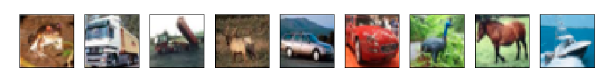

# Deep learning: Convolutional neural networks

## Image recognition: CIFAR-10

To illustrate convolutional networks, we will work with the CIFAR-10 data set, a standard benchmark for image recognition. It consists of 60 000 colour images of size  $p = (32 \times 32)$ pixels, each belonging to one of 10 object classes: $$ \mathcal{G} = \{\text{airplane}, \text{automobile}, \text{bird}, \text{cat}, \text{deer}, \text{dog}, \text{frog}, \text{horse}, \text{ship}, \text{truck}\}. $$

Each image has **three colour channels** (red, green, blue). At every pixel we therefore store three intensity values, one per channel. If we ignore the spatial structure and simply stack all pixel values into a single vector, the predictor dimension would be $$ p = 32 \times 32 \times 3 = 1024. $$

So each tiny CIFAR-10 image is already a 1024-dimensional point in input space. Many images are also quite ambiguous or noisy, making them challenging to classify even for humans. Yet modern convolutional neural networks, which explicitly exploit the 2D image structure and local patterns (edges, textures, shapes), reach test accuracies above 95 %. CIFAR-10 is therefore a convenient running example: small enough to train models quickly, but rich enough to show why specialised architectures for images are needed.

## Image recognition: CIFAR-10

To illustrate convolutional networks, we will work with the CIFAR-10 data set, a standard benchmark for image recognition. It consists of 60 000 colour images of size \(32 \times 32\) pixels, each belonging to one of 10 object classes:
$$ \mathcal{G} = \{\text{airplane}, \text{automobile}, \text{bird}, \text{cat}, \text{deer}, \text{dog}, \text{frog}, \text{horse}, \text{ship}, \text{truck}\}. $$

Each image has **three colour channels** (red, green, blue). At every pixel we therefore store three intensity values, one per channel. If we ignore the spatial structure and simply stack all pixel values into a single vector, the predictor dimension would be
$$ p = 32 \times 32 \times 3 = 1024. $$

So each tiny CIFAR-10 image is already a 1024-dimensional point in input space. Many images are also quite ambiguous or noisy, making them challenging to classify even for humans. Some examples are shown in @fig-cifar10-examples. Yet modern convolutional neural networks, which explicitly exploit the 2D image structure and local patterns (edges, textures, shapes), reach test accuracies above 95 %. CIFAR-10 is therefore a convenient running example: small enough to train models quickly, but rich enough to show why specialised architectures for images are needed.

{#fig-cifar10-examples width="80%" fig-align="center"}