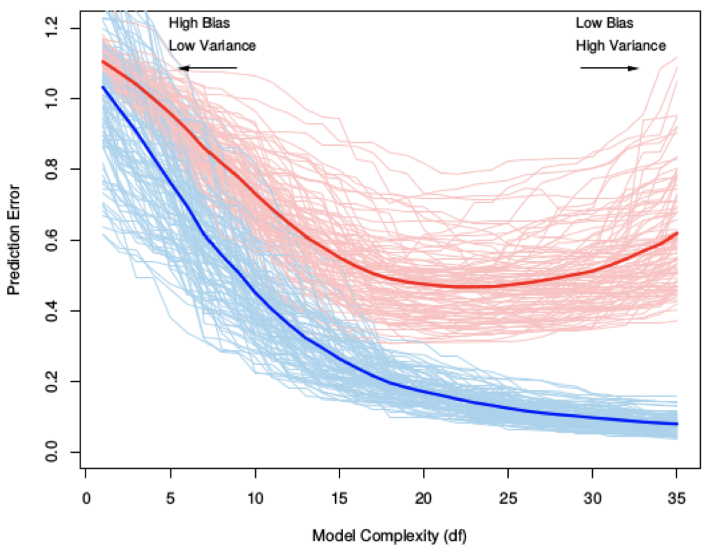

{#fig-ML3_graph width=85% fig-pos="H"}

\vspace{-0.6\baselineskip}
\noindent \textcolor{mlblue}{\textbf{Blue = training error, falls as complexity increases}} \textcolor{mlred}{\textbf{Red = test error, falls at first, then rises (U-shape)}}\
Faint curves show variability across training sets; thick curves show the typical pattern.\

**Left (low complexity): underfitting** — the model is too rigid $\Rightarrow$ **high bias, low variance**; both \textcolor{mlblue}{training} and \textcolor{mlred}{test} error are relatively high because important structure is missed.\
**Middle (intermediate complexity): best generalisation** — as flexibility increases, bias drops and the model captures the real signal present in both train and test data $\Rightarrow$ the \textcolor{mlred}{test error decreases} and reaches its minimum.\
**Right (high complexity): overfitting** — beyond a point, the model becomes too sensitive and starts fitting noise $\Rightarrow$ **variance dominates, low bias**; the \textcolor{mlblue}{training error keeps decreasing}, but the \textcolor{mlred}{test error rises again} because fitted noise does not generalise well to new data.

The \textcolor{mlred}{U-shaped test error} reflects the sum of two competing effects: $$ \text{Test Error} = \text{Bias}^2 + \text{Variance} + \text{Irreducible Error} $$
As model complexity increases, $\text{Bias}^2$ decreases (better fit to the signal), while variance increases (greater sensitivity to the particular training set). Initially, bias reduction dominates so the \textcolor{mlred}{test error falls}; eventually, variance dominates so the \textcolor{mlred}{test error rises}.
