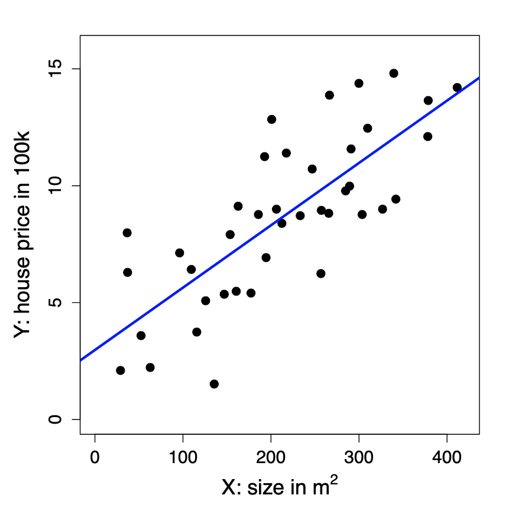
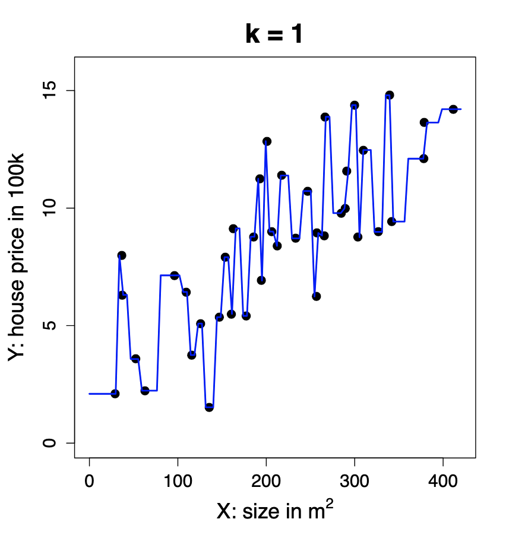
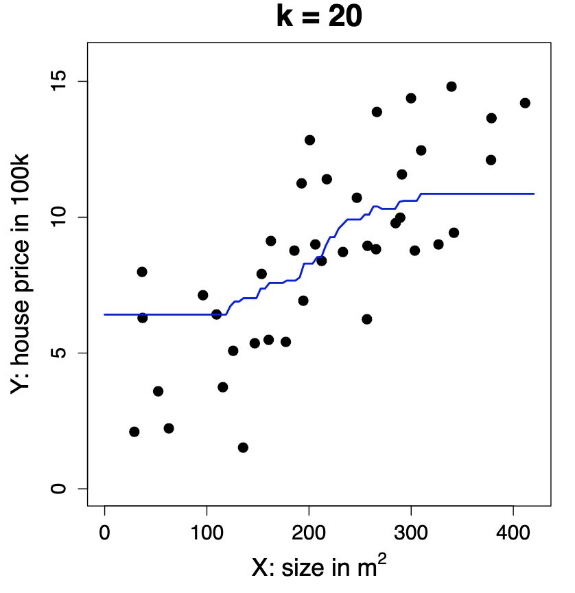
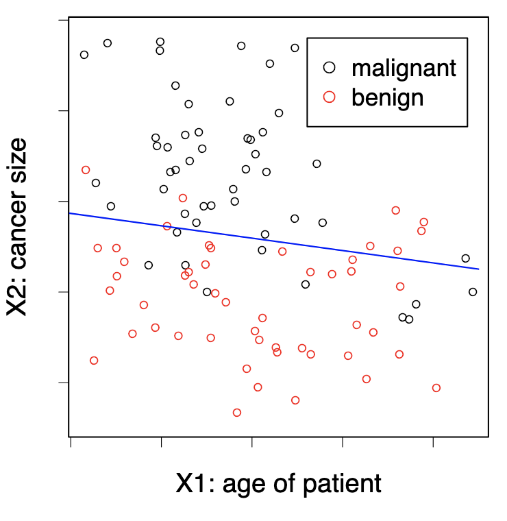
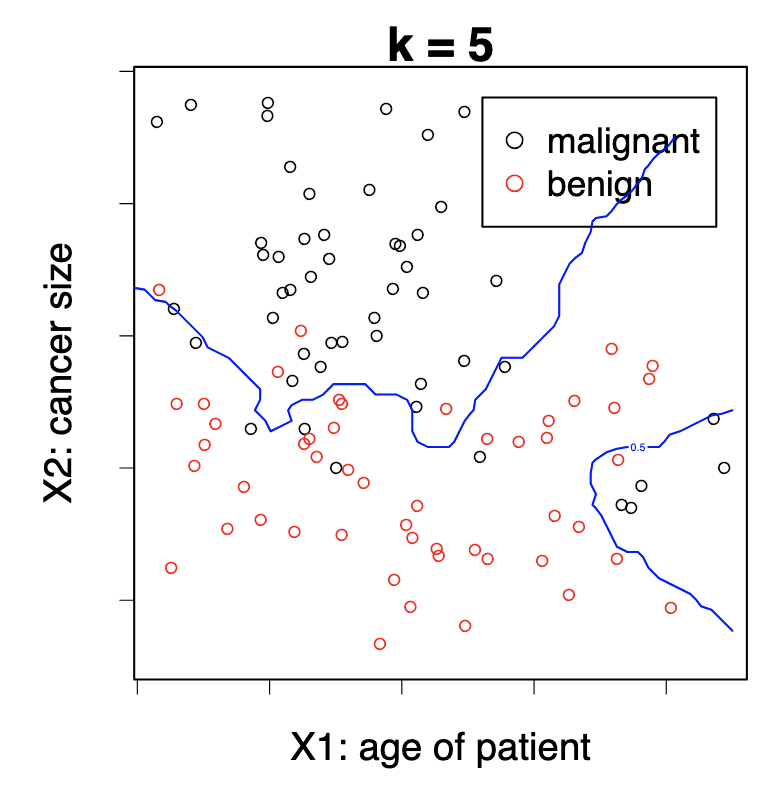
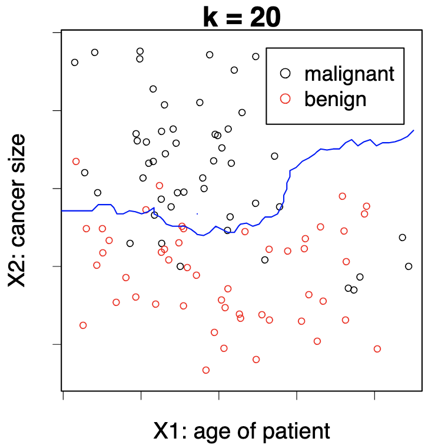

> **Disclaimer**: This material includes content adapted from the lectures and presentations of Prof. S. Engelke and other study materials. It is reproduced for educational purposes only and is not intended to infringe upon the rights of the original authors.

\newpage

# What is Machine Learning?

## What is Machine Learning?

Machine learning aims at programming a computer to learn from information (Data) to perform a task (Prediction, etc.) in an optimal way in terms of a performance measure (Loss Function).

Recent success of machine learning due to advances in its main ingredients:

1.  Data availability: huge growth due to automation, digitalization, web applications.

2.  Computing power: significant increase thanks to GPU computing, parallelization, etc.

3.  The learning algorithms: theoretical developments of new statistical models and training methods.

## The statistical framework

Types of variables:

-   quantitative variables take values in an ordered set, typically the real numbers R;

-   qualitative variables (also called categorical or factor) take values in a finite set $G = {G1, . . . , Gq }$ without ordering, e.g., ${Yes, No}$, ${blue, red, green, yellow}$, etc.

**Supervised learning**

We observe training data ($x_i , y_i ), i = 1, . . . , n$ where

-   the inputs $xi ∈ Rp$ are called predictors, covariates or features;

-   the outputs $y_i$ are called responses (in this course we assume they are univariate).

The goal is to predict the (unknown) response $y_0$ for a new (known) predictor $x_0$.

Regression: the responses $y_i ∈ R$ are quantitative.

Classification: the responses $y_i ∈ G$ are qualitative.

**Unsupervised learning**

We only observe multivariate data $x_i ∈ R^p , i = 1, . . . , n$ but without a particular response.

The goal is to summarize, understand, interpret and visualize the data.


## Regression: simple linear model

-   **Data**: Observations (x1, y1), . . . , (xn, yn)
-   **Goal**: Predict unknown outcome y0 for new predictor x0.

## Linear regression

$\hat{y}_0 = \hat{\beta}_0 + \hat{\beta}_1 x_0$

-   $\hat{y}_0$: This is the predicted value of the response variable $y$ when the input is $x_0$. The "hat" (\^) indicates it's an estimate, not the true value.

-   $\hat{\beta}_0$: This is the estimated intercept.\
    It represents the predicted value of $y$ when $x = 0$. It's called an *estimate* because it's computed from data and is an approximation of the true underlying intercept $\beta_0$.

-   $\hat{\beta}_1$: This is the estimated slope (also an approximation). It tells us how much $y$ is expected to increase (or decrease) when $x$ increases by 1 unit.

-   $x_0$: This is the value of the predictor (input) variable that we're using to make a prediction.

The numbers $\hat{\beta}_0, \hat{\beta}_1 \in \mathbb{R}$ are estimated model parameters. \### What does $\hat{\beta}_0, \hat{\beta}_1 \in \mathbb{R}$ mean?

It says both $\hat{\beta}_0$ and $\hat{\beta}_1$ are **real numbers** — elements of the set of real numbers $\mathbb{R}$.

In practical terms: they're just numerical values (like 2.3, -1.5, etc.) estimated from the data using statistical methods (usually least squares).

{width="40%"}

## Regression: kNN method

-   **Data**: Observations (x1, y1), . . . , (xn, yn)

-   **Goal**: Predict unknown outcome y0 for new predictor x0.

### The k-Nearest Neighbor (kNN) Method

The prediction for a new input $x_0$ is given by:

$$\hat{y}_0 = \frac{1}{k} \sum_{i : x_i \in N_k(x_0)} y_i = \text{ave}\{y_i : x_i \in N_k(x_0)\}$$

-   $N_k(x_0)$ refers to the $k$ closest points $x_i$ to $x_0$ in the training data.
-   The number $k$ is a **tuning parameter** that controls how many neighbours are used to make the prediction.

{width="33%"} {width="33%"} {width="33%"}

As we see in the figures above, the greater the number of neighbours, the smoother the curve since we are taking into account more information.

```{r}
#TODO how to put the three images next to each other with the undertitle
```

Business application: advertising

Medical application: body fat

## Classification: Simple Linear Regression

-   **Data:** Observations $(x_1, y_1), \ldots, (x_n, y_n)$, where $y_i \in G = \{0, 1\}$

```{r}
#TODO can classification methods have more y_i than 0 or 1?
```

-   **Goal:** Predict unknown class $y_0$ for new predictor $x_0$

Directly apply linear regression treating the classes as quantitative values 0 and 1.\
The prediction is

$$\hat{y}_0 = \begin{cases}
1, & \text{if } \hat{\beta}_0 + \hat{\beta}^T x_0 \geq \frac{1}{2}, \\
0, & \text{otherwise}.
\end{cases}$$

The numbers $\hat{\beta}_0, \hat{\beta}_1 \in \mathbb{R}$ are estimated model parameters.

can be explained term-by-term as follows:

-   $\hat{y}_0$: The predicted class label for a new input $x_0$. The hat ($\hat{\ }$) indicates it's an estimate from the model.

-   **The piecewise notation** $\begin{cases} ... \end{cases}$ means the prediction depends on a condition.

-   $\hat{\beta}_0$: The estimated intercept of the linear regression model, a scalar.

-   $\hat{\beta}^T x_0$: The dot product (transpose of $\hat{\beta}$ times $x_0$), representing the weighted sum of the input features.

-   $\hat{\beta}_0 + \hat{\beta}^T x_0$: The linear combination of the intercept and weighted features — the model’s predicted score.

-   $\geq \frac{1}{2}$: The threshold. If the score is greater than or equal to 0.5, predict class 1; otherwise, 0.

-   **1 and 0**: The two possible class labels (e.g., positive/negative or class 1/class 0).

In simple terms:\
You calculate a score from the model for $x_0$. If it’s at least 0.5, you predict class 1; otherwise, class 0.

{width="40%"}

## Classification: the kNN Method

-   **Data:** Observations $(x_1, y_1), \ldots, (x_n, y_n)$, where $y_i \in G = \{0, 1\}$

-   **Goal:** Predict unknown class $y_0$ for new predictor $x_0$

The k-Nearest-Neighbor (kNN) method predicts the majority class in the neighborhood:

$$\hat{y}_0 = \begin{cases}
1, & \text{if } \frac{1}{k} \sum_{i : x_i \in N_k(x_0)} \mathbf{1}\{y_i = 1\} > \frac{1}{2}, \\
0, & \text{otherwise}.
\end{cases}$$

Here, $N_k(x_0)$ are the $k$ closest points $x_i$ to $x_0$.\
The number $k$ is a tuning parameter, meaning that it does not come from the data. We can choose which k would be better using Cross Validation, for example.

### Explanation of terms:

-   $\hat{y}_0$: The predicted class label for the new input $x_0$.

-   $N_k(x_0)$: The set of the $k$ closest neighbors to $x_0$ in the training data.

-   $\mathbf{1}\{y_i = 1\}$: An indicator function that equals 1 if the class label $y_i$ is 1, and 0 otherwise.

-   $\frac{1}{k} \sum_{i : x_i \in N_k(x_0)} \mathbf{1}\{y_i = 1\}$: The fraction of neighbours whose class is 1 — effectively, the proportion of class 1 in the neighbourhood.

-   $> \frac{1}{2}$: The decision threshold — if more than half the neighbours are class 1, predict 1; otherwise, predict 0.

-   $k$: The tuning parameter controlling how many neighbors to consider.

{width="33%"} {width="33%"} {width="33%"}

Again, with low $k$, we tend to overfit the model to our training data.

### Handwritten characters / digits recognitions

Each pixel gives us the amount of darkness in a grey scale (0 to 9). We have 32 predictors (16 times 16, the size of the pictures). Given this predictors the system has to predict

## What is the right model?

*All models are wrong, some models are useful.*

\begin{flushright}
— George Box
\end{flushright}

In a sense its right since we would never find the model that has generated our data since Nature is too complex for this. However if they are flexible enough to capture the essence of what is happening in Nature.

*Everything should be made as simple as possible. But not simpler.*

\begin{flushright}
— Albert Einstein
\end{flushright}

We want to create a model that represents reality but we don't want to make it too complicated, if we can make it simpler without decreasing the goodness of fit, then we need to go with the simpler. In deep learning this does not apply.

\newpage

# Regression Framework

## Regression: Stochastic Framework

### The stochastic (population) model

-   We have a **quantitative response** $Y$ and $p$ **predictors** $X_1, \ldots, X_p$.

-   We assume there is a relationship between $Y$ and $X = (X_1, \ldots, X_p)$ given by\
    $$ Y = f(X) + \varepsilon $$ where $\varepsilon$ is a random error term with $\mathbb{E}(\varepsilon) = 0$ (on average, errors cancel out and there is no systematic bias in the error) and $\text{Var}(\varepsilon) = \sigma^2$ (the variability of $\varepsilon$ is constant — homoscedastic — i.e. it does not depend on $X$).

-   The function $f$ is **fixed but unknown**[^1] and represents the **systematic information** that $X$ provides about $Y$.

[^1]: It's fixed because the relationship between $X$ and $Y$ in the population exists — it’s not random. In our housing example, there really is a true relationship between size and price. And it's unknown, we don’t know what $f$ actually is, that’s what we’re trying to estimate using data. When we run a regression, we build an estimate $\hat{f}(X)$ that approximates the true (but hidden) $f(X)$.

**Example** Let: $Y =$ *house price* (in 100k) and $X =$ *size* (in $m^2$)

Then: $$Y = 2 + 0.03X + \varepsilon$$

which can be interpreted as: $\text{house price} = 2 + 0.03 \times \text{size} + \text{error}$

-   This true relationship $f(X) = 2 + 0.03X$ is called the **population regression line**.

### Random vectors and dimensionality

-   $(X, Y)$ is a $(p + 1)$-dimensional random vector. In this simulated example: $$ X \sim \mathcal{N}(0, \sigma_X^2), \quad Y = 2 + 0.03X + \mathcal{N}(0, \sigma_\varepsilon^2) $$

**Understanding why it is** $(p + 1)$-dimensional

In regression, $X$ is not just one variable — it’s a vector of predictors: $$ X = (X_1, X_2, \dots, X_p) $$

\newpage

1.  **What we mean by** $(X, Y)$

    -   Each $X_j$ represents one feature (e.g. size, number of rooms, location, etc.), and there are $p$ such features in total.
    -   The response variable $Y$ is another random variable — the outcome we want to predict (e.g. house price).
    -   So when we consider the pair $(X, Y)$ together, we’re grouping all predictors and the response into one joint random vector.

2.  **Counting the dimensions**

    -   $X$ alone has $p$ dimensions, because it contains $p$ predictor variables.
    -   $Y$ adds one more dimension (the outcome variable). Hence, when combined: $$ (X, Y) = (X_1, X_2, \dots, X_p, Y) $$
    -   This vector has $p + 1$ components → therefore, it’s a $(p + 1)$-dimensional random vector.

3.  **Why it matters**

    -   We call it a **random vector** because all its components (the predictors $X_1, \ldots, X_p$ and the response $Y$) are random variables.

    -   Their joint distribution $P(X_1, X_2, \dots, X_p, Y)$ describes how they vary together in the population.

    -   The goal of regression is to understand the **conditional relationship** between them, i.e., how $Y$ depends on $X$: $$ \mathbb{E}[Y \mid X] = f(X) $$

    -   That conditional expectation is exactly the **regression function** we try to estimate.

**Example**

At the **population level**, $(X, Y)$ represents the theoretical random vector: $$ (X, Y) = (X_1, X_2, \dots, X_p, Y) $$

Each $X_j$ is a random variable corresponding to one predictor, and $Y$ is the random response variable.

At the **observation level**, we work with realised data points — specific numerical values drawn from this population. For observation $i$, we write: $$ (x_i, y_i) = (x_{i1}, x_{i2}, \dots, x_{ip}, y_i) $$ For example, if $p = 2$ (size and number of rooms) and $Y$ is house price:

| Observation | $x_{i1}$ (size) | $x_{i2}$ (rooms) | $y_i$ (price) |
|:-----------:|:---------------:|:----------------:|:-------------:|
|      1      |       120       |        4         |      6.8      |
|      2      |       85        |        3         |      5.1      |
|      3      |       150       |        5         |      8.2      |

For the first observation: $$ (x_1, y_1) = (x_{11}, x_{12}, y_1) = (120, 4, 6.8) $$

Thus, each $(x_i, y_i)$ is one **realisation** of the $(p + 1)$-dimensional random vector $(X, Y)$.

## Regression: The Statistical Framework

### The Training Data

-   Assume we are given $n$ measurements $(x_1, y_1), \dots, (x_n, y_n)$ of $(X, Y)$, where $x_i = (x_{i1}, \dots, x_{ip})^\top$, and
    -   the inputs $x_i \in \mathbb{R}^p$ are called **predictors**
    -   the outputs $y_i$ are called **responses**
-   We will use this data to **learn** the unknown relationship $f$ between $Y$ and $X$, i.e., to **train** (or **estimate**) a predictive model $\hat{f}$

**Example** : $[Y = \text{house price (100k)}; \quad X = \text{size (m}^2)]$; $\text{house price} \approx \hat{f}(\text{size}) = 2.977 + 0.027 \times \text{size}$

-   The training data are realizations of the random vector $(X, Y)$:

| Observation  | X (Size in m²) | Y (House Price in 100k) |
|--------------|:--------------:|:-----------------------:|
| $(x_1, y_1)$ |      327       |           9.0           |
| $(x_2, y_2)$ |      154       |           7.9           |
| $(x_3, y_3)$ |      233       |           8.7           |

### Why do we estimate $f$?

1.  **Prediction** : Machine Learning

-   A set of inputs $X$ are readily available, but $Y$ cannot be easily obtained.
-   We can predict $Y$ by: $\hat{Y} = \hat{f}(X)$ where $\hat{f}$ is our **predictive model** for $f$.
-   The function $\hat{f}$ is often treated as a **black box**: we are not concerned with the exact form of $\hat{f}$ provided it yields good prediction for $Y$.

2.  **Inference**: Classical Multivariate Analysis

-   We are often interested in understanding **how** $Y$ is affected as $X_1, \dots, X_p$ change.
-   Cannot treat $\hat{f}$ as a black box; we need to know the exact form.
-   We want to answer questions such as:
    -   Which predictor is associated with the response?
    -   What is the relationship of the response and each predictor (positive, negative, ...)?
    -   Is the relationship linear or more complicated?
    -   etc.

## What is a good $\hat{f}$?

### Understanding the optimal prediction

-   For a fixed value of $X$, say $X = 3$, we want to know what would be an **optimal prediction** $\hat{f}(X)$ for the response $Y$.

-   Since the relationship between $X$ and $Y$ is stochastic,[^2] there might be **many different observed values** of $Y$ corresponding to the same $X = 3$. A **good** $\hat{f}$ is the function that **minimises the expected squared prediction error**: $\hat{f}(X) = \mathbb{E}[Y \mid X]$

[^2]: Since that relationship it involves random variation, it is not perfectly deterministic .

<!-- -->

-   In particular, for $X = 3$: $\hat{f}(3) = \mathbb{E}[Y \mid X = 3]$. That means $\hat{f}(3)$ gives the **expected value (average)** of $Y$ for all observations where $X = 3$.

In other words, among all possible prediction functions, the conditional expectation $\mathbb{E}[Y \mid X]$ is **optimal** in the sense that it minimises the **mean squared error (MSE)**: $$ \mathbb{E}[(Y - f(X))^2] $$

Geometrically, if you look at all points with the same $X = 3$, their $Y$-values vary due to noise. The best prediction $\hat{f}(3)$ is the **centre** of that distribution, i.e. the average $Y$ value for that $X$.

### Visual interpretation

\begin{minipage}{0.38\textwidth}
\vspace*{\fill}
\begin{figure}[H]
\centering
\includegraphics[width=0.95\linewidth]{Images_qmd_ML/fhat_ML2.png}
\caption{\footnotesize What is a good $\hat{f}$?}
\label{fig:fhat-ml2}
\end{figure}
\vspace*{\fill}
\end{minipage}
\hfill
\begin{minipage}{0.58\textwidth}
\textbf{As we see in the plot on the left:}

\begin{itemize}
  \setlength\itemsep{0.2em}
  \item The \textbf{red curve} represents $\hat{f}(X)$, the \emph{conditional mean} of $Y$ given $X$.
  \item For each value of $X$, $\hat{f}(X)$ passes through the \emph{average height} of the cloud of observed points.
  \item This illustrates how the regression function captures the \textbf{systematic (non-random)} trend in the data, summarising the central tendency of $Y$ as $X$ changes.
\end{itemize}
\end{minipage}


## The Loss Function

### Defining what a “good” prediction means

To decide what makes a **good prediction**, we need a way to measure how far a predicted value $\hat{y}$ is from the true value $y$. This is done through a **loss function** $L$, which quantifies the **discrepancy** between prediction and reality.

### Squared Error Loss

In regression, the most common choice is the **squared error loss**: $$L(y, \hat{y}) = (y - \hat{y})^2$$

This loss penalises large errors more heavily than small ones, because the difference is squared.

### Expected squared prediction error

For a predictive model $\hat{f}$, we can define the **expected loss**, that is, the expected squared prediction error across all possible pairs $(X, Y)$: $$ \text{Err}_{\hat{f}} = \mathbb{E}\{[Y - \hat{f}(X)]^2\} $$

Here, the expectation $\mathbb{E}$ is taken over the joint distribution of $(X, Y)$. It tells us the *average squared distance* between our predictions and the true outcomes in the population.

### Finding the optimal predictor

Ideally, we would like to find a function $f^*$ that **minimises** this expected error: $$ f^* = \arg \min_f \, \mathbb{E}\{[Y - f(X)]^2\} $$

This function $f^*$ is called the **regression function**.

### The optimal regression function

It can be shown (and we’ll later prove) that the function minimising the expected squared error is: $$ f^*(x) = \mathbb{E}[Y \mid X = x] $$

That is, the **conditional expectation** of $Y$ given $X = x$.

This satisfies the population model: $$ Y = f(X) + \varepsilon, \quad \text{where} \quad \mathbb{E}(\varepsilon) = 0. $$

------------------------------------------------------------------------

-   The loss function $L(y, \hat{y})$ defines how we measure mistakes.
-   The expected loss $\text{Err}_{\hat{f}}$ defines how well our model performs on average.
-   The best possible function $f^*$ (the **regression function)** predicts the *mean value* of $Y$ given $X$, because this minimises the expected squared error.

## How do we estimate $\hat{f}$ ?

In theory, we know that the optimal prediction function is the **conditional expectation**:$f^*(x) = \mathbb{E}[Y \mid X = x]$. However, in practice, we often have **few or no observations** with exactly the same $X$ value. For instance, there might be few or no data points where $X = 3$. Therefore, we **cannot compute** $\mathbb{E}[Y \mid X = 3]$ directly from the data.

What we can do to estimate $\hat{f}(x)$ in practice is to approximate the expectation ($\mathbb{E}[Y \mid X = x]$) using nearby observations to approximate. One simple and intuitive method is **k-Nearest Neighbours (k-NN) regression**.

### The k-Nearest Neighbours approach

The **k-Nearest Neighbours (k-NN)** method estimates $\hat{f}(x_0)$ by averaging the $Y$ values of the $k$ data points whose $X_i$ values are closest to $x_0$: $$\hat{f}(x_0) = \text{Ave}(Y \mid X \in N_k(x_0))$$where:

-   $N_k(x_0)$ is the set of the $k$ observations $(x_i, y_i)$ whose $x_i$ values are closest to $x_0$.

-   The **number** $k$ is a **tuning parameter**, i.e. it controls how “local” or “smooth” the estimate is.

    -   If $k$ is **small**, $\hat{f}(x_0)$ is based on very few nearby points → the estimate is **very local** and can capture detail (low bias, high variance).

    -   If $k$ is **large**, $\hat{f}(x_0)$ averages over more distant points → the estimate is **smoother** and more stable (high bias, low variance).

\begin{minipage}{0.38\textwidth}
\vspace*{\fill}
\begin{figure}[H]
\centering
\includegraphics[width=0.95\linewidth]{Images_qmd_ML/fhat__knn_ML2.png}
\caption{\footnotesize Estimating $\hat{f}$ with kNN}
\label{fig:fhat-knn}
\end{figure}
\vspace*{\fill}
\end{minipage}
\hfill
\begin{minipage}{0.58\textwidth}
\textbf{As we see in the plot on the left:}

\begin{itemize}
  \setlength\itemsep{0.2em}
  \item The \textbf{vertical solid line} marks the target point $x_0 = 3$.
  \item The \textbf{dashed vertical lines} indicate the neighbourhood $N_k(x_0)$, which contains the $k$ nearest observations around $x_0$.
  \item The \textbf{average of the $Y$ values} within this neighbourhood provides $\hat{f}(3)$ — the \emph{estimated regression value} at $X = 3$.
\end{itemize}
\end{minipage}


### Limitations of k-Nearest Neighbours

**Nearest neighbour averaging** works well when the number of predictors (dimension) $p$ is **small**, and the training dataset size $n$ is **large**.

However, when the number of predictors $X_1, \ldots, X_p$ increases, **kNN does not perform well**. This problem is known as the **curse of dimensionality**.

### The curse of dimensionality

As the number of predictors $p$ grows an data points become **sparser** in high-dimensional space. Therefore, the notion of “closeness” loses meaning since even the nearest neighbours are far away. As a result, the **averages become unreliable**, and the kNN estimate $\hat{f}(x)$ becomes noisy.

### Towards structured methods

We will therefore study **structured methods** that:

-   need **less data** to fit,
-   may be more **interpretable**,
-   but come at the cost of **lower flexibility**.

The key challenge is to find a good **compromise** between:

-   **flexibility** (capturing complex relationships), and
-   **parsimony** (simplicity and interpretability).

## The empirical loss: model evaluation

### Why the true error is unknown

The **expected prediction error** is a *theoretical quantity*: $$\text{Err}_{\hat{f}} = \mathbb{E}\{[Y - \hat{f}(X)]^2\}$$

It represents the **average squared difference** between the true $Y$ values and the model’s predictions $\hat{f}(X)$ across the entire population.

However, since we only have a finite dataset, we do **not know** the true joint distribution $P(X, Y)$. That means we cannot compute this expectation exactly, because we do not know *all possible* pairs $(x, y)$ in the population.

Therefore, to approximate $\text{Err}_{\hat{f}}$, we use a new, independent sample, called the **test dataset**:

$$\mathcal{T}_m = \{(\tilde{x}_1, \tilde{y}_1), \ldots, (\tilde{x}_m, \tilde{y}_m)\}.$$

-   For each input $\tilde{x}_i$, we **predict** the response using our model:$$ \hat{y}_i = \hat{f}(\tilde{x}_i) $$
-   We then **compare** these predictions $\hat{y}_i$ with the observed outputs $\tilde{y}_i$.

The **empirical prediction error** (also called the **Mean Squared Error**, MSE) is:

$$\text{err}_{\hat{f}} = \frac{1}{m} \sum_{i=1}^{m} [\tilde{y}_i - \hat{f}(\tilde{x}_i)]^2$$

This quantity estimates the expected squared prediction error using the available data.

We square the error for three main reasons:

1.  **To penalise large errors more strongly:**\
    Squaring makes large deviations more costly — an error of 4 is *four times* worse than an error of 2.
2.  **To avoid cancellation of positive and negative errors:**\
    Without squaring (or taking absolute values), overestimates and underestimates would cancel each other out.
3.  **For mathematical and statistical convenience:**\
    The squared loss is smooth and convex, making optimisation easier.\
    Moreover, minimising the expected squared loss leads directly to the **regression function**: $$ f^*(X) = \mathbb{E}[Y \mid X] $$

### Practical use

-   In practice, we **split** our data into **training** and **test** sets.
-   The training data are used to **fit** $\hat{f}$, while the test data are used to **evaluate** its performance.
-   When data are limited, we use **cross-validation**, which rotates the training and test roles to get a reliable estimate.
-   To obtain a more reliable measure of performance, we use **cross-validation**, which consists of:
    -   Dividing the dataset into $K$ subsets (called “folds”);
    -   Training the model on $K-1$ folds and testing it on the remaining one;
    -   Repeating this process $K$ times and averaging the test errors.

This ensures that every observation is used for both training and testing, giving a more robust estimate of the model’s predictive accuracy.

| Concept | Definition | Interpretation |
|:-----------------|:------------------------|:----------------------------|
| $\text{Err}_{\hat{f}}$ | $\mathbb{E}\{[Y - \hat{f}(X)]^2\}$ | True (theoretical) expected error |
| $\text{err}_{\hat{f}}$ | $\frac{1}{m} \sum_{i=1}^{m} [\tilde{y}_i - \hat{f}(\tilde{x}_i)]^2$ | Empirical estimate (MSE) from test data |

> The squared loss penalises large errors and ensures all deviations are positive, giving a smooth, interpretable measure of how well $\hat{f}$ generalises to unseen data.

# Linear Regression

## Simple Linear regression

**Recall the stochastic model:** we start from the general regression framework: $Y = f(X) + \varepsilon$ where $\varepsilon$ is a random error term with $\mathbb{E}(\varepsilon) = 0$ and $\text{Var}(\varepsilon) = \sigma^2$.

**The simple linear model**

In **simple linear regression**, we assume that the relationship between $Y$ and $X$ is **linear**: $f(X) = \beta_0 + \beta_1 X$, where:

-   $\beta_0$ is the **intercept**, i.e., the predicted value of $Y$ when $X = 0$;

-   $\beta_1$ is the **slope** — the expected change in $Y$ for a one-unit increase in $X$.

Together, $\beta_0$ and $\beta_1$ are called the **model coefficients** or **parameters**.

In order to apply linear regression in practice, we first **split the data** into **training** and **test** sets. For the training data, suppose we observe $n$ data points: $\{(x_i, y_i)\}_{i=1}^{n}$. We then use these observations to estimate the parameters $(\beta_0, \beta_1)$, obtaining their fitted (sample) estimates: $(\hat{\beta}_0, \hat{\beta}_1)$ For each observation $i$:

-   The **fitted value** (predicted response) is\
    $$\hat{y}_i = \hat{f}(x_i) = \hat{\beta}_0 + \hat{\beta}_1 x_i$$

-   The **residual** (prediction error) is\
    $$e_i = y_i - \hat{y}_i$$

Each residual measures how far the model’s prediction is from the actual observed value of $Y$.

Finally, to measure the total prediction error across all observations, we compute the **Residual Sum of Squares (RSS):**

$$ \text{RSS}(\hat{\beta}_0, \hat{\beta}_1) = e_1^2 + e_2^2 + \dots + e_n^2 $$

or equivalently,

$$ \text{RSS}(\hat{\beta}_0, \hat{\beta}_1) = \sum_{i=1}^{n} (y_i - \hat{f}(x_i))^2 = \sum_{i=1}^{n} (y_i - \hat{\beta}_0 - \hat{\beta}_1 x_i)^2 $$

Minimising this RSS gives the **least squares estimates** $\hat{\beta}_0$ and $\hat{\beta}_1$ — the line that best fits the data in the least-squares sense.

\begin{minipage}{0.38\textwidth}
\vspace*{\fill}
\begin{figure}[H]
\centering
\includegraphics[width=0.95\linewidth]{Images_qmd_ML/SLR_ML2.png}
\caption{\footnotesize Simple Linear Regression: true function vs. estimated function}
\label{fig:slr-lines}
\end{figure}
\vspace*{\fill}
\end{minipage}
\hfill
\begin{minipage}{0.58\textwidth}
\textbf{As we see in the plot on the left:}

\begin{itemize}
  \setlength\itemsep{0.2em} % tighter spacing between bullet points
  \item The \textbf{red line} represents the \emph{true} function $f(X) = \beta_0 + \beta_1 X$, which is generally unknown.
  \item The \textbf{blue line} represents the \emph{estimated} regression line $\hat{f}(X) = \hat{\beta}_0 + \hat{\beta}_1 X$.
  \item The \textbf{vertical grey lines} show the residuals $e_i = y_i - \hat{y}_i$, i.e., the differences between the observed and fitted values.
\end{itemize}

The goal of linear regression is to make the estimated line $\hat{f}(X)$ as close as possible to the true underlying relationship $f(X)$ by minimising the RSS.
\end{minipage}


## Estimation of parameters by least squares

To estimate the coefficients $(\beta_0, \beta_1)$ of the simple linear model, we choose the values that **minimise the Residual Sum of Squares (RSS):** $$(\hat{\beta}_0, \hat{\beta}_1) = \arg\min_{(\beta_0, \beta_1) \in \mathbb{R}^2} \text{RSS}(\beta_0, \beta_1)$$

where $$\text{RSS}(\beta_0, \beta_1) = \sum_{i=1}^{n} (y_i - \beta_0 - \beta_1 x_i)^2$$

This means we are finding the intercept and slope that make the predicted values $\hat{y}_i = \beta_0 + \beta_1 x_i$ as close as possible to the actual $y_i$, in the least-squares sense.

So, **how do we solve the optimisation problem?**.

There are two main approaches to find $(\hat{\beta}_0, \hat{\beta}_1)$:

1.  **Numerically**, using computer algorithms such as **gradient descent**, which iteratively adjusts the coefficients to reduce the RSS.
2.  **Analytically**, by **differentiation** — setting the partial derivatives of the RSS with respect to $\beta_0$ and $\beta_1$ to zero and solving the system of equations.

The analytical (closed-form) solutions are:

$$\hat{\beta}_1 = \frac{\sum_{i=1}^{n}(x_i - \bar{x})(y_i - \bar{y})}{\sum_{i=1}^{n}(x_i - \bar{x})^2}$$

$$\hat{\beta}_0 = \bar{y} - \hat{\beta}_1 \bar{x}$$

where $\bar{x} = \frac{1}{n} \sum_{i=1}^{n} x_i$ and $\bar{y} = \frac{1}{n} \sum_{i=1}^{n} y_i$ are the **sample means** of $X$ and $Y$ respectively.

Therefore, $\hat{\beta}_1$ measures the **average change in** $Y$ associated with a one-unit increase in $X$, whereas $\hat{\beta}_0$ is the **predicted value of** $Y$ when $X = 0$. Both coefficients are calculated so that the **sum of squared residuals** is as small as possible.

### Randomness of the estimates

The estimates $(\hat{\beta}_0, \hat{\beta}_1)$ are **random variables**, not fixed numbers. This is because if we collected a new training dataset (another random sample from the same population) we would obtain slightly different estimates.

\begin{minipage}{0.6\textwidth}
\textbf{In the plot on the right:}

\begin{itemize}
  \item The \textbf{red line} represents the true model $f(X) = \beta_0 + \beta_1 X$.
  \item The \textbf{blue line} shows the estimated regression line $\hat{f}(X) = \hat{\beta}_0 + \hat{\beta}_1 X$.
  \item The \textbf{grey lines} correspond to regression lines obtained from other random samples, illustrating how $(\hat{\beta}_0, \hat{\beta}_1)$ vary due to sampling variability.
\end{itemize}
\end{minipage}
\hfill
\begin{minipage}{0.35\textwidth}
\begin{figure}[H]
\centering
\includegraphics[width=\linewidth]{Images_qmd_ML/SLR_est_ML2.png}
\caption{Sampling variability in least squares estimates}
\label{fig:slr-estimation}
\end{figure}
\end{minipage}


## Advertising data

## Multiple Linear Regression

We now consider $p$ predictors $X = (X_1, \ldots, X_p)$ for the response variable $Y$.  
The model becomes:

$$Y = \beta_0 + \beta_1 X_1 + \beta_2 X_2 + \cdots + \beta_p X_p + \varepsilon$$

where:
- $\beta_0$ is the intercept (value of $Y$ when all predictors are 0),  
- $\beta_j$ for $j = 1, \ldots, p$ are the coefficients representing the partial effect of each predictor $X_j$,  
- $\varepsilon$ is the random error term.

**Example: The Advertising dataset**: for instance, suppose we study how different types of media advertising affect sales. Then our model could be:

$$\text{sales} = \beta_0 + \beta_1 \times \text{TV} + \beta_2 \times \text{radio} + \beta_3 \times \text{newspaper} + \varepsilon$$

Here: $Y =$ sales, $X_1 =$ TV advertising budget, $X_2 =$ radio budget, $X_3 =$ newspaper budget.

### Matrix form of the training data

We observe $n$ data points $\{(x_i, y_i)\}_{i=1}^{n}$, where each $x_i = (x_{i1}, \ldots, x_{ip})^\top$ contains the $p$ predictor values for observation $i$.  

All predictors can be represented compactly as an $n \times p$ matrix:
$$\mathbf{X} =
\begin{bmatrix}
x_{11} & x_{12} & \cdots & x_{1p} \\
x_{21} & x_{22} & \cdots & x_{2p} \\
\vdots & \vdots & \ddots & \vdots \\
x_{n1} & x_{n2} & \cdots & x_{np}
\end{bmatrix}$$

### Dot product notation

For notational convenience, we sometimes write the model using a **dot product** between vectors $x, y \in \mathbb{R}^p$:
$$x^\top y = \sum_{i=1}^{p} x_i y_i = x_1 y_1 + x_2 y_2 + \cdots + x_p y_p$$

This lets us express the regression model compactly as:

$$Y = \beta_0 + x^\top \beta + \varepsilon$$


