> **Disclaimer**: This material includes content adapted from the lectures and presentations of Prof. S. Engelke and other study materials. It is reproduced for educational purposes only and is not intended to infringe upon the rights of the original authors.

\newpage

# What is Machine Learning?

## What is Machine Learning?

Machine learning aims at programming a computer to learn from information (Data) to perform a task (Prediction, etc.) in an optimal way in terms of a performance measure (Loss Function).

1.  Data availability: huge growth due to automation, digitalization, web applications.

2.  Computing power: significant increase thanks to GPU computing, parallelization, etc.

3.  The learning algorithms: theoretical developments of new statistical models and training methods.

## The statistical framework

Types of variables:

-   quantitative variables take values in an ordered set, typically the real numbers R;

-   qualitative variables (also called categorical or factor) take values in a finite set $G = {G1, . . . , Gq }$ without ordering, e.g., ${Yes, No}$, ${blue, red, green, yellow}$, etc.

**Supervised learning**

We observe training data ($x_i , y_i ), i = 1, . . . , n$ where

-   the inputs $xi ∈ Rp$ are called predictors, covariates or features;

-   the outputs $y_i$ are called responses (in this course we assume they are univariate).

The goal is to predict the (unknown) response $y_0$ for a new (known) predictor $x_0$.

Regression: the responses $y_i ∈ R$ are quantitative.

Classification: the responses $y_i ∈ G$ are qualitative.

**Unsupervised learning**

We only observe multivariate data $x_i ∈ R^p , i = 1, . . . , n$ but without a particular response.

The goal is to summarize, understand, interpret and visualize the data.


## Regression: simple linear model

-   **Data**: Observations (x1, y1), . . . , (xn, yn)
-   **Goal**: Predict unknown outcome y0 for new predictor x0.

## Linear regression

$\hat{y}_0 = \hat{\beta}_0 + \hat{\beta}_1 x_0$

-   $\hat{y}_0$: This is the predicted value of the response variable $y$ when the input is $x_0$. The "hat" (\^) indicates it's an estimate, not the true value.

-   $\hat{\beta}_0$: This is the estimated intercept.\
    It represents the predicted value of $y$ when $x = 0$. It's called an *estimate* because it's computed from data and is an approximation of the true underlying intercept $\beta_0$.

-   $\hat{\beta}_1$: This is the estimated slope (also an approximation). It tells us how much $y$ is expected to increase (or decrease) when $x$ increases by 1 unit.

-   $x_0$: This is the value of the predictor (input) variable that we're using to make a prediction.

The numbers $\hat{\beta}_0, \hat{\beta}_1 \in \mathbb{R}$ are estimated model parameters. \### What does $\hat{\beta}_0, \hat{\beta}_1 \in \mathbb{R}$ mean?

It says both $\hat{\beta}_0$ and $\hat{\beta}_1$ are **real numbers** — elements of the set of real numbers $\mathbb{R}$.

In practical terms: they're just numerical values (like 2.3, -1.5, etc.) estimated from the data using statistical methods (usually least squares).

{width="40%"}

## Regression: kNN method

-   **Data**: Observations (x1, y1), . . . , (xn, yn)

-   **Goal**: Predict unknown outcome y0 for new predictor x0.

### The k-Nearest Neighbor (kNN) Method

The prediction for a new input $x_0$ is given by:

$$\hat{y}_0 = \frac{1}{k} \sum_{i : x_i \in N_k(x_0)} y_i = \text{ave}\{y_i : x_i \in N_k(x_0)\}$$

-   $N_k(x_0)$ refers to the $k$ closest points $x_i$ to $x_0$ in the training data.
-   The number $k$ is a **tuning parameter** that controls how many neighbours are used to make the prediction.

{width="33%"} 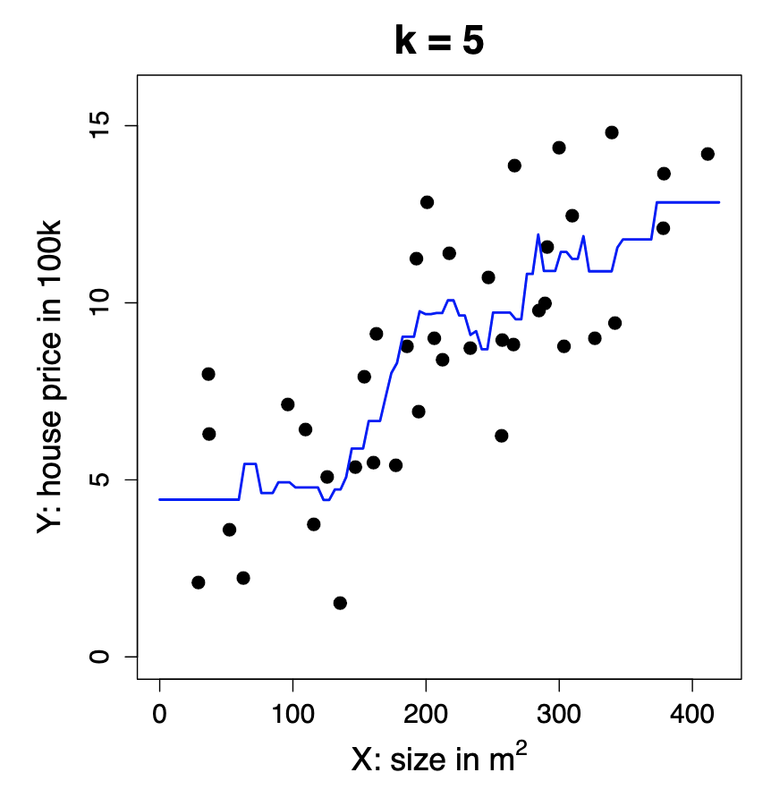{width="33%"} {width="33%"}

As we see in the figures above, the greater the number of neighbours, the smoother the curve since we are taking into account more information.

```{r}
#TODO how to put the three images next to each other with the undertitle
```

Business application: advertising

Medical application: body fat

## Classification: Simple Linear Regression

-   **Data:** Observations $(x_1, y_1), \ldots, (x_n, y_n)$, where $y_i \in G = \{0, 1\}$

```{r}
#TODO can classification methods have more y_i than 0 or 1?
```

-   **Goal:** Predict unknown class $y_0$ for new predictor $x_0$

Directly apply linear regression treating the classes as quantitative values 0 and 1.\
The prediction is

$$\hat{y}_0 = \begin{cases}
1, & \text{if } \hat{\beta}_0 + \hat{\beta}^T x_0 \geq \frac{1}{2}, \\
0, & \text{otherwise}.
\end{cases}$$

The numbers $\hat{\beta}_0, \hat{\beta}_1 \in \mathbb{R}$ are estimated model parameters.

can be explained term-by-term as follows:

-   $\hat{y}_0$: The predicted class label for a new input $x_0$. The hat ($\hat{\ }$) indicates it's an estimate from the model.

-   **The piecewise notation** $\begin{cases} ... \end{cases}$ means the prediction depends on a condition.

-   $\hat{\beta}_0$: The estimated intercept of the linear regression model, a scalar.

-   $\hat{\beta}^T x_0$: The dot product (transpose of $\hat{\beta}$ times $x_0$), representing the weighted sum of the input features.

-   $\hat{\beta}_0 + \hat{\beta}^T x_0$: The linear combination of the intercept and weighted features — the model’s predicted score.

-   $\geq \frac{1}{2}$: The threshold. If the score is greater than or equal to 0.5, predict class 1; otherwise, 0.

-   **1 and 0**: The two possible class labels (e.g., positive/negative or class 1/class 0).

In simple terms:\
You calculate a score from the model for $x_0$. If it’s at least 0.5, you predict class 1; otherwise, class 0.

{width="40%"}

## Classification: the kNN Method

-   **Data:** Observations $(x_1, y_1), \ldots, (x_n, y_n)$, where $y_i \in G = \{0, 1\}$

-   **Goal:** Predict unknown class $y_0$ for new predictor $x_0$

The k-Nearest-Neighbor (kNN) method predicts the majority class in the neighborhood:

$$\hat{y}_0 = \begin{cases}
1, & \text{if } \frac{1}{k} \sum_{i : x_i \in N_k(x_0)} \mathbf{1}\{y_i = 1\} > \frac{1}{2}, \\
0, & \text{otherwise}.
\end{cases}$$

Here, $N_k(x_0)$ are the $k$ closest points $x_i$ to $x_0$.\
The number $k$ is a tuning parameter, meaning that it does not come from the data. We can choose which k would be better using Cross Validation, for example.

### Explanation of terms:

-   $\hat{y}_0$: The predicted class label for the new input $x_0$.

-   $N_k(x_0)$: The set of the $k$ closest neighbors to $x_0$ in the training data.

-   $\mathbf{1}\{y_i = 1\}$: An indicator function that equals 1 if the class label $y_i$ is 1, and 0 otherwise.

-   $\frac{1}{k} \sum_{i : x_i \in N_k(x_0)} \mathbf{1}\{y_i = 1\}$: The fraction of neighbours whose class is 1 — effectively, the proportion of class 1 in the neighbourhood.

-   $> \frac{1}{2}$: The decision threshold — if more than half the neighbours are class 1, predict 1; otherwise, predict 0.

-   $k$: The tuning parameter controlling how many neighbors to consider.

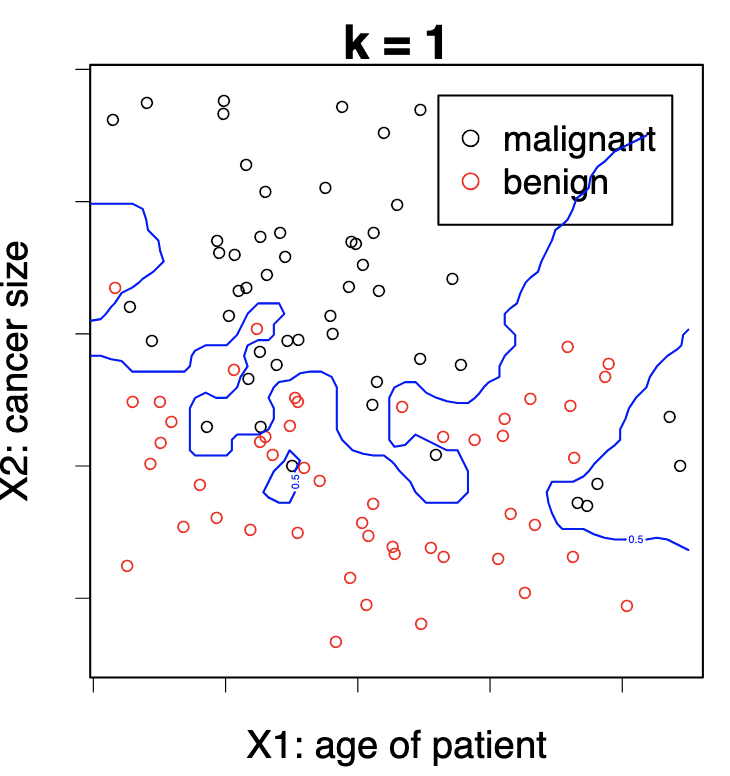{width="33%"} {width="33%"} {width="33%"}

Again, with low $k$, we tend to overfit the model to our training data.

### Handwritten characters / digits recognitions

Each pixel gives us the amount of darkness in a grey scale (0 to 9). We have 32 predictors (16 times 16, the size of the pictures). Given this predictors the system has to predict

## What is the right model?

*All models are wrong, some models are useful.*

\begin{flushright}
— George Box
\end{flushright}

In a sense its right since we would never find the model that has generated our data since Nature is too complex for this. However if they are flexible enough to capture the essence of what is happening in Nature.

*Everything should be made as simple as possible. But not simpler.*

\begin{flushright}
— Albert Einstein
\end{flushright}

We want to create a model that represents reality but we don't want to make it too complicated, if we can make it simpler without decreasing the goodness of fit, then we need to go with the simpler. In deep learning this does not apply.

\newpage

# Regression Framework

## Regression: Stochastic Framework

### The stochastic (population) model

-   We have a **quantitative response** $Y$ and $p$ **predictors** $X_1, \ldots, X_p$.

-   We assume there is a relationship between $Y$ and $X = (X_1, \ldots, X_p)$ given by\
    $$ Y = f(X) + \varepsilon $$ where $\varepsilon$ is a random error term with $\mathbb{E}(\varepsilon) = 0$ (on average, errors cancel out and there is no systematic bias in the error) and $\text{Var}(\varepsilon) = \sigma^2$ (the variability of $\varepsilon$ is constant — homoscedastic — i.e. it does not depend on $X$).

-   The function $f$ is **fixed but unknown**[^1] and represents the **systematic information** that $X$ provides about $Y$.

[^1]: It's fixed because the relationship between $X$ and $Y$ in the population exists — it’s not random. In our housing example, there really is a true relationship between size and price. And it's unknown, we don’t know what $f$ actually is, that’s what we’re trying to estimate using data. When we run a regression, we build an estimate $\hat{f}(X)$ that approximates the true (but hidden) $f(X)$.

**Example** Let: $Y =$ *house price* (in 100k) and $X =$ *size* (in $m^2$)

Then: $$Y = 2 + 0.03X + \varepsilon$$

which can be interpreted as: $\text{house price} = 2 + 0.03 \times \text{size} + \text{error}$

-   This true relationship $f(X) = 2 + 0.03X$ is called the **population regression line**.

### Random vectors and dimensionality

-   $(X, Y)$ is a $(p + 1)$-dimensional random vector. In this simulated example: $$ X \sim \mathcal{N}(0, \sigma_X^2), \quad Y = 2 + 0.03X + \mathcal{N}(0, \sigma_\varepsilon^2) $$

**Understanding why it is** $(p + 1)$-dimensional

In regression, $X$ is not just one variable — it’s a vector of predictors: $$ X = (X_1, X_2, \dots, X_p) $$

\newpage

1.  **What we mean by** $(X, Y)$

    -   Each $X_j$ represents one feature (e.g. size, number of rooms, location, etc.), and there are $p$ such features in total.
    -   The response variable $Y$ is another random variable — the outcome we want to predict (e.g. house price).
    -   So when we consider the pair $(X, Y)$ together, we’re grouping all predictors and the response into one joint random vector.

2.  **Counting the dimensions**

    -   $X$ alone has $p$ dimensions, because it contains $p$ predictor variables.
    -   $Y$ adds one more dimension (the outcome variable). Hence, when combined: $$ (X, Y) = (X_1, X_2, \dots, X_p, Y) $$
    -   This vector has $p + 1$ components → therefore, it’s a $(p + 1)$-dimensional random vector.

3.  **Why it matters**

    -   We call it a **random vector** because all its components (the predictors $X_1, \ldots, X_p$ and the response $Y$) are random variables.

    -   Their joint distribution $P(X_1, X_2, \dots, X_p, Y)$ describes how they vary together in the population.

    -   The goal of regression is to understand the **conditional relationship** between them, i.e., how $Y$ depends on $X$: $$ \mathbb{E}[Y \mid X] = f(X) $$

    -   That conditional expectation is exactly the **regression function** we try to estimate.

**Example**

At the **population level**, $(X, Y)$ represents the theoretical random vector: $$ (X, Y) = (X_1, X_2, \dots, X_p, Y) $$

Each $X_j$ is a random variable corresponding to one predictor, and $Y$ is the random response variable.

At the **observation level**, we work with realised data points — specific numerical values drawn from this population. For observation $i$, we write: $$ (x_i, y_i) = (x_{i1}, x_{i2}, \dots, x_{ip}, y_i) $$ For example, if $p = 2$ (size and number of rooms) and $Y$ is house price:

| Observation | $x_{i1}$ (size) | $x_{i2}$ (rooms) | $y_i$ (price) |
|:-----------:|:---------------:|:----------------:|:-------------:|
|      1      |       120       |        4         |      6.8      |
|      2      |       85        |        3         |      5.1      |
|      3      |       150       |        5         |      8.2      |

For the first observation: $$ (x_1, y_1) = (x_{11}, x_{12}, y_1) = (120, 4, 6.8) $$

Thus, each $(x_i, y_i)$ is one **realisation** of the $(p + 1)$-dimensional random vector $(X, Y)$.

## Regression: The Statistical Framework

### The Training Data

-   Assume we are given $n$ measurements $(x_1, y_1), \dots, (x_n, y_n)$ of $(X, Y)$, where $x_i = (x_{i1}, \dots, x_{ip})^\top$, and
    -   the inputs $x_i \in \mathbb{R}^p$ are called **predictors**
    -   the outputs $y_i$ are called **responses**
-   We will use this data to **learn** the unknown relationship $f$ between $Y$ and $X$, i.e., to **train** (or **estimate**) a predictive model $\hat{f}$

**Example** : $[Y = \text{house price (100k)}; \quad X = \text{size (m}^2)]$; $\text{house price} \approx \hat{f}(\text{size}) = 2.977 + 0.027 \times \text{size}$

-   The training data are realizations of the random vector $(X, Y)$:

| Observation  | X (Size in m²) | Y (House Price in 100k) |
|--------------|:--------------:|:-----------------------:|
| $(x_1, y_1)$ |      327       |           9.0           |
| $(x_2, y_2)$ |      154       |           7.9           |
| $(x_3, y_3)$ |      233       |           8.7           |

### Why do we estimate $f$?

1.  **Prediction** : Machine Learning

-   A set of inputs $X$ are readily available, but $Y$ cannot be easily obtained.
-   We can predict $Y$ by: $\hat{Y} = \hat{f}(X)$ where $\hat{f}$ is our **predictive model** for $f$.
-   The function $\hat{f}$ is often treated as a **black box**: we are not concerned with the exact form of $\hat{f}$ provided it yields good prediction for $Y$.

2.  **Inference**: Classical Multivariate Analysis

-   We are often interested in understanding **how** $Y$ is affected as $X_1, \dots, X_p$ change.
-   Cannot treat $\hat{f}$ as a black box; we need to know the exact form.
-   We want to answer questions such as:
    -   Which predictor is associated with the response?
    -   What is the relationship of the response and each predictor (positive, negative, ...)?
    -   Is the relationship linear or more complicated?
    -   etc.

## What is a good $\hat{f}$?

### Understanding the optimal prediction

-   For a fixed value of $X$, say $X = 3$, we want to know what would be an **optimal prediction** $\hat{f}(X)$ for the response $Y$.

-   Since the relationship between $X$ and $Y$ is stochastic,[^2] there might be **many different observed values** of $Y$ corresponding to the same $X = 3$. A **good** $\hat{f}$ is the function that **minimises the expected squared prediction error**: $\hat{f}(X) = \mathbb{E}[Y \mid X]$

[^2]: Since that relationship it involves random variation, it is not perfectly deterministic .

<!-- -->

-   In particular, for $X = 3$: $\hat{f}(3) = \mathbb{E}[Y \mid X = 3]$. That means $\hat{f}(3)$ gives the **expected value (average)** of $Y$ for all observations where $X = 3$.

In other words, among all possible prediction functions, the conditional expectation $\mathbb{E}[Y \mid X]$ is **optimal** in the sense that it minimises the **mean squared error (MSE)**: $$ \mathbb{E}[(Y - f(X))^2] $$

Geometrically, if you look at all points with the same $X = 3$, their $Y$-values vary due to noise. The best prediction $\hat{f}(3)$ is the **centre** of that distribution, i.e. the average $Y$ value for that $X$.

### Visual interpretation

\begin{minipage}{0.38\textwidth}
\vspace*{\fill}
\begin{figure}[H]
\centering
\includegraphics[width=0.95\linewidth]{Images_qmd_ML/ML2_fhat.png}
\caption{\footnotesize What is a good $\hat{f}$?}
\label{fig:fhat-ml2}
\end{figure}
\vspace*{\fill}
\end{minipage}
\hfill
\begin{minipage}{0.58\textwidth}
\textbf{As we see in the plot on the left:}

\begin{itemize}
  \setlength\itemsep{0.2em}
  \item The \textbf{red curve} represents $\hat{f}(X)$, the \emph{conditional mean} of $Y$ given $X$.
  \item For each value of $X$, $\hat{f}(X)$ passes through the \emph{average height} of the cloud of observed points.
  \item This illustrates how the regression function captures the \textbf{systematic (non-random)} trend in the data, summarising the central tendency of $Y$ as $X$ changes.
\end{itemize}
\end{minipage}

## The Loss Function

### Defining what a “good” prediction means

To decide what makes a **good prediction**, we need a way to measure how far a predicted value $\hat{y}$ is from the true value $y$. This is done through a **loss function** $L$, which quantifies the **discrepancy** between prediction and reality.

### Squared Error Loss

In regression, the most common choice is the **squared error loss**: $$L(y, \hat{y}) = (y - \hat{y})^2$$

This loss penalises large errors more heavily than small ones, because the difference is squared.

### Expected squared prediction error

For a predictive model $\hat{f}$, we can define the **expected loss**, that is, the expected squared prediction error across all possible pairs $(X, Y)$: $$ \text{Err}_{\hat{f}} = \mathbb{E}\{[Y - \hat{f}(X)]^2\} $$

Here, the expectation $\mathbb{E}$ is taken over the joint distribution of $(X, Y)$. It tells us the *average squared distance* between our predictions and the true outcomes in the population.

### Finding the optimal predictor

Ideally, we would like to find a function $f^*$ that **minimises** this expected error: $$ f^* = \arg \min_f \, \mathbb{E}\{[Y - f(X)]^2\} $$

This function $f^*$ is called the **regression function**.

### The optimal regression function

It can be shown (and we’ll later prove) that the function minimising the expected squared error is: $$ f^*(x) = \mathbb{E}[Y \mid X = x] $$

That is, the **conditional expectation** of $Y$ given $X = x$.

This satisfies the population model: $$ Y = f(X) + \varepsilon, \quad \text{where} \quad \mathbb{E}(\varepsilon) = 0. $$

------------------------------------------------------------------------

-   The loss function $L(y, \hat{y})$ defines how we measure mistakes.
-   The expected loss $\text{Err}_{\hat{f}}$ defines how well our model performs on average.
-   The best possible function $f^*$ (the **regression function)** predicts the *mean value* of $Y$ given $X$, because this minimises the expected squared error.

## How do we estimate $\hat{f}$ ?

In theory, we know that the optimal prediction function is the **conditional expectation**:$f^*(x) = \mathbb{E}[Y \mid X = x]$. However, in practice, we often have **few or no observations** with exactly the same $X$ value. For instance, there might be few or no data points where $X = 3$. Therefore, we **cannot compute** $\mathbb{E}[Y \mid X = 3]$ directly from the data.

What we can do to estimate $\hat{f}(x)$ in practice is to approximate the expectation ($\mathbb{E}[Y \mid X = x]$) using nearby observations to approximate. One simple and intuitive method is **k-Nearest Neighbours (k-NN) regression**.

### The k-Nearest Neighbours approach

The **k-Nearest Neighbours (k-NN)** method estimates $\hat{f}(x_0)$ by averaging the $Y$ values of the $k$ data points whose $X_i$ values are closest to $x_0$: $$\hat{f}(x_0) = \text{Ave}(Y \mid X \in N_k(x_0))$$where:

-   $N_k(x_0)$ is the set of the $k$ observations $(x_i, y_i)$ whose $x_i$ values are closest to $x_0$.

-   The **number** $k$ is a **tuning parameter**, i.e. it controls how “local” or “smooth” the estimate is.

    -   If $k$ is **small**, $\hat{f}(x_0)$ is based on very few nearby points → the estimate is **very local** and can capture detail (low bias, high variance).

    -   If $k$ is **large**, $\hat{f}(x_0)$ averages over more distant points → the estimate is **smoother** and more stable (high bias, low variance).

\begin{minipage}{0.38\textwidth}
\vspace*{\fill}
\begin{figure}[H]
\centering
\includegraphics[width=0.95\linewidth]{Images_qmd_ML/ML2_fhat_knn.png}
\caption{\footnotesize Estimating $\hat{f}$ with kNN}
\label{fig:fhat-knn}
\end{figure}
\vspace*{\fill}
\end{minipage}
\hfill
\begin{minipage}{0.58\textwidth}
\textbf{As we see in the plot on the left:}

\begin{itemize}
  \setlength\itemsep{0.2em}
  \item The \textbf{vertical solid line} marks the target point $x_0 = 3$.
  \item The \textbf{dashed vertical lines} indicate the neighbourhood $N_k(x_0)$, which contains the $k$ nearest observations around $x_0$.
  \item The \textbf{average of the $Y$ values} within this neighbourhood provides $\hat{f}(3)$ — the \emph{estimated regression value} at $X = 3$.
\end{itemize}
\end{minipage}

### Limitations of k-Nearest Neighbours

**Nearest neighbour averaging** works well when the number of predictors (dimension) $p$ is **small**, and the training dataset size $n$ is **large**.

However, when the number of predictors $X_1, \ldots, X_p$ increases, **kNN does not perform well**. This problem is known as the **curse of dimensionality**.

### The curse of dimensionality

As the number of predictors $p$ grows an data points become **sparser** in high-dimensional space. Therefore, the notion of “closeness” loses meaning since even the nearest neighbours are far away. As a result, the **averages become unreliable**, and the kNN estimate $\hat{f}(x)$ becomes noisy.

### Towards structured methods

We will therefore study **structured methods** that:

-   need **less data** to fit,
-   may be more **interpretable**,
-   but come at the cost of **lower flexibility**.

The key challenge is to find a good **compromise** between:

-   **flexibility** (capturing complex relationships), and
-   **parsimony** (simplicity and interpretability).

## The empirical loss: model evaluation

### Why the true error is unknown

The **expected prediction error** is a *theoretical quantity*: $$\text{Err}_{\hat{f}} = \mathbb{E}\{[Y - \hat{f}(X)]^2\}$$

It represents the **average squared difference** between the true $Y$ values and the model’s predictions $\hat{f}(X)$ across the entire population.

However, since we only have a finite dataset, we do **not know** the true joint distribution $P(X, Y)$. That means we cannot compute this expectation exactly, because we do not know *all possible* pairs $(x, y)$ in the population.

Therefore, to approximate $\text{Err}_{\hat{f}}$, we use a new, independent sample, called the **test dataset**: $$\mathcal{T}_m = \{(\tilde{x}_1, \tilde{y}_1), \ldots, (\tilde{x}_m, \tilde{y}_m)\}.$$

-   For each input $\tilde{x}_i$, we **predict** the response using our model:$$ \hat{y}_i = \hat{f}(\tilde{x}_i) $$
-   We then **compare** these predictions $\hat{y}_i$ with the observed outputs $\tilde{y}_i$.

The **empirical prediction error** (also called the **Mean Squared Error**, MSE) is: $$\text{err}_{\hat{f}} = \frac{1}{m} \sum_{i=1}^{m} [\tilde{y}_i - \hat{f}(\tilde{x}_i)]^2$$

This quantity estimates the expected squared prediction error using the available data.

We square the error for three main reasons:

1.  **To penalise large errors more strongly:**\
    Squaring makes large deviations more costly — an error of 4 is *four times* worse than an error of 2.
2.  **To avoid cancellation of positive and negative errors:**\
    Without squaring (or taking absolute values), overestimates and underestimates would cancel each other out.
3.  **For mathematical and statistical convenience:**\
    The squared loss is smooth and convex, making optimisation easier.\
    Moreover, minimising the expected squared loss leads directly to the **regression function**: $$f^*(X) = \mathbb{E}[Y \mid X]$$

### Practical use

-   In practice, we **split** our data into **training** and **test** sets.
-   The training data are used to **fit** $\hat{f}$, while the test data are used to **evaluate** its performance.
-   When data are limited, we use **cross-validation**, which rotates the training and test roles to get a reliable estimate.
-   To obtain a more reliable measure of performance, we use **cross-validation**, which consists of:
    -   Dividing the dataset into $K$ subsets (called “folds”);
    -   Training the model on $K-1$ folds and testing it on the remaining one;
    -   Repeating this process $K$ times and averaging the test errors.

This ensures that every observation is used for both training and testing, giving a more robust estimate of the model’s predictive accuracy.

| Concept | Definition | Interpretation |
|:-----------------------|:-----------------------|:-----------------------|
| $\text{Err}_{\hat{f}}$ | $\mathbb{E}\{[Y - \hat{f}(X)]^2\}$ | True (theoretical) expected error |
| $\text{err}_{\hat{f}}$ | $\frac{1}{m} \sum_{i=1}^{m} [\tilde{y}_i - \hat{f}(\tilde{x}_i)]^2$ | Empirical estimate (MSE) from test data |

> The squared loss penalises large errors and ensures all deviations are positive, giving a smooth, interpretable measure of how well $\hat{f}$ generalises to unseen data.

# Linear Regression

## Simple Linear regression

**Recall the stochastic model:** we start from the general regression framework: $Y = f(X) + \varepsilon$ where $\varepsilon$ is a random error term with $\mathbb{E}(\varepsilon) = 0$ and $\text{Var}(\varepsilon) = \sigma^2$.

**The simple linear model**

In **simple linear regression**, we assume that the relationship between $Y$ and $X$ is **linear**: $f(X) = \beta_0 + \beta_1 X$, where:

-   $\beta_0$ is the **intercept**, i.e., the predicted value of $Y$ when $X = 0$;

-   $\beta_1$ is the **slope** — the expected change in $Y$ for a one-unit increase in $X$.

Together, $\beta_0$ and $\beta_1$ are called the **model coefficients** or **parameters**.

In order to apply linear regression in practice, we first **split the data** into **training** and **test** sets. For the training data, suppose we observe $n$ data points: $\{(x_i, y_i)\}_{i=1}^{n}$. We then use these observations to estimate the parameters $(\beta_0, \beta_1)$, obtaining their fitted (sample) estimates: $(\hat{\beta}_0, \hat{\beta}_1)$ For each observation $i$:

-   The **fitted value** (predicted response) is $$\hat{y}_i = \hat{f}(x_i) = \hat{\beta}_0 + \hat{\beta}_1 x_i$$

-   The **residual** (prediction error) is $$e_i = y_i - \hat{y}_i$$

Each residual measures how far the model’s prediction is from the actual observed value of $Y$.

Finally, to measure the total prediction error across all observations, we compute the **Residual Sum of Squares (RSS):** $$ \text{RSS}(\hat{\beta}_0, \hat{\beta}_1) = e_1^2 + e_2^2 + \dots + e_n^2 $$

or equivalently, $$ \text{RSS}(\hat{\beta}_0, \hat{\beta}_1) = \sum_{i=1}^{n} (y_i - \hat{f}(x_i))^2 = \sum_{i=1}^{n} (y_i - \hat{\beta}_0 - \hat{\beta}_1 x_i)^2 $$

Minimising this RSS gives the **least squares estimates** $\hat{\beta}_0$ and $\hat{\beta}_1$ — the line that best fits the data in the least-squares sense.

\begin{minipage}{0.38\textwidth}
\vspace*{\fill}
\begin{figure}[H]
\centering
\includegraphics[width=0.95\linewidth]{Images_qmd_ML/ML2_SLR.png}
\caption{\footnotesize Simple Linear Regression: true function vs. estimated function}
\label{fig:slr-lines}
\end{figure}
\vspace*{\fill}
\end{minipage}
\hfill
\begin{minipage}{0.58\textwidth}
\textbf{As we see in the plot on the left:}

\begin{itemize}
  \setlength\itemsep{0.2em} % tighter spacing between bullet points
  \item The \textbf{red line} represents the \emph{true} function $f(X) = \beta_0 + \beta_1 X$, which is generally unknown.
  \item The \textbf{blue line} represents the \emph{estimated} regression line $\hat{f}(X) = \hat{\beta}_0 + \hat{\beta}_1 X$.
  \item The \textbf{vertical grey lines} show the residuals $e_i = y_i - \hat{y}_i$, i.e., the differences between the observed and fitted values.
\end{itemize}

The goal of linear regression is to make the estimated line $\hat{f}(X)$ as close as possible to the true underlying relationship $f(X)$ by minimising the RSS.
\end{minipage}

## Estimation of parameters by least squares

To estimate the coefficients $(\beta_0, \beta_1)$ of the simple linear model, we choose the values that **minimise the Residual Sum of Squares (RSS):** $$(\hat{\beta}_0, \hat{\beta}_1) = \arg\min_{(\beta_0, \beta_1) \in \mathbb{R}^2} \text{RSS}(\beta_0, \beta_1)$$

where $$\text{RSS}(\beta_0, \beta_1) = \sum_{i=1}^{n} (y_i - \beta_0 - \beta_1 x_i)^2$$

This means we are finding the intercept and slope that make the predicted values $\hat{y}_i = \beta_0 + \beta_1 x_i$ as close as possible to the actual $y_i$, in the least-squares sense.

So, **how do we solve the optimisation problem?**.

There are two main approaches to find $(\hat{\beta}_0, \hat{\beta}_1)$:

1.  **Numerically**, using computer algorithms such as **gradient descent**, which iteratively adjusts the coefficients to reduce the RSS.
2.  **Analytically**, by **differentiation** — setting the partial derivatives of the RSS with respect to $\beta_0$ and $\beta_1$ to zero and solving the system of equations.

The analytical (closed-form) solutions are:

$$\hat{\beta}_1 = \frac{\sum_{i=1}^{n}(x_i - \bar{x})(y_i - \bar{y})}{\sum_{i=1}^{n}(x_i - \bar{x})^2}$$

$$\hat{\beta}_0 = \bar{y} - \hat{\beta}_1 \bar{x}$$

where $\bar{x} = \frac{1}{n} \sum_{i=1}^{n} x_i$ and $\bar{y} = \frac{1}{n} \sum_{i=1}^{n} y_i$ are the **sample means** of $X$ and $Y$ respectively.

Therefore, $\hat{\beta}_1$ measures the **average change in** $Y$ associated with a one-unit increase in $X$, whereas $\hat{\beta}_0$ is the **predicted value of** $Y$ when $X = 0$. Both coefficients are calculated so that the **sum of squared residuals** is as small as possible.

### Randomness of the estimates

The estimates $(\hat{\beta}_0, \hat{\beta}_1)$ are **random variables**, not fixed numbers. This is because if we collected a new training dataset (another random sample from the same population) we would obtain slightly different estimates.

\begin{minipage}{0.6\textwidth}
\textbf{In the plot on the right:}

\begin{itemize}
  \item The \textbf{red line} represents the true model $f(X) = \beta_0 + \beta_1 X$.
  \item The \textbf{blue line} shows the estimated regression line $\hat{f}(X) = \hat{\beta}_0 + \hat{\beta}_1 X$.
  \item The \textbf{grey lines} correspond to regression lines obtained from other random samples, illustrating how $(\hat{\beta}_0, \hat{\beta}_1)$ vary due to sampling variability.
\end{itemize}
\end{minipage}
\hfill
\begin{minipage}{0.35\textwidth}
\begin{figure}[H]
\centering
\includegraphics[width=\linewidth]{Images_qmd_ML/ML2_SLR_est.png}
\caption{Sampling variability in least squares estimates}
\label{fig:slr-estimation}
\end{figure}
\end{minipage}

## Advertising data

## Multiple Linear Regression

We now consider $p$ predictors $X = (X_1, \ldots, X_p)$ for the response variable $Y$. The model becomes: $$Y = \beta_0 + \beta_1 X_1 + \beta_2 X_2 + \cdots + \beta_p X_p + \varepsilon$$

where $\beta_0$ is the intercept (the predicted value of $Y$ when all predictors are 0), $\beta_j$ for $j = 1, \ldots, p$ are the coefficients representing the partial effect of each predictor $X_j$, and $\varepsilon$ is the random error term.

**Intuition:**\
This is the natural extension of simple linear regression to multiple predictors. In simple regression, $Y$ varies with a single $X$, forming a **line** in 2D space.\
With multiple predictors, the model defines a **hyperplane** in $(p + 1)$-dimensional space, since each predictor adds one dimension. Moreover, each coefficient $\beta_j$ tells us how $Y$ changes *on average* when $X_j$ increases by one unit, while all other predictors are held constant.

**Example: The Advertising dataset**

For instance, suppose we study how different types of media advertising affect sales. Then our model could be: $$\text{sales} = \beta_0 + \beta_1 \times \text{TV} + \beta_2 \times \text{radio} + \beta_3 \times \text{newspaper} + \varepsilon$$

Here: $Y =$ sales, $X_1 =$ TV advertising budget, $X_2 =$ radio budget, $X_3 =$ newspaper budget.

Each predictor contributes independently to explaining $Y$. The regression finds the “best-fitting” hyperplane that minimises the total squared distance between the observed and predicted sales values.

### Matrix form of the training data

We observe $n$ data points $\{(x_i, y_i)\}_{i=1}^{n}$, where each $x_i = (x_{i1}, \ldots, x_{ip})^\top$ contains the $p$ predictor values for observation $i$. All predictors can be represented compactly as an $n \times p$ matrix:

$$\mathbf{X} =
\begin{bmatrix}
x_{11} & x_{12} & \cdots & x_{1p} \\
x_{21} & x_{22} & \cdots & x_{2p} \\
\vdots & \vdots & \ddots & \vdots \\
x_{n1} & x_{n2} & \cdots & x_{np}
\end{bmatrix}$$

**Intuition:** each **row** of $\mathbf{X}$ corresponds to one observation, and each **column** to one predictor (feature).\
This compact matrix notation allows us to handle all data points and predictors simultaneously, which is essential when we later express the model in vector–matrix form. In other words, $x_{11}$ would be the value for the observation $i=1$ coupled with the feature $x=1$, whereas $x_{32}$ would be the value for observation $i=3$ coupled with the feature $x=2$.

### Dot product notation

For notational convenience, we sometimes write the model using a **dot product** between vectors $x, y \in \mathbb{R}^p$: $$x^\top y = \sum_{i=1}^{p} x_i y_i = x_1 y_1 + x_2 y_2 + \cdots + x_p y_p$$

This lets us express the regression model compactly as: $$Y = \beta_0 + x^\top \beta + \varepsilon$$

**Intuition:** the dot product $x^\top \beta$ is just a concise way of combining all predictors and their coefficients:\
$\beta_1 X_1 + \beta_2 X_2 + \cdots + \beta_p X_p$. This compact form simplifies derivations and computations, it’s the same as saying we take a weighted average of predictors, where the weights are the regression coefficients. In other words, the term $x^\top \beta$ includes all coefficients except $\beta_0$, because $\beta_0$ (the intercept) is handled separately.

## Estimation and Prediction in Multiple Linear Regression

As before, we estimate the parameters $(\beta_0, \beta_1, \ldots, \beta_p)$ by minimising the **residual sum of squares (RSS)**: $$\text{RSS}(\beta_0, \ldots, \beta_p) = \sum_{i=1}^{n} (y_i - \beta_0 - x_i^\top \beta)^2$$

Expanding the dot product $x_i^\top \beta$ gives $$\text{RSS}(\beta_0, \ldots, \beta_p) = \sum_{i=1}^{n} (y_i - \beta_0 - \beta_1 x_{i1} - \cdots - \beta_p x_{ip})^2$$

This expression measures how far the model’s predictions are from the true observed values, across all $n$ observations. The parameter estimates $(\hat{\beta}_0, \hat{\beta}_1, \ldots, \hat{\beta}_p)$ are the values that **minimise** this total squared error.

**Intuition:** this generalises the simple linear regression idea — we’re fitting a *hyperplane* rather than a line. Each coefficient $\beta_j$ tells us how $Y$ changes when predictor $X_j$ increases by one unit, **holding all other predictors constant**. The minimisation process finds the hyperplane that best fits all the data points in $p$-dimensional space by minimising the vertical distances (residuals).

### Making Predictions

Once the parameters are estimated, we can predict the response for a new observation $x_0 = (x_{01}, \ldots, x_{0p})$ using $$\hat{y}_0 = \hat{\beta}_0 + x_0^\top \hat{\beta}$$ or equivalently $$\hat{y}_0 = \hat{\beta}_0 + \hat{\beta}_1 x_{01} + \cdots + \hat{\beta}_p x_{0p}$$ where $\hat{\beta} = (\hat{\beta}_1, \ldots, \hat{\beta}_p)$.

Here, the new point $x_0$ represents a new combination of predictor values (e.g. TV, radio, and newspaper budgets). By plugging these into the model, we obtain the **predicted response** $\hat{y}_0$, which lies on the estimated regression surface.

\begin{minipage}{0.6\textwidth}
\textbf{In the 3D plot on the right:}
\begin{itemize}
  \item The \textbf{green–blue surface} represents the fitted regression plane (the model $\hat{f}(X)$).
  \item The \textbf{red points} are the observed data points $(x_{i1}, x_{i2}, y_i)$.
  \item The \textbf{vertical red lines} show residuals — the distances between the actual values and the fitted surface.
\end{itemize}

\textbf{Intuition:} when we move from simple to multiple regression, we replace the best-fitting line with the best-fitting \textit{plane} (or \textit{hyperplane} in higher dimensions). The same least-squares principle applies: the plane is positioned to minimise the overall squared vertical distances between the observed points and the regression surface.
\end{minipage}
\hfill
\begin{minipage}{0.35\textwidth}
\begin{figure}[H]
\centering
\includegraphics[width=\linewidth]{Images_qmd_ML/ML2_3d.png}
\caption{Fitted regression plane in multiple linear regression}
\label{fig:mlr-3d}
\end{figure}
\end{minipage}

## Estimation and Prediction in Multiple Linear Regression

As before, we estimate the parameters $(\beta_0, \beta_1, \ldots, \beta_p)$ by minimising the **residual sum of squares (RSS)**: $$\text{RSS}(\beta_0, \ldots, \beta_p) = \sum_{i=1}^{n} (y_i - \beta_0 - x_i^\top \beta)^2$$

Expanding the dot product $x_i^\top \beta$ gives $$\text{RSS}(\beta_0, \ldots, \beta_p) = \sum_{i=1}^{n} (y_i - \beta_0 - \beta_1 x_{i1} - \cdots - \beta_p x_{ip})^2$$

This expression measures how far the model’s predictions are from the true observed values, across all $n$ observations. The parameter estimates $(\hat{\beta}_0, \hat{\beta}_1, \ldots, \hat{\beta}_p)$ are the values that **minimise** this total squared error.

**Intuition:** this generalises the simple linear regression idea — we’re fitting a *hyperplane* rather than a line. Each coefficient $\beta_j$ tells us how $Y$ changes when predictor $X_j$ increases by one unit, **holding all other predictors constant**. The minimisation process finds the hyperplane that best fits all the data points in $p$-dimensional space by minimising the vertical distances (residuals).

### Making Predictions

Once the parameters are estimated, we can predict the response for a new observation $x_0 = (x_{01}, \ldots, x_{0p})$ using $$\hat{y}_0 = \hat{\beta}_0 + x_0^\top \hat{\beta}$$ or equivalently $$\hat{y}_0 = \hat{\beta}_0 + \hat{\beta}_1 x_{01} + \cdots + \hat{\beta}_p x_{0p}$$ where $\hat{\beta} = (\hat{\beta}_1, \ldots, \hat{\beta}_p)$.

**Intuition:** the new point $x_0$ represents a new combination of predictor values (e.g. TV, radio, and newspaper budgets). By plugging these into the model, we obtain the **predicted response** $\hat{y}_0$, which lies on the estimated regression surface.

### Visual Interpretation

In the 3D plot on the right: - The **green–blue surface** represents the fitted regression plane (the model $\hat{f}(X)$).\
- The **red points** are the observed data points $(x_{i1}, x_{i2}, y_i)$.\
- The **vertical red lines** show residuals — the distances between actual values and the fitted surface.

**Intuition:** when we move from simple to multiple regression, we replace the best-fitting line with the best-fitting *plane* (or *hyperplane* in higher dimensions). The same least-squares principle applies: the plane is positioned to minimise the overall squared vertical distances between the data points and the surface.

## Advertising Data

The **Advertising** dataset is a classic example of multiple linear regression, where we try to predict **sales** (in thousands of units) from the amount spent on different media types. We fit the model $$\text{sales} = \beta_0 + \beta_1 \times \text{TV} + \beta_2 \times \text{radio} + \beta_3 \times \text{newspaper} + \varepsilon$$

| Coefficient   | Estimate | Std. Error | t value | p-value  |
|:--------------|:--------:|:----------:|:-------:|:--------:|
| **Intercept** |  2.939   |   0.3119   |  9.42   | \< 2e−16 |
| **TV**        |  0.046   |   0.0014   |  32.81  | \< 2e−16 |
| **radio**     |  0.189   |   0.0086   |  21.89  | \< 2e−16 |
| **newspaper** |  −0.001  |   0.0059   |  −0.18  |  0.8599  |

The **intercept** (2.939) represents the expected sales when all advertising budgets are zero. The **TV** and **radio** coefficients are positive and highly significant ($p < 2e−16$), meaning they have a clear effect on sales. The **newspaper** coefficient is near zero and not statistically significant ($p = 0.8599$), suggesting newspaper advertising has little to no predictive power in this model.

**Intuition:** each coefficient tells us how much sales are expected to change, on average, for a one-unit increase in that advertising budget, **holding other media constant**.

### Correlations Among Predictors

|               | TV  | radio  | newspaper |
|:--------------|:---:|:------:|:---------:|
| **TV**        |  1  | 0.0548 |  0.0567   |
| **radio**     |     |   1    |   0.354   |
| **newspaper** |     |        |     1     |

**Intuition:** correlations among predictors help us detect **multicollinearity** — when predictors are correlated with each other. Here, the correlations are low (except a moderate 0.354 between radio and newspaper), so multicollinearity is not a major issue.

## Example: The Auto Data Set

The **Auto** dataset contains measurements for $n = 397$ cars, such as **mpg** (miles per gallon), **horsepower**, **year**, etc. We can fit the model $$\text{mpg} = \beta_0 + \beta_1 \times \text{horsepower} + \beta_2 \times \text{horsepower}^2 + \varepsilon$$

Even though this model includes $\text{horsepower}^2$, it is still a **linear model** in the parameters $(\beta_0, \beta_1, \beta_2)$, since no coefficients are raised to a power.

**Intuition:** here, $X_1 = \text{horsepower}$ and $X_2 = \text{horsepower}^2$. By including the squared term, the model captures curvature since the relationship between horsepower and mpg is not strictly linear but decreases more steeply at higher horsepower levels.

In this case, both $\beta_1$ and $\beta_2$ are statistically significant, meaning the quadratic relationship is meaningful. Even higher-order polynomials (degree 3, 4, 5, etc.) can also be fitted to capture more complex patterns, but doing so increases the risk of **overfitting**.

\begin{minipage}{0.35\textwidth}
\begin{figure}[H]
\centering
\includegraphics[width=\linewidth]{Images_qmd_ML/ML2_auto_poly.png}
\caption{Different degrees Polynomial Regressions}
\label{fig:auto-poly}
\end{figure}
\end{minipage}
\hfill
\begin{minipage}{0.6\textwidth}
\begin{itemize}
  \item The \textbf{yellow line} represents a simple linear fit (degree 1).
  \item The \textbf{blue curve} (degree 2) captures curvature and fits the data better.
  \item The \textbf{green curve} (degree 5) fits the data even more closely but may overfit small variations.
\end{itemize}

The goal is to strike a balance between \textbf{bias} (oversimplification) and \textbf{variance} (overfitting) when choosing model complexity.
\end{minipage}

## Beyond Linearity: Linear Basis Functions

Most often, the true function $f(X)$ is not linear in the predictors $X_1, \ldots, X_p$. However, we can adjust the linear model by transforming the predictors.

Instead of using $X = (X_1, \ldots, X_p)$ directly, we consider transformations of them. Let $h_m(X): \mathbb{R}^p \rightarrow \mathbb{R}$ be the $m$th transformation, for $m = 1, \ldots, M$. The model becomes $$f(X) = \sum_{m=1}^{M} \beta_m h_m(X)$$

This model is still **linear in the parameters** $\beta_1, \ldots, \beta_M$, but **nonlinear in the predictors** $X$. The functions $h_1(X), \ldots, h_M(X)$ are called **basis functions**, and estimation or prediction can be applied as before using least squares.

By using basis functions, we can bend or reshape the linear model to capture more complex relationships between $X$ and $Y$, i.e., without losing the simplicity of linear estimation. The model is “linear” in $\beta$ but flexible in $X$.

### Possible Choices for the Basis Functions $h_m(X)$

-   $h_m(X) = X_m$, for $m = 1, \ldots, p$: essentially recovers the original linear model.\
-   $h_m(X) = X_j^2$ or $h_m(X) = X_j X_k$: allows higher-order polynomial terms or interactions between predictors.\
-   $h_m(X) = \log(X_j)$ or $h_m(X) = \sqrt{X_j}$: captures other nonlinear transformations.\
-   etc.

**Intuition:** each $h_m(X)$ acts as a new transformed version of the original predictors, expanding the feature space to better approximate the true relationship $f(X)$. Linear regression then finds the best linear combination of these transformed predictors.

# Gradient Descent

In least squares regression, we often minimise the residual sum of squares (RSS) to estimate the coefficients. Here, for simplicity, we fix $\beta_1$ to its true value $\beta_1^*$ and only estimate $\beta_0$ by least squares.

In gradient descent, the **cost function** (often denoted as $J(\theta)$ or $L(\theta)$) is the mathematical expression that measures how wrong the model is, that is, how far the model’s predictions are from the true values. It tells us how costly a particular choice of parameters $\theta$ (like $\beta_0$, $\beta_1$, …) is.

The goal of gradient descent is to find the parameters $\theta$ that **minimise the cost function**, i.e., make the model as accurate as possible. In this case, to find the value of $\beta_0$ that minimises $$\hat{\beta}_0 = \arg\min_{\beta_0 \in \mathbb{R}} \text{RSS}(\beta_0) = \arg\min_{\beta_0 \in \mathbb{R}} J(\beta_0)$$

-   $\hat{\beta}_0$: this is the **estimated intercept**. The hat indicates it’s an estimate obtained from the data, not the true parameter.

-   $\arg\min$: this stands for *“argument of the minimum.”* It means: find the value of $\beta_0$ that minimises the expression following it. For example, if you think of a function $f(x)$, $\arg\min_x f(x)$ gives the $x$ that produces the lowest possible value of $f(x)$.

-   $\beta_0 \in \mathbb{R}$: the parameter $\beta_0$ is a real number.

-   $\text{RSS}(\beta_0)$: this is the **Residual Sum of Squares** as a function of $\beta_0$. It measures the total squared difference between the observed $y_i$ and the predicted values given $\beta_0$:\
    $$\text{RSS}(\beta_0) = \sum_{i=1}^{n} (y_i - \beta_0 - \beta_1 x_i)^2$$\
    Since $\beta_1$ is fixed here, RSS only changes with $\beta_0$.

-   $J(\beta_0)$: this is a **generic name for the cost function**. In optimisation problems, we often denote the function to be minimised as $J(\cdot)$. Here, $J(\beta_0)$ is simply another name for $\text{RSS}(\beta_0)$.

## The Gradient Descent Algorithm

-   Start with an arbitrary initial value $\beta_0^{(0)} \in \mathbb{R}$.\
-   In the $i$th step:
    -   Compute the **gradient** (or derivative) of the cost function $J$ at the current position $\beta_0^{(i-1)}$:\
        $$\nabla J(\beta_0^{(i-1)}) = \frac{\partial J(\beta_0)}{\partial \beta_0} \Big|_{\beta_0 = \beta_0^{(i-1)}}$$
    -   Update your estimate using:\
        $$\beta_0^{(i)} = \beta_0^{(i-1)} - \alpha \nabla J(\beta_0^{(i-1)})$$\
        where $\alpha$ is a **tuning parameter** known as the **learning rate**.
-   Repeat until convergence, i.e. when $\beta_0^{(i)}$ changes very little or not at all.

\begin{minipage}{0.55\textwidth}
\textbf{} Gradient descent is an iterative algorithm that adjusts parameters step by step in the direction that most rapidly decreases the cost function (here, RSS). The learning rate $\alpha$ controls how large each step is:
\begin{itemize}
  \item If $\alpha$ is too small → convergence is very slow.  
  \item If $\alpha$ is too large → the algorithm may overshoot and fail to converge.  
\end{itemize}
This process continues until the algorithm reaches the minimum of $J(\beta_0)$, i.e., the point where its slope is zero.
\end{minipage}
\hfill
\begin{minipage}{0.4\textwidth}
\begin{figure}[H]
\centering
\includegraphics[width=\linewidth]{Images_qmd_ML/ML2_gradient.png}
\caption{Gradient descent minimising the cost function $J(\beta_0)$}
\label{fig:gradient-descent}
\end{figure}
\end{minipage}

## Gradient Descent: Higher Dimensions

In multiple linear regression, we estimate both $\beta_0$ and $\beta_1$ (and, in general, all $\beta_j$ for $j = 1, \dots, p$) by minimising the cost function:

$$(\hat{\beta}_0, \hat{\beta}_1) = \arg\min_{(\beta_0, \beta_1) \in \mathbb{R}^2} \text{RSS}(\beta_0, \beta_1) = \arg\min_{\theta \in \mathbb{R}^d} J(\theta)$$

Here $\theta = (\beta_0, \beta_1)^\top$ denotes the parameter vector, and $J(\theta)$ (or RSS) measures the total squared error between predictions and observed values.

## The Gradient Descent Algorithm (in multiple dimensions)

-   Start with an arbitrary initial value $\theta^{(0)} \in \mathbb{R}^d$.
-   In the $i$th step:
    -   Compute the **gradient** of the cost function $J$ at the current position $\theta^{(i-1)}$:\
        $$\nabla J(\theta^{(i-1)}) = \frac{\partial J(\theta)}{\partial \theta} \Big|_{\theta = \theta^{(i-1)}} \in \mathbb{R}^d$$
    -   Update your estimate using:\
        $$\theta^{(i)} = \theta^{(i-1)} - \alpha \nabla J(\theta^{(i-1)}) \in \mathbb{R}^d$$ where $\alpha$ is the **learning rate** (a tuning parameter controlling the step size).
-   Stop when the algorithm **converges**, i.e. when $\theta^{(i)}$ changes very little or not at all.

\begin{minipage}{0.45\textwidth}
\begin{itemize}
  \item The plot shows **contour lines** of the cost surface $J(\beta_0, \beta_1)$, where each line connects points with equal RSS.
  \item The **red dot** marks the minimum — the optimal pair $(\hat{\beta}_0, \hat{\beta}_1)$.
  \item Gradient descent iteratively updates $(\beta_0, \beta_1)$, moving step by step along the steepest downward direction until it reaches the centre.
\end{itemize}
\end{minipage}
\hfill
\begin{minipage}{0.5\textwidth}
\begin{figure}[H]
\centering
\includegraphics[width=\linewidth]{Images_qmd_ML/ML2_gradient_2d.png}
\caption{Gradient descent in higher dimensions: contour plot of the cost function $J(\beta_0, \beta_1)$.}
\label{fig:gradient-2d}
\end{figure}
\end{minipage}

## Gradient Descent: Remarks

Gradient descent is a general optimisation algorithm used to find the parameter values that minimise a cost (or objective) function $J(\theta)$.nFormally, it solves the problem $\arg\min_{\theta \in \mathbb{R}^d} J(\theta)$.

## Key Points

-   The essential components are:

    -   The **objective function** $J(\theta)$, which measures model error or loss.
    -   Its **derivatives** (gradients) in all directions, denoted $\nabla J$.

-   The **gradient** $\nabla J(\theta)$ is the collection of **derivatives** of $J$ with respect to each parameter in $\theta$.\
    Intuitively, a derivative measures how much the cost function $J$ changes when one parameter changes slightly.\
    In one dimension, it’s just the slope $\frac{dJ}{d\theta}$; in multiple dimensions, the gradient vector\
    $\nabla J(\theta) = \left[\frac{\partial J}{\partial \beta_0}, \frac{\partial J}{\partial \beta_1}, \ldots, \frac{\partial J}{\partial \beta_p}\right]^\top$\
    points in the direction of the **steepest increase** of $J$ at point $\theta$. Therefore, gradient descent moves **in the opposite direction** — the direction of the **steepest decrease** — to minimise $J(\theta)$.

-   **Important restriction:** the function $J$ must be **differentiable**. Otherwise, gradients cannot be computed.

-   Gradient descent is a **generic numerical method** that typically finds a **local minimum** of $J(\theta)$.

-   If $J(\theta)$ is **convex**, then the local minimum is also the **global minimum**, and convergence is guaranteed.

-   The **tuning parameter** $\alpha$, also called the **learning rate**, determines how large each update step is. It must be carefully chosen or adapted. If too large, the algorithm overshoots the minimum; if too small, it converges very slowly.

-   In complex or high-dimensional models, gradient descent is often the **only feasible way** to find even a local minimum.

-   Depending on the model, there exist several **variants and approximations**, such as:

    -   **Stochastic Gradient Descent (SGD)**: uses a subset (batch) of data per iteration.
    -   **Backpropagation**: applies gradient descent efficiently in neural networks.

Think of gradient descent as walking downhill on a complex landscape. You can’t always see the entire surface, but by feeling the slope beneath your feet (the gradient), you can take small steps in the direction that lowers your elevation (the loss) until you reach a valley, ideally, the lowest one.

# Training versus Test Errors

### Training Data

-   We fit our model $\hat{f}$ on the **training data** $\{(x_1,y_1),\dots,(x_n,y_n)\}$, representing $n$ observations of $(X,Y)$.
-   The model learns patterns from this dataset by adjusting its parameters (e.g. $\beta_0$, $\beta_1$, …) to minimise the error between predictions and true values.
-   The **training error** measures how well the model fits this known data:$$ \text{MSE}_{\text{Tr}} = \frac{1}{n}\sum_{i=1}^{n}\{y_i - \hat{f}(x_i)\}^2 $$
-   Because the model has already seen these points, increasing its complexity (e.g. more parameters or higher-order terms) almost always reduces this error, sometimes to zero.
-   However, this makes the training error **overly optimistic**, since it does not reflect how the model performs on unseen data.

### Test Data

-   To evaluate **generalisation**, we use a separate **test dataset** $\{(\tilde{x}_1,\tilde{y}_1),\dots,(\tilde{x}_m,\tilde{y}_m)\}$ containing $m$ new observations not seen during training.
-   The model $\hat{f}$, trained earlier, is now applied to these new points to produce predictions $\tilde{y}_i = \hat{f}(\tilde{x}_i)$.
-   The **test (or generalisation) error** is then computed as: $$\text{MSE}_{\text{Te}} = \frac{1}{m}\sum_{i=1}^{m}\{\tilde{y}_i - \hat{f}(\tilde{x}_i)\}^2$$
-   This test error provides an unbiased measure of how well the model is expected to perform on future data.
-   Formally, it estimates the **expected prediction error:** $$\text{Err}_{\hat{f}} = \mathbb{E}[(Y - \hat{f}(X))^2]$$

The training error measures how well the model explains the data it has already seen, while the test error shows how well it generalises to unseen examples. As model flexibility increases, the training error steadily decreases, but the test error often follows a U-shaped curve, first improving, then worsening, because of **overfitting**.

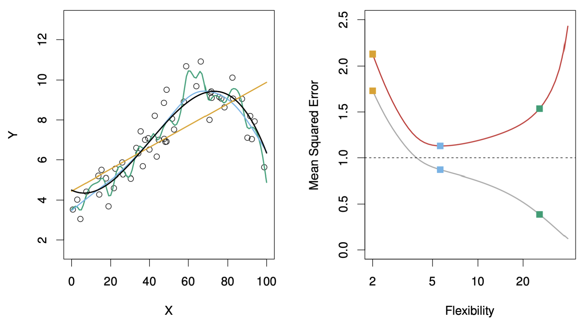{width="92%"}

The figure above illustrates how **training** and **test errors** evolve as model **flexibility** increases.

-   On the **left**, the data are generated from the true function $f$ (black line) and fitted using three models:
    -   a **linear model** (orange line),
    -   a **moderately flexible polynomial** (blue line),
    -   and a **highly flexible polynomial** (green line).
-   On the **right**, the curves show:
    -   **Training error** $\text{MSE}_{\text{Tr}}$ in grey, which decreases steadily as flexibility increases.
    -   **Test error** $\text{MSE}_{\text{Te}}$ in red, which decreases at first but eventually rises due to overfitting.

When model flexibility is low, both training and test errors are high, in other words, the model underfits and fails to capture the structure of the data. As flexibility increases, the model fits the training data better and generalises more effectively, reaching a point of **optimal complexity** where test error is minimised. Beyond this point, further flexibility causes the model to memorise noise, leading to rising test error, i.e., the hallmark of **overfitting**.

```{r}
#TODO LDA invariant to rescaling
```

## The Bias–Variance Decomposition

-   We assume a simple model where the outcome is generated as $$Y = f(X) + \varepsilon, \quad \text{with } \mathbb{E}(\varepsilon) = 0 \text{ and } \text{Var}(\varepsilon) = \sigma_\varepsilon^2.$$
-   For a regression fit $\hat{f}$, the **expected prediction error** at an input $X = x_0$ is $$\text{Err}_{\hat{f}}(x_0) = \mathbb{E}[(Y - \hat{f}(X))^2 \mid X = x_0].$$
-   This can be decomposed into three components:\
    $$\text{Err}_{\hat{f}}(x_0) = \sigma_\varepsilon^2 + \text{Bias}^2(\hat{f}(x_0)) + \text{Var}(\hat{f}(x_0))$$ $$= \text{Irreducible Error} + \text{Bias}^2 + \text{Variance}.$$

**Intuition:**\
The **Irreducible Error** is the error due to the noise variable $\varepsilon$ and cannot be improved. The **Bias** measures how far the model’s average prediction $\mathbb{E}[\hat{f}(x_0)]$ is from the true function $f(x_0)$.\
The **Variance** captures how much $\hat{f}(x_0)$ fluctuates across different training sets.\
**A good model finds a balance between low bias and low variance to minimise total error**.

#### Example: Bias–Variance Trade-off in k-Nearest Neighbours\*\*

\begin{minipage}{0.48\textwidth}
The $k$-Nearest Neighbours (k-NN) algorithm predicts $\hat{f}_k(x_0)$ as the average of the $k$ closest training points to $x_0$: $$ \hat{f}_k(x_0) = \frac{1}{k}\sum_{x_i \in N_k(x_0)} y_i.$$

The expected prediction error is $$ \text{Err}_{\hat{f}}(x_0) = \sigma_\varepsilon^2 + \Big[f(x_0) - \frac{1}{k}\sum_{x_i \in N_k(x_0)} f(x_i)\Big]^2 + \frac{\sigma_\varepsilon^2}{k}. $$

When $k$ is small, the model is very flexible → low bias, high variance.  
As $k$ increases, predictions become smoother → higher bias, lower variance.  
The total prediction error reaches its minimum when bias and variance are optimally balanced.

\end{minipage}
\hfill
\begin{minipage}{0.48\textwidth}
\begin{figure}[H]
\centering
\includegraphics[width= 0.85\linewidth]{Images_qmd_ML/ML3_bias_var_desc.png}
\caption{Bias–variance decomposition in k-NN}
\label{fig:ML3_bias_var_desc}
\end{figure}
\end{minipage}

**Intuition:**\
- When $k$ is **small**, the model is very flexible → **low bias** but **high variance**.\
- As $k$ increases, predictions become smoother → **higher bias** but **lower variance**.\
- The **orange curve** in the figure shows the **total prediction error**, which is minimised at an intermediate $k$, where bias and variance are optimally balanced.\
- The **green curve** represents the **squared bias**, and the **blue curve** shows the **variance**, both plotted as functions of $k$ to illustrate their trade-off.

**Summary:**\
- **Low** $k$ (high flexibility): low bias → high variance → overfitting\
- **High** $k$ (low flexibility): high bias → low variance → underfitting\
- **Optimal** $k$: balanced bias and variance → minimal expected prediction error

## The Bias–Variance Trade-off

Simple parametric models such as **linear regression** or **logistic regression**:

-   Have **low flexibility** → **high bias**, but require less data to fit.
-   Are **stable** across different datasets → **low variance**.
-   Fit well when the data satisfy model assumptions.
-   Are suitable for **inference** and **interpretation**, since model parameters have clear meaning.

Complex (often non-parametric) models such as **k-Nearest Neighbours** or **decision trees**:

-   Can be **highly flexible** → **low bias**, but require more data to train.
-   Are more prone to **overfitting** and can vary strongly across datasets → **high variance**.
-   Perform poorly in **high-dimensional** settings (large $p$) due to the **curse of dimensionality**.
-   Are often better suited for **prediction**, where flexibility outweighs interpretability.

In other words, simple models generalise better when data are limited or assumptions hold, while complex models can capture richer patterns but risk memorising noise.

Choosing the right model involves balancing **bias**, **variance**, and the **purpose** of analysis, i.e., explanation or prediction.

\begin{figure}[H]
\centering
\begin{minipage}{0.48\textwidth}
When we start with a very simple model, it has \textbf{high bias}, it systematically misses important structure in the data. Both training and test errors are large because the model is too rigid and underfits. As we make the model more flexible, it begins to capture the true relationships in the data, reducing bias and fitting the underlying pattern more accurately. Since this structure exists in both the training and test sets, the \textbf{test error initially decreases}.
\end{minipage}
\hfill
\begin{minipage}{0.48\textwidth}
\centering
\includegraphics[width=\linewidth]{Images_qmd_ML/ML3_graph.png}
\caption{Training versus test error}
\label{fig:ML3_graph}
\end{minipage}
\end{figure}

Beyond a certain level of flexibility, however, the model becomes **too sensitive** to the training data. It starts fitting random noise or small fluctuations that are not part of the true signal. On the training data, the error keeps dropping, but these fitted noise patterns do not generalise to new observations. As a result, variance, the model’s sensitivity to random noise, dominates, and the **test error rises again**.

The **U-shaped curve** of the test error reflects the sum of two competing effects: $$ \text{Test Error} = \text{Bias}^2 + \text{Variance} + \text{Irreducible Error}$$ As model complexity increases, **bias² decreases** (the model fits better) while **variance increases** (the model becomes unstable across datasets). Initially, bias reduction dominates, leading to lower test error; eventually, the growing variance outweighs this benefit, causing the test error to rise again.

# Cross-Validation

-   The **training error** $\text{MSE}_{\text{Tr}}$[^3] is **not reliable** for model selection, since a model that overfits the training data can achieve a very small $\text{MSE}_{\text{Tr}}$ but perform poorly on unseen data.
-   A good model should minimise the **expected prediction error** $\text{Err}_{\hat{f}}$, that is, it should generalise well to new data. In other words, $\text{Err}_{\hat{f}}$ measures how well will our model predict outcomes for new data that it has never seen before.
-   However, in practice, we only have **one dataset**, so we must find a way to **estimate** $\text{Err}_{\hat{f}}$ using it.

[^3]: The **Mean Squared Error (MSE)** measures the average squared difference between the predicted values $\hat{y}_i$ and the true values $y_i$: $\text{MSE} = \frac{1}{n}\sum_{i=1}^{n}(y_i - \hat{y}_i)^2$. It quantifies how close the model’s predictions are to the actual outcomes. In cross-validation, MSE is computed on the validation folds to estimate the model’s **generalisation ability**. **Lower MSE values indicate better predictive performance on unseen data, making it the most common metric for model comparison and selection in machine learning**.

**Two main approaches:**

1.  **Theoretical approximations** of $\text{Err}_{\hat{f}}$
    -   Based on analytical criteria such as the **Akaike Information Criterion (AIC)** or the **Bayesian Information Criterion (BIC)**.
    -   These rely on assumptions about the model class (e.g. linear models) and penalise excessive complexity to prevent overfitting.
2.  **Empirical estimation** of $\text{Err}_{\hat{f}}$
    -   Based on the **test error** $\text{MSE}_{\text{Te}}$ estimated from resampling methods such as **Bootstrap** or **Cross-Validation**.
    -   These methods approximate the model’s performance on unseen data by dividing the available dataset into subsets used for training and testing.

**Intuition:** Cross-validation provides a systematic way to simulate how the model would perform on new, unseen data. By repeatedly splitting the dataset into training and validation parts, we can estimate the expected prediction error $\text{Err}_{\hat{f}}$ and choose the model complexity that minimises it.

## K-Fold Cross-Validation

-   We only have **one dataset** $\{(x_1, y_1), \dots, (x_n, y_n)\}$. The question is: *how can we estimate how the model will perform on new, unseen data*

-   In **K-Fold Cross-Validation**, we randomly divide the dataset into $K$ equally sized subsets, called **folds**, denoted $C_1, C_2, \dots, C_K$.

-   Each fold acts once as a **validation set**, while the remaining $K - 1$ folds are used for training.

-   We then compute the **validation MSE** for each fold: $$\text{MSE}_k = \frac{K}{n}\sum_{i \in C_k}(y_i - \hat{f}_{-k}(x_i))^2$$\
    where $\hat{f}_{-k}$ is the model trained on all data *except* fold $C_k$.

-   Finally, the **K-Fold Cross-Validation estimate** of the prediction error is the **average validation error** across all folds: $$\text{CV}_{(K)} = \frac{1}{K}\sum_{k=1}^{K}\text{MSE}_k$$

Since we cannot collect new data to test our model, we simulate this process by holding out different subsets of the data in turn. Each fold provides an estimate of how well the model generalises, and averaging these results gives a more stable and less biased estimate of the **expected prediction error** $\text{Err}_{\hat{f}}$.

**Choosing the number of folds:**\
The parameter $K$ determines how the data are divided between training and validation, directly influencing the **bias**, **variance**, and **computational cost** of the cross-validation estimate.

-   With a **small** $K$ (e.g. 5): each **training set** is smaller because a larger portion of the data is held out for validation in each iteration. As a result, the model is fitted on less data and may **underfit slightly**, leading to a **higher bias** in the estimated prediction error. However, the **validation sets are larger**, which makes the error estimates across folds more stable and results in **lower variance**. Training fewer models also makes the procedure **computationally faster**.

-   With a **large** $K$ (e.g. 10, or $K = n$ in Leave-One-Out Cross-Validation): each **training set** is larger, and the **validation set** becomes smaller. This reduces bias since each model is trained on nearly the full dataset, but increases variance because the validation results depend more on specific observations. It also requires fitting more models, which increases **computational cost**.

In practice, choosing $K = 5$ or $K = 10$ usually provides the best balance: bias remains reasonably low, variance manageable, and computation time practical for most applications.

## Interpreting the K-Fold Cross-Validation Estimate

-   The **K-Fold Cross-Validation estimate** is a widely used and general method that can be applied to almost any model.\
-   This estimate allows us to **select the best model** among several candidates and provides an empirical approximation of the **expected prediction error** $\text{Err}_{\hat{f}}$ for the final chosen model.\
-   The appropriate choice of $K$ depends on the dataset size $n$, but in practice, $K = 5$ or $K = 10$ are commonly used as they provide a good balance between bias, variance, and computational efficiency.

**Interpreting the cross-validation estimate:**\
K-Fold Cross-Validation not only estimates how well a model generalises, but also gives an indication of the **uncertainty** associated with this estimate, that is, how much the result would vary if we repeated the procedure with a different random split of the data. This variability is measured through the **standard error** of the cross-validation estimate: $$ \widehat{\text{SE}}(\text{CV}_{(K)}) = \frac{1}{\sqrt{K}} \sqrt{\frac{\sum_{k=1}^{K}(\text{MSE}_k - \text{CV}_{(K)})^2}{K - 1}}$$

A **small standard error** means that the model performs consistently across folds. Its generalisation is stable and reliable.\
A **large standard error**, on the other hand, indicates that the model’s performance varies substantially depending on which data points are used for training and validation, suggesting possible instability or overfitting.

Thus, cross-validation helps assess not only *which model performs best on average*, but also *which model performs most consistently* across different subsets of the data.

## Leave-One-Out Cross-Validation

-   One limitation of **K-Fold Cross-Validation** is that it requires training $K$ separate models, which can become computationally expensive for large datasets.

-   A useful special case of K-Fold CV is **Leave-One-Out Cross-Validation (LOOCV)**, where each observation is treated as its own validation fold. In this case, $K = n$ and $C_k = \{k\}$ for $k = 1, \dots, n$.

-   The **LOOCV estimate** of the prediction error is: $$\text{CV}_{(n)} = \frac{1}{n} \sum_{k=1}^{n} (y_k - \hat{f}_{-k}(x_k))^2$$ where $\hat{f}_{-k}$ denotes the model fitted on all data except the $k$-th observation.

-   In general, this requires fitting $n$ separate models (one for each observation) which can be computationally intensive. However, for **linear models**, a convenient approximation exists: $$ \text{CV}_{(n)} \approx \frac{1}{n} \sum_{k=1}^{n} \left( \frac{y_k - \hat{f}(x_k)}{1 - S_{kk}} \right)^2$$ where $S_{kk}$ are leverage values (diagonal elements of the hat matrix), automatically available from the linear model fit.

-   Overall, $\text{CV}_{(K)}$ is a reliable estimate of the **expected prediction error** $\text{Err}_{\hat{f}}$. The choice of $K$ reflects a **bias–variance trade-off**:

    -   Large $K$ (e.g. LOOCV) → smaller bias but higher variance.
    -   Small $K$ (e.g. 5-Fold CV) → higher bias but lower variance.

In practical terms, LOOCV makes almost full use of the data for training in each iteration, which **reduces bias** because each model is trained on nearly all available observations. However, since each validation fold contains only one observation, the resulting errors vary more from case to case, leading to **higher variance**. This makes LOOCV less stable for complex models or large datasets, but highly effective and appealing for small samples or simple models such as linear regression.

## Cross-validation applied to the body fat dataset

\begin{minipage}{0.52\textwidth}
\textbf{The body fat dataset} is used to illustrate how \textbf{K-Fold Cross-Validation (CV)} helps in selecting the most suitable regression model when multiple predictors are available.As seen in the plot on the right:

\begin{itemize}
  \setlength\itemsep{0.3em}
  \item The \textbf{y-axis (CV)} represents the average cross-validation error.
  \item Each point indicates the CV estimate for a model with a given number of variables.
  \item The \textbf{grey bars} show one standard error around that estimate.
  \item The model with the \textbf{lowest CV error} (black dot) achieves the best predictive performance under this random partitioning of the data.
\end{itemize}
\end{minipage}
\hfill
\begin{minipage}{0.44\textwidth}
\vspace*{\fill}
\begin{figure}[H]
\centering
\includegraphics[width=\linewidth]{Images_qmd_ML/ML3_bodyfat_cv1.png}
\caption{\footnotesize 10-fold CV}
\label{fig:bodyfat-cv1}
\end{figure}
\vspace*{\fill}
\end{minipage}
\begin{minipage}{0.44\textwidth}
\vspace*{\fill}
\begin{figure}[H]
\centering
\includegraphics[width=\linewidth]{Images_qmd_ML/ML3_bodyfat_cv2.png}
\caption{\footnotesize Four repetitions of 10-fold CV}
\label{fig:bodyfat-cv4}
\end{figure}
\vspace*{\fill}
\end{minipage}
\hfill
\begin{minipage}{0.52\textwidth}
\textbf{When the folds are randomly selected:}

\begin{itemize}
  \setlength\itemsep{0.3em}
  \item Repeating the \textbf{10-fold CV} several times can lead to \textbf{different results}.
  \item The \textbf{minimum CV error} does not always occur at the same number of predictors.
  \item This variation arises because \textbf{CV depends on the random partitioning} of the data.
  \item Therefore, a single CV run may not always yield a stable estimate of the optimal model size, in other words, \textbf{randomness matters}.
\end{itemize}
\end{minipage}

### Stability and the one-standard-error rule

The instability caused by random fold assignments can be mitigated by applying the **one-standard-error rule**. Instead of always picking the model with the absolute lowest CV error, we choose the **simplest (most parsimonious)** model whose error is within **one standard error** of the minimum. This rule favours models that generalise better and are less sensitive to random fluctuations in the folds.

To illustrate this, the cross-validation process was repeated **100 times**. Table \ref{tab:bodyfat-cv-results} shows how often each model size ($k$) was selected:

::: {#tbl-bodyfat-cv-results .tbl-cap .booktabs}
Model sizes (*k*) selected across 100 repetitions of 10-fold cross-validation.

```{=latex}
\begin{center}
\begin{tabular}{lccccccccccccc}
\toprule
\textit{k} & 1 & 2 & 3 & 4 & 5 & 6 & 7 & 8 & 9 & 10 & 11 & 12 & 13 \\
\midrule
\textbf{arg min of CV} & 0 & 5 & 8 & 11 & 0 & 1 & 11 & 20 & 11 & 12 & 18 & 3 & 0 \\
\textbf{one-sd-error rule} & 0 & 83 & 15 & 2 & 0 & 0 & 0 & 0 & 0 & 0 & 0 & 0 & 0 \\
\bottomrule
\end{tabular}
\label{tab:bodyfat-cv-results}
\end{center}
```
:::

These results show that **direct minimisation** of the CV error produces more variable choices across repetitions, whereas the **one-standard-error rule** consistently selects smaller and more stable models (most frequently $k = 2$). This confirms that the rule provides a **more robust and interpretable** choice, i.e., sacrificing only a negligible loss in predictive accuracy for a significant gain in simplicity and reliability.

## Final model selection

Cross-validation identified a model with **three predictors** ($\hat{k} = 3$): **weight**, **abdomen**, and **wrist**.\
As shown in Figure \ref{fig:bodyfat-cv1}, this specification achieved the **lowest cross-validation error** in the *best-subset selection* analysis, striking an effective balance between predictive accuracy and simplicity. It explains most of the variation in body fat percentage without overfitting.

The corresponding model $\hat{f}_3$ is then refitted on **all 252 observations** to obtain the final parameter estimates based on the full dataset.

Overall, cross-validation proved useful not only for identifying the best-performing model ($p = 3$) but also for ensuring that the final specification remains **interpretable, stable, and generalisable**.

# Linear Model selection and Regularization

## Credit data set and data standardisation

-   The **Credit data set** from the package *ISLR* contains the response *balance* (average credit card debt) and quantitative predictors such as *age*, number of credit *cards*, *income*, and *education*.

-   It also includes four qualitative predictors: *gender*, *student*, *status*, and *ethnicity*.

-   Such variables often exhibit **different numeric scales** or units of measurement, which can affect the behaviour of many algorithms.

-   When predictors $X_1, \dots, X_p$ have **different scales**, the relative magnitude of each variable can distort distance-based methods (e.g. $k$-Nearest Neighbour) or affect regularisation penalties.

-   To ensure comparability, it is good practice to **standardise the predictors** in the training data $\mathbf{x}_i$, $i = 1, \dots, n$, for each margin $j = 1, \dots, p$: $$ x_{ij}^{\text{scaled}} = \frac{x_{ij} - \bar{x}_j}{\hat{\sigma}_j} $$\
    where $\bar{x}_j$ and $\hat{\sigma}_j$ are the sample mean and standard deviation of predictor $j$

-   In Python, this can be done with the transformer `StandardScaler()`.

-   For a new input $x_0 \in \mathbb{R}^p$, standardise as $x_{0j}^{\text{scaled}} = (x_{0j} - \bar{x}_j)/\hat{\sigma}_j$ before applying the predictive model.

Standardisation ensures that all predictors contribute equally to the model by removing scale effects. Without it, a single variable with large numerical values—such as *income* measured in thousands—can dominate the model’s distance or penalty calculations, overshadowing the contribution of smaller-scale variables such as *age* or *education*.

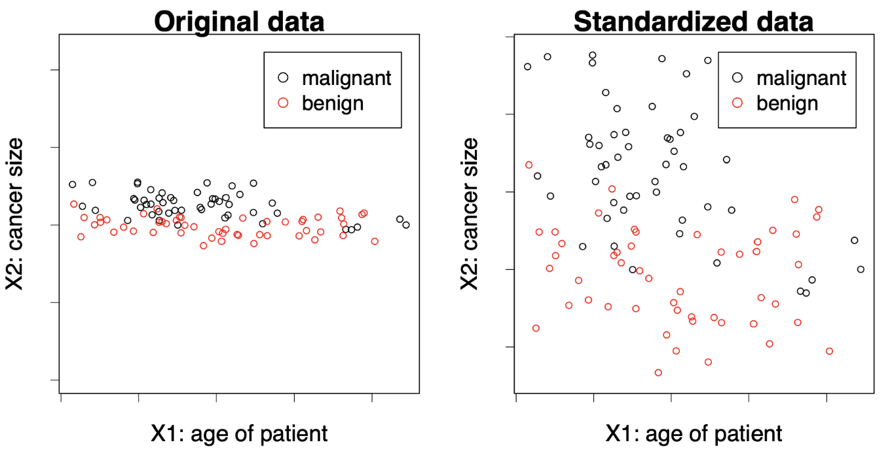

Using an unscaled variable like *income* (with values in thousands) directly in a model can lead to **biased parameter estimation or distorted decision boundaries**. The figure above shows how scale differences skew the relative importance of predictors. After standardisation, each feature is centred and rescaled to unit variance, allowing the model to treat them on an equal footing.

## Back to linear models

-   In the **regression setting**, a multiple linear model\
    $$ Y = \beta_0 + \beta_1 X_1 + \cdots + \beta_p X_p $$\
    is fitted to the data $(x_i, y_i)$, $i = 1, \dots, n$.

-   The estimated vector $\hat{\boldsymbol{\beta}} = (\hat{\beta}_0, \dots, \hat{\beta}_p)$ minimises the residual sum of squares (RSS):\
    $$ \text{RSS} = \sum_{i=1}^{n} \left( y_i - \beta_0 - \sum_{j=1}^{p} \beta_j x_{ij} \right)^2 $$

-   Why might we want to use a **different estimation method** than least squares?

(1) **Prediction accuracy:** If $n$ is not much larger than the number of predictors $p$, or even $p \gg n$ (a *high-dimensional setting*), the least squares estimate $\hat{\boldsymbol{\beta}}$ may have high variance, leading to overfitting. By **shrinking** or **regularising** the coefficients, we can reduce variance and improve prediction accuracy on new test data.

(2) **Model interpretability:** Some predictors may have weak or no relationship with the response, yet least squares rarely estimates their coefficients as exactly zero. Excluding such **irrelevant predictors** simplifies the model and improves interpretability.

As we saw in Figure \ref{fig:mlr-3d}, the fitted regression plane represents the least-squares solution that minimises the vertical distances between the observed data points and the estimated surface. However, when the number of predictors grows or when predictors are correlated, the position and slope of this plane become unstable. Regularisation methods modify this fitting process by penalising large coefficient values, thereby stabilising the plane and improving both prediction accuracy and interpretability.

## Alternatives to least squares

Several approaches extend or modify least squares estimation to improve prediction accuracy and interpretability when dealing with many or correlated predictors.

(1) **Subset selection:** Identify a subset of the $p$ predictors and then fit a linear model by least squares.

-   *Best subset selection* evaluates all possible combinations of predictors.
-   *Stepwise selection* (forward or backward) adds or removes predictors sequentially.\
    Details in \[ISL\], Chapter 6.

(2) **Dimension reduction:** Project the $p$ predictors into an $M$-dimensional subspace ($M < p$) using techniques such as PCA, then fit a linear regression to the projected variables by least squares.\
    Details in \[ISL\], Chapter 6.

(3) **Shrinkage (regularisation):** Fit a linear regression to all $p$ predictors, but shrink the estimated coefficients towards zero relative to the least squares fit. Depending on the regularisation method (e.g. Ridge, LASSO), some coefficients may even become exactly zero. This penalisation both stabilises estimation and can perform **automatic variable selection**.

These alternative methods adjust the standard least-squares fitting process by reducing the number of predictors, transforming them into a lower-dimensional representation, or constraining their estimated effects to achieve models that generalise better and are easier to interpret.

## Ridge regression

-   Instead of minimising the RSS, the **ridge regression** coefficient estimates $\hat{\boldsymbol{\beta}}^{R}_{\lambda}$ minimise the penalised version $$ \sum_{i=1}^{n} \left( y_i - \beta_0 - \sum_{j=1}^{p} \beta_j x_{ij} \right)^2 + \lambda \sum_{j=1}^{p} \beta_j^2 = \text{RSS} + \lambda \sum_{j=1}^{p} \beta_j^2$$\
    where $\lambda \ge 0$ is the **tuning parameter**.
-   The penalty term $\lambda \sum_{j} \beta_j^2$ is called a **shrinkage penalty** and becomes small when all $\beta_1, \dots, \beta_p$ are close to zero.
-   For each $\lambda \ge 0$, ridge regression produces a different set of coefficient estimates $\hat{\boldsymbol{\beta}}^{R}_{\lambda}$.
    -   If $\lambda = 0$, they coincide with the least-squares estimates.
    -   As $\lambda \to \infty$, they shrink towards zero.
-   Choosing an appropriate $\lambda$ is crucial and is typically done through **cross-validation**.

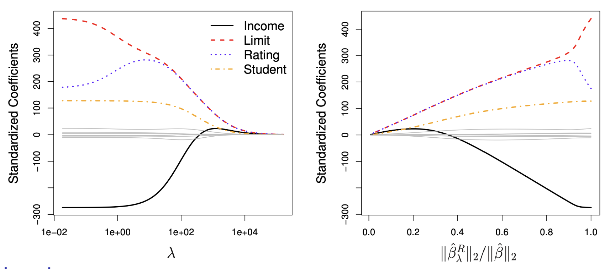{#fig-ridge-paths}

As shown in @fig-ridge-paths, ridge regression progressively shrinks the coefficients as the regularisation parameter $\lambda$ increases.\

In the **left panel**, $\lambda$ is displayed on a logarithmic scale. Each coloured curve represents the standardised coefficient for one predictor. The **black curve**, corresponding to *Income*, starts around –200, indicating that higher income initially reduces the predicted credit balance. As $\lambda$ increases, its magnitude gradually decreases, meaning the model gives less weight to that predictor under stronger regularisation. The **red** (*Limit*), **blue** (*Rating*), and **yellow** (*Student*) curves follow similar paths, each shrinking smoothly towards zero.

In the **right panel**, the same shrinkage is shown against the ratio $\|\hat{\boldsymbol{\beta}}^{R}_{\lambda}\|_2 / \|\hat{\boldsymbol{\beta}}\|_2$, which measures how much of the total coefficient magnitude remains relative to the unpenalised least-squares solution.

These plots illustrate the **bias–variance trade-off**: increasing $\lambda$ reduces model variance but introduces bias. Ridge regression thus stabilises estimates in the presence of multicollinearity or high-dimensional data, and the optimal $\lambda$ is typically identified via cross-validation.

## Ridge regression: closed-form solution

-   Ridge regression has a **closed-form solution**: $$\hat{\boldsymbol{\beta}}^{R}_{\lambda} = (\mathbf{X}^{\mathsf{T}}\mathbf{X} + \lambda \mathbf{I})^{-1}\mathbf{X}^{\mathsf{T}}\mathbf{y}$$

    where $\mathbf{X} \in \mathbb{R}^{n \times p}$ is the data matrix, $\mathbf{I} \in \mathbb{R}^{p \times p}$ is the identity matrix, and $\mathbf{y} = (y_1, \dots, y_n)$ is the vector of responses.

-   This can be compared to the **least squares solution**: $$\hat{\boldsymbol{\beta}} = (\mathbf{X}^{\mathsf{T}}\mathbf{X})^{-1}\mathbf{X}^{\mathsf{T}}\mathbf{y}$$

-   The ridge estimator modifies the least-squares expression by adding $\lambda \mathbf{I}$ before inversion. This term prevents instability when predictors are highly correlated or when $p > n$, and shows how ridge regression **shrinks** the least squares estimates towards zero.

## Lasso: least absolute shrinkage and selection operator

-   Ridge regression has the disadvantage that it includes **all** $p$ predictors in the final model.
-   The **lasso** overcomes this limitation. The lasso coefficients $\hat{\boldsymbol{\beta}}^{L}_{\lambda}$ minimise the penalised RSS $$ \sum_{i=1}^{n} \left( y_i - \beta_0 - \sum_{j=1}^{p} \beta_j x_{ij} \right)^2 + \lambda \sum_{j=1}^{p} |\beta_j| = \text{RSS} + \lambda \sum_{j=1}^{p} |\beta_j| $$\
    where $\lambda \ge 0$ is again a **tuning parameter**.
-   The key difference from ridge regression is that the **lasso penalty** uses the $\ell_1$-norm of $\boldsymbol{\beta}$.
-   This penalty allows some coefficient estimates to become **exactly zero** when $\lambda$ is large enough, meaning the lasso performs **automatic variable selection**.
-   As with ridge regression, a suitable value of $\lambda$ is critical and typically chosen via **cross-validation**.

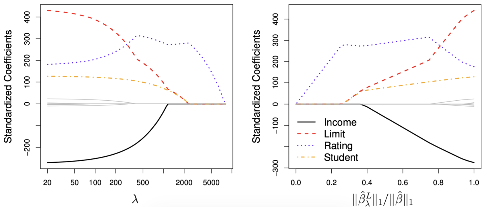{#fig-lasso-paths}

As shown in @fig-lasso-paths, lasso regression behaves similarly to ridge regression for small values of $\lambda$, but differs in how coefficients shrink as $\lambda$ increases.\
- In the **left panel**, the coefficient paths are plotted against $\lambda$ on a logarithmic scale. As $\lambda$ grows, some coefficients are driven exactly to zero, effectively removing those predictors from the model.\
- In the **right panel**, the same process is shown against the ratio $\|\hat{\boldsymbol{\beta}}^{L}_{\lambda}\|_1 / \|\hat{\boldsymbol{\beta}}\|_1$, representing the proportion of total coefficient magnitude retained.

This sparsity property distinguishes the lasso from ridge regression: while ridge continuously shrinks all coefficients, lasso can produce a simpler, more interpretable model by selecting only a subset of relevant predictors.

## Regularisation: geometric interpretation

-   **Equivalent formulation:** ridge and lasso regression can each be expressed as constrained optimisation problems. The estimated coefficients $\hat{\boldsymbol{\beta}}^{R}_{\lambda}$ and $\hat{\boldsymbol{\beta}}^{L}_{\lambda}$ minimise the residual sum of squares subject to different types of constraints: $$ \sum_{i=1}^{n} \left( y_i - \beta_0 - \sum_{j=1}^{p} \beta_j x_{ij} \right)^2 \quad \text{subject to} \quad \sum_{j=1}^{p} \beta_j^2 \le s, $$ $$ \sum_{i=1}^{n} \left( y_i - \beta_0 - \sum_{j=1}^{p} \beta_j x_{ij} \right)^2 \quad \text{subject to} \quad \sum_{j=1}^{p} |\beta_j| \le s. $$
-   The first corresponds to **ridge regression** (a quadratic constraint, $L_2$-norm), and the second to **lasso** (a diamond-shaped constraint, $L_1$-norm).
-   This formulation provides a **geometric interpretation** of penalisation: the constraint defines a region of feasible coefficient values, and the solution occurs where this region first touches the elliptical contours of the RSS.

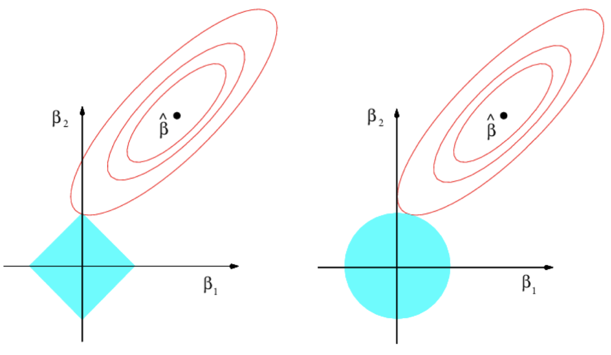{#fig-geom width="70%"}

As shown in @fig-geom, the circular constraint region on the right represents ridge regression, where coefficients are continuously shrunk but rarely set to zero. The diamond-shaped region on the left represents the lasso: because the corners align with the coordinate axes, the optimal solution often lies exactly on an axis, producing zero-valued coefficients. This geometric property explains why the lasso can perform variable selection, while ridge regression cannot.

## Comments

-   For large $p$, best subset selection is computationally infeasible. In such cases, the **lasso** can be used to perform **variable selection** efficiently.
-   While ridge coefficients $\hat{\boldsymbol{\beta}}^{R}_{\lambda}$ have a closed-form solution, lasso coefficients $\hat{\boldsymbol{\beta}}^{L}_{\lambda}$ do not. They are obtained through **numerical optimisation**, which remains tractable since both problems are **convex**.
-   In practice, ridge and lasso often achieve similar **predictive performance** (for well-chosen $\lambda$), but lasso models tend to be **more interpretable** because of their sparsity.
-   The **elastic net** (Zou & Hastie, 2005) combines ridge and lasso penalties into\
    $$ \lambda \sum_{j=1}^{p} \left((1 - \alpha)\beta_j^2 + \alpha|\beta_j|\right), $$\
    where $\alpha \in [0,1]$ controls the relative weight of each penalty ($\alpha = 0$ gives ridge, $\alpha = 1$ gives lasso).
-   In applied settings, lasso is often used to **pre-select** a manageable subset of relevant predictors, which can then be refined in more flexible predictive models.
-   **Regularisation** extends beyond linear regression and can also be applied to models such as **logistic regression** or **generalised linear models**.

## Example: Hitters data set

\begin{minipage}{0.55\textwidth}
The \textbf{Hitters} data set from the \emph{ISLR} package contains the annual \textbf{Salary} of 263 baseball players and $p = 19$ predictors such as the number of \textbf{Years} played in the major leagues and the number of \textbf{Hits}. The colour scale encodes salary, from low (yellow–red) to high (blue–green).

This dataset illustrates how regularisation handles models with many correlated predictors. Salary tends to increase with both \emph{Years} and \emph{Hits}, but these variables are also strongly correlated, leading to \textbf{multicollinearity}, an ideal case for ridge or lasso regression.
\end{minipage}
\hfill
\begin{minipage}{0.4\textwidth}
\begin{figure}[H]
\centering
\includegraphics[width=\linewidth]{Images_qmd_ML/ML4_hitters.png}
\caption{Hitters data set}
\label{fig-hitters}
\end{figure}
\end{minipage}

### Ridge regression on the Hitters data set

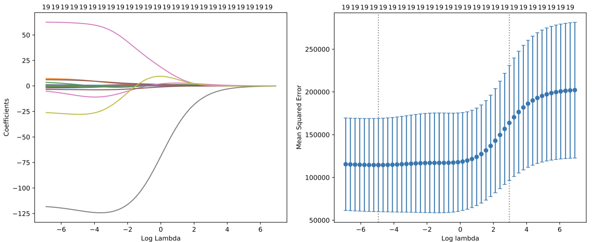{#fig-hitters-ridge}

As shown in @fig-hitters-ridge, the **left panel** displays the *ridge coefficient paths* as functions of $\log(\lambda)$.\
- Each coloured curve corresponds to one of the 19 predictors.\
- As $\lambda$ increases, coefficients shrink continuously towards zero but never reach it, meaning all variables remain in the model.

The **right panel** shows the **mean squared error (MSE)** estimated by cross-validation for different $\lambda$ values.\
- The dotted vertical line indicates the value of $\lambda$ that minimises prediction error.\
- For small $\lambda$, the model overfits; for large $\lambda$, coefficients are overly constrained and bias dominates.\
- The optimal $\lambda$ achieves a balance between bias and variance, providing stable but slightly biased predictions.

### Lasso regression on the Hitters data set

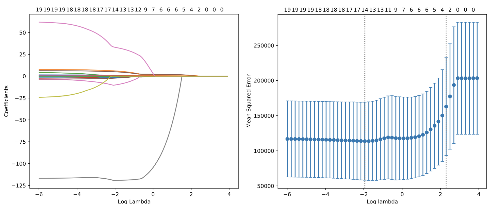{#fig-hitters-lasso}

In @fig-hitters-lasso, the **left panel** shows the *lasso coefficient paths*.

-   As $\lambda$ increases, some coefficients drop exactly to zero, removing the corresponding predictors from the model.
-   This reflects lasso’s ability to perform **automatic variable selection** by enforcing sparsity.

The **right panel** again shows the cross-validation MSE across values of $\lambda$.\

-   The optimal $\lambda$ (dotted line) identifies a simpler model that excludes less relevant predictors while maintaining strong predictive performance.
-   Compared with ridge, lasso yields more interpretable models by retaining only a subset of significant predictors.

Together, these results demonstrate how both ridge and lasso manage the bias–variance trade-off, but differ in **model complexity**: ridge smooths coefficients continuously, while lasso introduces sparsity by setting some exactly to zero.

# Classification Framework

## Classification: Introduction

Classification, also called *pattern recognition*, aims to predict **qualitative** response variables $Y$ that take values in an unordered set $\mathcal{G} = \{ G_1, \ldots, G_q \}$, for example: infected $\in \{\text{Yes}, \text{No}\}$ and eye colour $\in \{\text{brown}, \text{blue}, \text{green}\}$.

Given the vector of predictors $\mathbf{X} = (X_1, \ldots, X_p)$, the goal of classification is to build a function $G$, called a *classifier*, that takes $\mathbf{X}$ and predicts the value of $Y$, i.e. $G(\mathbf{X}) \in \mathcal{G}$.

Often, one is more interested in the **probability** that $Y$ belongs to each class $G_1, \ldots, G_q$, for instance:

-   the probability that a bank client will default
-   the probability that a tumour is malignant
-   etc.

We typically identify the $q$ classes with the numbers $1$ to $q$, such that $\mathcal{G} = \{1, \ldots, q\}$, or if there are only two classes (*binary data*), then $\mathcal{G} = \{0, 1\}$.

\begin{minipage}{0.55\textwidth}
\textbf{Example.} Classification of cancer with $p = 2$ and $q = 2$.  
We aim to find a classifier $$G(\textit{age}, \textit{size}) \in \mathcal{G} = \{\text{benign}, \text{malignant}\}$$ that predicts whether a cancer is \textcolor{red}{benign} or \textcolor{black}{malignant}, based on the predictors $\textit{age}$ and $\textit{size}$.

Each observation corresponds to a patient, represented by their age ($X_1$) and tumour size ($X_2$). The classifier will learn a decision boundary that best separates the two classes.
\end{minipage}
\hfill
\begin{minipage}{0.4\textwidth}
\begin{figure}[H]
\centering
\includegraphics[width=\linewidth]{Images_qmd_ML/ML4_class_intro.png}
\caption{Scatter plot of tumour size versus patient age, coloured by diagnosis.}
\label{fig-class-intro}
\end{figure}
\end{minipage}

This example illustrates a **binary classification** task where each observation is assigned to one of two possible categories. The goal is to construct a decision function $G(\mathbf{X})$ that correctly predicts the label $Y$ for new, unseen patients.

Let us clarify that the classifier $G$ maps the two predictor variables $(\textit{age}, \textit{size})$ to one of the possible outcomes in $\mathcal{G}$, either *benign* or *malignant*. In other words, $G$ is a decision rule that assigns each patient to a diagnostic category based on these predictors.

## The 0–1 Loss Function

How do we measure the quality of a prediction? For classification, the squared error loss is not ideal. Therefore, to measure the the **misclassification error** for a prediction $\hat{y}$, we usually use the **0–1 loss function** $$L(y, \hat{y}) = \mathbf{1}\{y \ne \hat{y}\} = 
  \begin{cases}
  0 & \text{if } y = \hat{y} \\
  1 & \text{if } y \ne \hat{y}
  \end{cases}.$$

-   For a classifier $\hat{G}$, the **expected misclassification rate** is $$\text{Err}_{\hat{G}} = \mathbb{E}[\,\mathbf{1}\{Y \ne \hat{G}(X)\}\,] = \Pr\{Y \ne \hat{G}(X)\}, $$ where the expectation is taken over $(X, Y)$.

-   **Note:** Other loss functions for classification tasks are also common, since:

    -   In medical or safety-critical settings, false negatives and false positives are not equally severe, so one may wish to penalise one type of error more than the other.
    -   The 0–1 loss is not smooth, which can lead to optimisation difficulties when fitting models.

## The Bayes Classifier

What is a \textbf{good classifier}? Ideally, we would like to find the optimal $G^*$ that minimises  
$$ \text{Err}_{\hat{G}} = \Pr\{Y \ne \hat{G}(X)\}. $$

For simplicity, consider \textbf{two-class classification}, i.e. $\mathcal{G} = \{0, 1\}$.  
The optimal $G^*$ is called the \textbf{Bayes classifier}, which assigns each observation to the class with the highest conditional probability $\Pr(Y = j \mid X = \mathbf{x})$.

Formally, the Bayes classifier assigns to a predictor $\mathbf{x}$ the most likely class:
$$ G^*(\mathbf{x}) = \underset{j = 0, 1}{\arg\max} \, \Pr(Y = j \mid X = \mathbf{x}) = 
  \begin{cases}
  0 & \text{if } \Pr(Y = 0 \mid X = \mathbf{x}) > 1/2, \\
  1 & \text{otherwise.}
  \end{cases} $$

- The \textbf{Bayes decision boundary} is the curve (in $\mathbb{R}^p$) where  
  $$ \Pr(Y = 0 \mid X = \mathbf{x}) = 1/2. $$

- The Bayes classifier achieves the \textbf{lowest possible 0–1 loss} — this minimum achievable error is called the \textbf{Bayes error rate}, given by  
  $$ \text{Err}_{G^*} = \Pr\{Y \ne G^*(X)\}. $$

The Bayes classifier represents the theoretical ideal: it predicts the class with the highest conditional probability given the input $X = \mathbf{x}$.  
In practice, the true probabilities $\Pr(Y \mid X)$ are unknown, so learning algorithms approximate this rule from data.  
The \textbf{decision boundary} (white curve in Figure \ref{fig-bayes-classifier}) separates regions where each class is more likely; in other words, it marks $\Pr(Y = 0 \mid X) = 0.5$.

\begin{minipage}{0.55\textwidth}
\textbf{Example:} Bayes classifier for a two-class problem.  
The \textbf{Bayes classifier} is the theoretical ideal: it assigns each observation to the class with the highest conditional probability $\Pr(Y = j \mid X = \mathbf{x})$.  
Since the true probabilities $\Pr(Y \mid X)$ are unknown, learning algorithms approximate this rule from sample data.  
The \textbf{decision boundary} (white curve in the plot) separates regions where one class is more likely than the other, corresponding to $\Pr(Y = 0 \mid X) = 0.5$.
\end{minipage}
\hfill
\begin{minipage}{0.4\textwidth}
\begin{figure}[H]
\centering
\includegraphics[width=\linewidth]{Images_qmd_ML/ML4_Bayes.png}
\caption{Bayes classifier and decision boundary for a two-class problem.}
\label{fig-bayes-classifier}
\end{figure}
\end{minipage}

## The Bayes Decision Rule

The **Bayes classifier** provides the theoretical optimum but requires knowing the true probabilities $\Pr(Y \mid X)$, which are unknown in practice. To approximate it, we estimate the **posterior class probabilities** $$ \widehat{\Pr}(Y = j \mid X = \mathbf{x}), \quad j = 0, 1, $$ and then apply the **plug-in decision rule**: $$ \hat{G}(\mathbf{x}) =
\begin{cases}
0 & \text{if } \widehat{\Pr}(Y = 0 \mid X = \mathbf{x}) > 1/2, \\
1 & \text{otherwise.}
\end{cases} $$

The **decision boundary** is the line (or surface in higher dimensions) where both posterior probabilities are equal: $$ \widehat{\Pr}(Y = 0 \mid X = \mathbf{x}) = \widehat{\Pr}(Y = 1 \mid X = \mathbf{x}) = 1/2. $$

\begin{minipage}{0.55\textwidth}
\textbf{Example.} Estimated and true Bayes decision boundaries.  
This figure compares the \textbf{true} and \textbf{estimated decision boundaries} for a two-class classification problem. The blue solid line represents the \textbf{estimated boundary} obtained from sample data, while the dashed line corresponds to the \textbf{theoretical Bayes boundary}.  

In practice, the plug-in rule approximates the Bayes classifier by estimating $\Pr(Y \mid X)$ from observed data rather than knowing it exactly. This illustrates how statistical learning methods attempt to reproduce the optimal (but unattainable) Bayes boundary using empirical information.
\end{minipage}
\hfill
\begin{minipage}{0.4\textwidth}
\begin{figure}[H]
\centering
\includegraphics[width=\linewidth]{Images_qmd_ML/ML4_b_rule.png}
\caption{Estimated and true Bayes decision boundaries for a two-class problem.}
\label{fig-bayes-decision-rule}
\end{figure}
\end{minipage}

## Statistical Modelling of $\hat{G}$

Depending on how we model the relationship between $Y$ and $X$, we can distinguish three main approaches to classification:

**(a) Generative models** estimate the **joint distribution** of $(Y, X)$ and then deduce the posterior class probabilities for $j = 0, 1$:  
$$ \widehat{\Pr}(Y = j \mid X = \mathbf{x}) = \frac{\widehat{\Pr}(Y = j, X = \mathbf{x})}{\widehat{\Pr}(X = \mathbf{x})}. $$  
- More complex and data-demanding, as they require modelling both $Y$ and $X$.  
- **Examples:** Linear/Quadratic Discriminant Analysis, Naive Bayes.

**(b) Discriminative models** estimate only the **conditional distribution** $\Pr(Y \mid X)$. That is, they directly model the posterior class probabilities $\widehat{\Pr}(Y = j \mid X = \mathbf{x})$.  
- Usually preferred, since they provide posterior probabilities and are less complex than generative models.  
- **Examples:** *k*-Nearest Neighbours (kNN), Logistic Regression, Random Forest, Neural Networks.

**(c) Geometric models** directly estimate a **decision boundary function** that predicts the class (0 or 1) from $\mathbf{x}$ without modelling probabilities.  
- Simpler, since no probability distribution is assumed, but they do not provide estimates of class probabilities.  
- **Examples:** Support Vector Machines (SVM).

## The Empirical Misclassification Rate

Given a **training data set** $(x_1, y_1), \ldots, (x_n, y_n)$, with $x_i \in \mathbb{R}^p$ and $y_i \in \{1, \ldots, q\}$, how can we estimate the model $\hat{G}$?

In regression, we minimise the **empirical mean squared error** on the training set. Similarly, for classification, we can minimise the **empirical misclassification rate**: $$ \text{err}_{\hat{G}} = \frac{1}{n} \sum_{i = 1}^{n} \mathbf{1}\{y_i \ne \hat{G}(x_i)\}. $$

However, the **0–1 loss function** $\mathbf{1}\{y \ne \hat{y}\}$ is **discontinuous**, which makes **numerical optimisation** difficult.

Different methods such as **maximum likelihood estimation** are therefore used for **parameter estimation**, providing differentiable alternatives that approximate the 0–1 loss.

The **0–1 loss** can still be used for **model selection** or for comparing models fitted with different methods.

\begin{minipage}{0.55\textwidth}
\textbf{Example.} Empirical misclassification rate.  
The plot on the right shows how the empirical misclassification rate changes with different values of $\beta_0$. Each point represents the average error across the training data for a given parameter value. The goal is to minimise this error to improve classification performance.
\end{minipage}
\hfill
\begin{minipage}{0.4\textwidth}
\begin{figure}[H]
\centering
\includegraphics[width=\linewidth]{Images_qmd_ML/ML4_misscla.png}
\caption{Empirical misclassification rate as a function of $\beta_0$.}
\label{fig-empirical-misclassification}
\end{figure}
\end{minipage}

## K-Fold Cross-Validation

Given a **data set** $\{(x_1, y_1), \ldots, (x_n, y_n)\}$, we perform **K-Fold Cross-Validation (CV)** to estimate how well a classifier generalises to unseen data.

For each fold $C_k$, $k = 1, \ldots, K$, we treat $C_k$ as the **validation/test set** and fit the classification model $\hat{G}_{-k}$ on the remaining $K - 1$ folds.  
The **empirical misclassification rate** for fold $k$ is given by  
$$ \text{err}_k = \frac{1}{|C_k|} \sum_{i \in C_k} L(y_i, \hat{G}_{-k}(x_i)) = \frac{1}{n/K} \sum_{i \in C_k} \mathbf{1}\{y_i \ne \hat{G}_{-k}(x_i)\}. $$

The **K-Fold CV estimate** is then the average of these values:  
$$ \text{CV}(K) = \frac{1}{K} \sum_{k = 1}^{K} \text{err}_k. $$

{#fig-kfold-cv}

As shown in @fig-kfold-cv, each block $C_1, C_2, \ldots, C_K$ represents a different subset of the data. The algorithm cycles through these folds, training on $K - 1$ parts and validating on the remaining one. This rotation ensures that every observation is used both for training and validation exactly once, producing a balanced and robust estimate of model accuracy.


# Linear and Quadratic Discriminant Analysis (LDA & QDA)

## Linear Decision Boundaries: Hyperplanes

Linear classification methods assign classes according to the sign of a linear function. Suppose we have two classes $G = {0,1}$. Each observation $\mathbf{x}$ is evaluated through a linear combination of its predictors, and the points where this expression equals zero define the decision boundary (or hyperplane).

In a $p$-dimensional space, a hyperplane is a flat affine subspace of dimension $p - 1$. It is defined by parameters $b_0, b_1, \ldots, b_p \in \mathbb{R}$ as the set of points $\mathbf{x} \in \mathbb{R}^p$ satisfying $$b_0 + b_1x_1 + \cdots + b_p x_p = 0. $$

If a point $\mathbf{x}$ does not satisfy this equality, then $$b_0 + b_1x_1 + \cdots + b_p x_p > 0 $$

indicates that it lies on one side of the hyperplane, while a negative value places it on the opposite side.\

Plugging any point $\mathbf{x}$ into this expression tells us on which side of the boundary it lies: a positive value corresponds to one class, a negative value to the other, and zero means the point lies exactly on the hyperplane.

\begin{minipage}{0.55\textwidth}
\textbf{Example $p = 1$.} In one dimension, the hyperplane degenerates into a single point separating two classes along a line:
$$ b_0 + b_1x = 0 \;\;\Longleftrightarrow\;\; x = -\frac{b_0}{b_1}. $$
The scalar $x = -b_0/b_1$ is where the linear function crosses zero, i.e. the \emph{decision boundary}. Plugging in values to the left or right yields positive or negative outputs, determining the class. The function’s sign alone decides the classification: points to the left or right of this threshold yield opposite signs of $b_0 + b_1x$, with positive values corresponding to one class and negative values to the other.
\end{minipage}
\hfill
\begin{minipage}{0.4\textwidth}
\centering
\includegraphics[width=\linewidth]{Images_qmd_ML/ML5_hyperpl.png}
\captionof{figure}{Linear decision boundary in $\mathbb{R}^1$ (a point dividing two classes).}\label{fig:hyperplane-1d}
\end{minipage}

\bigskip

\begin{minipage}{0.55\textwidth}
\textbf{Example $p = 2$.} In two dimensions, the hyperplane becomes a line dividing the plane into two half-spaces:
$$(x_1, x_2) \in \mathbb{R}^2 : \; b_0 + b_1x_1 + b_2x_2 = 0$$
or equivalently,
$$ x_2 = -\frac{b_0}{b_2} - \frac{b_1}{b_2}x_1. $$
The slope $-\frac{b_1}{b_2}$ defines the orientation of the boundary, and the intercept $-\frac{b_0}{b_2}$ determines its position.

Any point $(x_1, x_2)$ that satisfies this equation lies on the decision boundary; points above make the linear function positive and belong to one class, those below negative and to the other. In general, a hyperplane in $\mathbb{R}^p$ always has one dimension fewer than the input space.
\end{minipage}
\hfill
\begin{minipage}{0.4\textwidth}
\centering
\includegraphics[width=\linewidth]{Images_qmd_ML/ML5_hyperp_2.png}
\captionof{figure}{Linear decision boundary in $\mathbb{R}^2$ separating two classes.}\label{fig:hyperplane-2d}
\end{minipage}

Figures \ref{fig:hyperplane-1d} and \ref{fig:hyperplane-2d} illustrate that a hyperplane in $\mathbb{R}^p$ is an affine subspace of dimension $p-1$. Classification decisions depend solely on the sign of $b_0 + \mathbf{b}^\top \mathbf{x}$—that is, on which side of the boundary each observation lies.
We next show how \emph{Linear Discriminant Analysis (LDA)} uses probabilistic modelling to generate these linear decision boundaries.

\bigskip

**Example $p = 3$**

When we move to three dimensions, the hyperplane becomes a two-dimensional \emph{plane} in $\mathbb{R}^3$: $$(x_1, x_2, x_3) \in \mathbb{R}^3 : \; b_0 + b_1x_1 + b_2x_2 + b_3x_3 = 0.$$
This plane divides the three-dimensional feature space into two half-spaces, one for each class.  
Each additional predictor adds a new dimension to the feature space, while the decision boundary always remains one dimension lower.  
The geometry is analogous to the regression surface shown earlier in Figure \ref{fig:mlr-3d}, except that here the plane represents a \emph{separating boundary} rather than a fitted surface.

## Linear Methods for Classification

A direct but naive approach to classification is to apply **linear regression** to a binary response, e.g. $G = \{0, 1\}$. By fitting a regression line to class labels treated as numerical values, we can obtain a simple linear decision boundary, but this is usually **not a good idea**, as linear regression is not designed for categorical outcomes.

Many other classification methods, however, also produce **linear decision boundaries**. These boundaries are linear **in the feature space**, corresponding to hyperplanes of the form $$b_0 + b_1x_1 + \cdots + b_p x_p = 0. $$

By augmenting the feature space with transformations such as squares, interactions, or higher powers (e.g. $x_1^2$, $x_1x_2$, $x_2^3$), the model remains linear in this \emph{expanded space}, but its projection onto the original predictor space becomes **non-linear**.  
Thus, linear classification in a rich feature space can yield flexible, curved decision boundaries in the original variables.

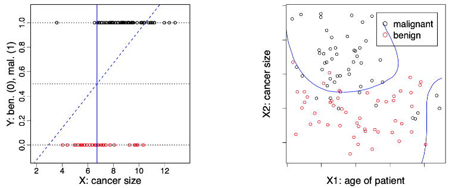{#fig-linear-classification}

In problems with more than two classes, linear methods produce **piecewise linear decision boundaries**, i.e. separate hyperplanes that divide the feature space into multiple regions, one for each class.

## Linear Discriminant Analysis

### Setup

We aim to classify an observation $Y \in \mathcal{G} = \{1, \ldots, q\}$ given predictors $X = (X_1, \ldots, X_p)$.  
The idea is to model the **class-conditional densities** of $X$ given the class $Y = j$, denoted $g_j(x)$, and the **marginal class probabilities** $\pi_j = \Pr(Y = j)$ for $j = 1, \ldots, q$.  
Using Bayes’ theorem, we can express the posterior probability of belonging to class $j$ as $$\Pr(Y = j \mid X = x) = \frac{\Pr(X = x \mid Y = j) \Pr(Y = j)}{\Pr(X = x)}\propto g_j(x)\pi_j.$$

This proportionality means that, for classification, we only need to compare the quantities $g_j(x)\pi_j$ across classes.

### Modelling Assumptions

In **Linear Discriminant Analysis (LDA)**:

1. Each class-conditional density $g_j(x)$ is assumed to follow a **multivariate normal distribution**: $$g_j(x) = \frac{1}{(2\pi)^{p/2} (\det \Sigma_j)^{1/2}} \exp\left\{ -\frac{1}{2}(x - \mu_j)^\top \Sigma_j^{-1} (x - \mu_j) \right\}.$$

2. All classes share the **same covariance matrix**, that is, $\Sigma_j = \Sigma$ for all $j$.

Under these assumptions, the decision boundary between two classes is **linear** in $x$, because the logarithm of the posterior probabilities yields a linear function of $x$.

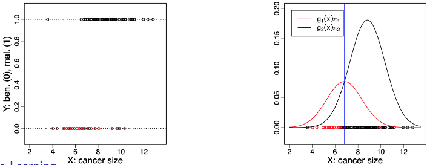{#fig-lda-gaussians}

@fig-lda-gaussians shows a one-dimensional example with two classes. Each class distribution is modelled by a Gaussian density with its own mean but identical variance.  
The intersection point between the scaled densities $g_1(x)\pi_1$ and $g_2(x)\pi_2$ corresponds to the **decision boundary**, i.e., the value of $x$ where the posterior probabilities are equal.

## Estimation

In practice, the parameters of LDA are estimated from a training sample $(y_1, \mathbf{x}_1), \ldots, (y_n, \mathbf{x}_n)$.  
The model includes:

- the **prior class probabilities** $\pi_1, \ldots, \pi_q \in (0, 1)$  
- the **class mean vectors** $\boldsymbol{\mu}_1, \ldots, \boldsymbol{\mu}_q \in \mathbb{R}^p$  
- the **common covariance matrix** $\boldsymbol{\Sigma} \in \mathbb{R}^{p \times p}$  

We estimate these by the **maximum likelihood estimators**: $$\hat{\pi}_j = \frac{1}{n} \sum_{i=1}^{n} \mathbf{1}\{y_i = j\}, \quad \hat{\boldsymbol{\mu}}_j = \frac{\sum_{i=1}^{n} \mathbf{x}_i \mathbf{1}\{y_i = j\}}{\sum_{i=1}^{n} \mathbf{1}\{y_i = j\}}, $$ $$\hat{\boldsymbol{\Sigma}} = \frac{\sum_{j=1}^{q} \sum_{i=1}^{n} (\mathbf{x}_i - \hat{\boldsymbol{\mu}}_j)(\mathbf{x}_i - \hat{\boldsymbol{\mu}}_j)^{\top} \mathbf{1}\{y_i = j\}}{n - q}.$$

These estimators are simple closed forms — no iterative optimisation is needed — which makes LDA **computationally very fast**.  
Unlike linear regression, we do not use the numerical values of the $y_i$’s, only their class membership.

## Prediction

Given a new observation $\mathbf{x}_0 \in \mathbb{R}^p$, we predict its class by maximising the posterior probability estimated from the training data: $$\hat{y}_0 = \arg\max_{j=1,\ldots,q} \widehat{\Pr}(Y = j \mid X = \mathbf{x}_0) = \arg\max_{j=1,\ldots,q} \log \widehat{\Pr}(Y = j \mid X = \mathbf{x}_0).$$

From the Gaussian model, we have: $$\log \widehat{\Pr}(Y = j \mid X = \mathbf{x}_0) = \log \hat{g}_j(\mathbf{x}_0) + \log \hat{\pi}_j + \text{constant},$$

which expands to $$-\tfrac{1}{2}(\mathbf{x}_0 - \hat{\boldsymbol{\mu}}_j)^{\top} \hat{\boldsymbol{\Sigma}}^{-1} (\mathbf{x}_0 - \hat{\boldsymbol{\mu}}_j) + \log \hat{\pi}_j + \text{constant}.$$

Ignoring terms independent of $j$, this simplifies to a **linear discriminant function**: $$\delta_j(\mathbf{x}_0) = \mathbf{x}_0^{\top}\hat{\boldsymbol{\Sigma}}^{-1}\hat{\boldsymbol{\mu}}_j - \tfrac{1}{2}\hat{\boldsymbol{\mu}}_j^{\top}\hat{\boldsymbol{\Sigma}}^{-1}\hat{\boldsymbol{\mu}}_j + \log \hat{\pi}_j.$$

We assign $\mathbf{x}_0$ to the class with the largest $\delta_j(\mathbf{x}_0)$.

### Geometric interpretation

LDA classifies points based on their **Mahalanobis distance** to each class mean, adjusted by the prior probabilities: $$d_{\Sigma^{-1}}(x, \mu_j) = (x - \mu_j)^{\top}\Sigma^{-1}(x - \mu_j).$$

In geometric terms, the decision boundary lies at points where two discriminant functions are equal, i.e. where the posterior probabilities of the classes coincide.  
These boundaries are **linear** because $\Sigma$ is common to all classes.

## Decision Boundaries

The **decision boundary** separating two classes $j, m \in \{1, \ldots, q\}$ is the set of all $\mathbf{x} \in \mathbb{R}^p$ such that $$\Pr(Y = j \mid X = \mathbf{x}) = \Pr(Y = m \mid X = \mathbf{x}).$$

This is equivalent to $$\log \Pr(Y = j \mid X = \mathbf{x}) - \log \Pr(Y = m \mid X = \mathbf{x}) = 0.$$

Replacing these probabilities by their Gaussian expressions and the prior class probabilities gives the **decision boundary equation**: $$\log \frac{\pi_j}{\pi_m} - \tfrac{1}{2}(\boldsymbol{\mu}_j + \boldsymbol{\mu}_m)^{\top}\boldsymbol{\Sigma}^{-1}(\boldsymbol{\mu}_j - \boldsymbol{\mu}_m) + \mathbf{x}^{\top}\boldsymbol{\Sigma}^{-1}(\boldsymbol{\mu}_j - \boldsymbol{\mu}_m) = 0.$$

This is a **linear equation in $\mathbf{x}$**.  
Hence, the boundaries separating any two classes $j$ and $m$ are **hyperplanes** in $\mathbb{R}^p$ of dimension $p - 1$.  
For $q > 2$ classes, these hyperplanes together form a **piecewise linear decision boundary**.

## Iris Data Set

To illustrate LDA in practice, we use the classic **Iris data set**, which contains 150 observations of three flower species: *setosa*, *versicolor*, and *virginica*.  Each plant is described by $p = 4$ predictors (sepal length, sepal width, petal length, and petal width), and the response variable $G = \{\textit{setosa}, \textit{versicolor}, \textit{virginica}\}$ indicates the species.

Here, we restrict the analysis to only **two predictors** (sepal length and sepal width) to visualise the classification boundary in two dimensions.  
After fitting LDA to these two features, we obtain three **piecewise linear decision boundaries**, each separating one species from the others.

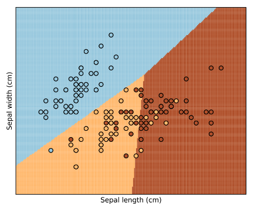{#fig-lda-iris width="55%"}

In @fig-lda-iris, each coloured region represents the set of points assigned to one of the three classes. The black circles correspond to the training observations.  
As expected from LDA, the boundaries between classes are straight lines — consistent with the linear decision boundaries derived theoretically.  
Despite using only two features, LDA achieves clear separation between *setosa* and the other two species, while *versicolor* and *virginica* overlap slightly, reflecting their natural similarity in the data.

## Extensions of LDA

There are many ways to extend LDA. The Bayes’ formulation $$\Pr(Y = j \mid X = x) = \frac{\Pr(X = x \mid Y = j)\Pr(Y = j)}{\Pr(X = x)} = \frac{g_j(x)\pi_j}{\sum_{k=1}^{q} g_k(x)\pi_k}$$ can be used with different forms of the class-conditional densities $g_j(x)$.

**Quadratic Discriminant Analysis (QDA)** models each $g_j$ as a multivariate normal distribution but allows for **different covariance matrices** $\boldsymbol{\Sigma}_j$, leading to **quadratic decision boundaries**.

**Mixture models** use combinations of Gaussian components to represent more complex class-conditional densities $g_j(x)$, providing greater flexibility when class distributions are not unimodal.

**Naive Bayes** assumes **conditional independence** between predictors given the class. In this case, $$g_j(x) = \prod_{\ell=1}^{p} g_{j,\ell}(x_\ell),$$ where each feature contributes independently to the overall class likelihood.

When some predictors are **categorical**, such as $X_1$, we can write $$g_j(x) = \Pr(X_1 = x_1 \mid Y = j) g_j(x_2, \ldots, x_p \mid X_1 = x_1, Y = j),$$ where $g_j(x_2, \ldots, x_p \mid X_1 = x_1, Y = j)$ represents the density of the remaining continuous variables.

Finally, **non-parametric approaches** estimate $g_j(x)$ directly from data without assuming any specific parametric form, offering the most flexibility at the cost of greater computational effort.


## Iris Data Set: QDA

We again use the **Iris data set** to compare QDA with LDA.  
The same three classes (*setosa*, *versicolor*, and *virginica*) are modelled using only two predictors: sepal length and sepal width.

Fitting QDA allows each class to have its own covariance structure, producing **curved boundaries** that better adapt to class shapes in the feature space.

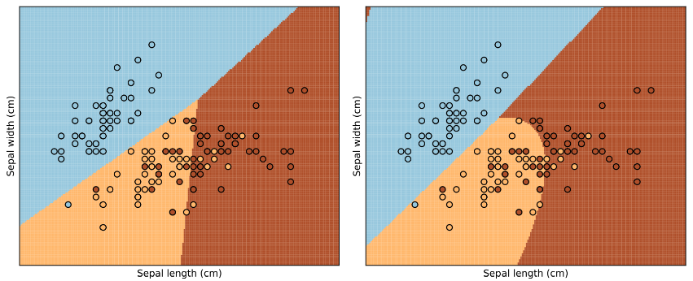{#fig-lda-vs-qda}

@fig-lda-vs-qda compares the classification regions obtained with LDA (left) and QDA (right).  
LDA yields **linear boundaries**, while QDA produces **quadratic, more flexible** ones that better capture non-linear class separation.  
Although QDA can fit the data more closely, it also increases the risk of overfitting when the number of predictors or classes grows.

## Comments on LDA

LDA is **easy** and **fast to compute**.  
It also provides estimates of the **posterior class probabilities**: $$\widehat{\Pr}(Y = j \mid X = \mathbf{x}_0) = \frac{\hat{g}_j(\mathbf{x}_0)\hat{\pi}_j}{\sum_{k=1}^{q} \hat{g}_k(\mathbf{x}_0)\hat{\pi}_k}.$$

In practice, LDA usually performs well and can compete with more complex methods.  
This is not because the normality assumption is realistic, but because a **linear decision boundary** is often the best the data can support.  
Moreover, LDA is a **stable estimation method**, meaning that even if the assumed Gaussian model is imperfect, the resulting decision boundary remains robust.

We do not need highly accurate $g_j$ to obtain a good posterior; @fig-comments-lda illustrates this idea.

On the **left**, the two class-conditional densities $g_1(x)$ and $g_2(x)$ are clearly **non-Gaussian**—the blue density is even bimodal.  
On the **right**, we see the corresponding **posterior probability** of belonging to the red class.  
Despite the complex shape of the densities, the posterior remains **smooth and monotonic**, producing a clear linear-like separation.  
This shows that even if the normality assumption fails, LDA still yields reliable classification boundaries.

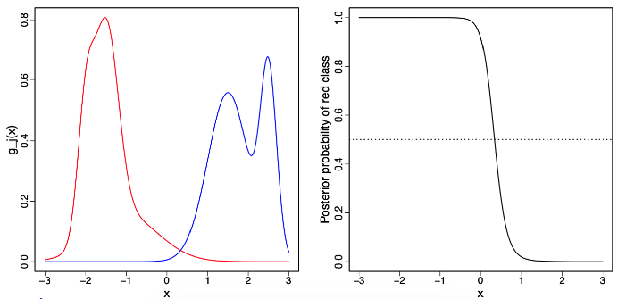{#fig-comments-lda}


# Logistic Regression

# Image Recognition

## Image Recognition: introduction

Image recognition aims to identify or classify objects within digital images by learning the relationship between pixel intensities and their corresponding labels. Each image is represented as a grid of pixels, where each pixel encodes the degree of darkness on a greyscale from 0 (white) to 9 (black). In this example, every handwritten digit image consists of $16 \times 16 = 256$ pixels, meaning we have 256 predictors for each observation.

Each predictor corresponds to a specific pixel intensity, and together these values form a feature vector $\mathbf{x}_i = (x_{i1}, x_{i2}, \ldots, x_{i256})$. The model learns a mapping $\hat{f}(\mathbf{x}_i)$ that associates these pixel values with the corresponding digit label $y_i \in \{0, \ldots, 9\}$. Classification algorithms such as logistic regression, neural networks, or convolutional networks can be used to learn this mapping.

This approach converts visual information into numerical data, allowing statistical or machine learning methods to identify complex patterns of brightness and shape that define each digit. The more pixels that are used as predictors, the higher the potential resolution and detail the model can learn, although this also increases computational cost and the need for regularisation.

## Two-class classification: one predictor

The two rows of digits above illustrate how the greyscale information is represented numerically. The top row shows examples of handwritten digits, while the bottom row highlights in red the pixel being used as a predictor (marked with a blue cross). Each pixel’s greyscale value serves as an input feature $x_{ij}$, and the task is to learn which configurations of these features correspond to each digit.

\begin{minipage}{0.55\textwidth}
\textbf{Two-class example:} If we simplify the problem to classify only two digits (e.g. zero and one), a single pixel can already provide limited predictive power. Suppose we use the value at Pixel 1 (blue cross) as our predictor $X_1$. Applying logistic regression, we can fit a classifier based solely on $X_1$. The decision boundary divides the range of pixel values into regions associated with each class.

\smallskip

The predictor and class definitions are:
\begin{itemize}
\tightlist
\item Value at Pixel 1 (blue cross) is the predictor, $X_1 \in [-1, 1]$.
\item The class is $Y \in \{0, 1\} = \{\text{zero}, \text{one}\}$.
\item Logistic regression provides the following classifier:
\end{itemize}
$$\hat{G}(x) =
\begin{cases}
\text{zero} & \text{if (Pixel 1) < 0.45} \\
\text{one} & \text{otherwise.}
\end{cases}$$
\end{minipage}
\hfill
\begin{minipage}{0.4\textwidth}
\begin{figure}[H]
\centering
\includegraphics[width=\linewidth]{Images_qmd_ML/ML6_op_plot.png}
\caption{Two-class classification using a single pixel as predictor}
\label{fig-ML6-op-plot}
\end{figure}
\end{minipage}

This shows that even a single pixel may carry some information about class membership, but meaningful recognition requires combining all 256 pixel predictors to capture the full spatial structure of each digit. As seen in Figure \ref{fig-ML6-op-plot}, logistic regression produces a smooth probability curve separating the two classes based on Pixel 1 intensity.

## Two-class classification: two predictors

We now extend the previous example to include two pixel predictors instead of one. Each handwritten image is still represented as a $16 \times 16$ greyscale matrix, but we now focus on two specific pixel locations whose intensity values serve as features. Let these be $X_1$ (Pixel 1) and $X_2$ (Pixel 2), each scaled to the interval $[-1, 1]$. The model must distinguish between two classes, $Y \in \{0, 1\} = \{\text{zero}, \text{one}\}$, based on these two predictors.

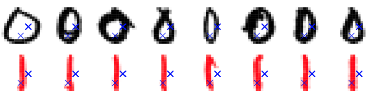

The two rows above show examples of handwritten zeros and ones. The blue crosses mark the pixels chosen as predictors. The top row displays the original digits, while the bottom row highlights in red the regions where these two pixels vary in intensity. Together, $X_1$ and $X_2$ capture more information about the digit’s shape than a single pixel could, since their joint variation reflects spatial structure.

\begin{minipage}{0.55\textwidth}
\textbf{Two predictors:} Increasing the number of predictors from one to two allows the classifier to capture dependencies between neighbouring pixels. The logistic regression model now uses two predictors to estimate a decision boundary in the $(X_1, X_2)$ plane. The following definitions summarise the setup:

\smallskip

\begin{itemize}
\tightlist
\item $p = 2$: Predictors are  
  $X_1 =$ “value at Pixel 1” $\in [-1, 1]$,  
  $X_2 =$ “value at Pixel 2” $\in [-1, 1]$.
\item The class is $Y \in \{0, 1\} = \{\text{zero}, \text{one}\}$.
\item We apply logistic regression to obtain a classifier based only on $X_1$ and $X_2$.
\end{itemize}
\end{minipage}
\hfill
\begin{minipage}{0.4\textwidth}
\begin{figure}[H]
\centering
\includegraphics[width=\linewidth]{Images_qmd_ML/ML6_op_plot_2pred.png}
\caption{Two-class classification using two pixel predictors}
\label{fig-ML6-op-plot-2pred}
\end{figure}
\end{minipage}

As seen in Figure \ref{fig-ML6-op-plot-2pred}, the logistic regression model constructs a linear decision boundary in the two-dimensional pixel space. Although still a simple model, it illustrates how combining multiple pixel predictors improves the classifier’s ability to capture the geometric characteristics of each digit.

## 10-class classification: two predictors

We now extend the model to classify all ten digits simultaneously. Each handwritten image is represented by 256 pixel intensities, but here we restrict the model to use only two predictors: $X_1$ (Pixel 1) and $X_2$ (Pixel 2), each scaled to the interval $[-1, 1]$. The goal is to predict one of ten classes $Y \in \{0, 1, \ldots, 9\} = \{\text{zero}, \text{one}, \ldots, \text{nine}\}$ using just these two features.

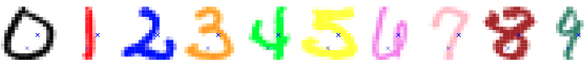

The digits above illustrate the complexity of the task. The blue crosses mark the two pixel positions used as predictors. Although these pixels provide some information about local brightness, they are clearly insufficient to distinguish all ten digits reliably. This visual example highlights how limited features constrain the classifier’s ability to capture the structural variation among digits.

\begin{minipage}{0.55\textwidth}
\textbf{Ten classes with two predictors:} Extending from binary to multiclass classification requires the model to output a probability distribution across ten possible classes. The logistic regression generalises to a \emph{multinomial regression} model. The main elements are:

\smallskip

\begin{itemize}
\tightlist
\item $p = 2$: Predictors are  
  $X_1 =$ “value at Pixel 1” $\in [-1, 1]$,  
  $X_2 =$ “value at Pixel 2” $\in [-1, 1]$.
\item The class is $Y \in \{0, 1, \ldots, 9\} = \{\text{zero}, \text{one}, \ldots, \text{nine}\}$.
\item We apply \emph{multinomial regression} based only on $X_1$ and $X_2$, though with only two pixels this remains a very difficult task.
\end{itemize}
\end{minipage}
\hfill
\begin{minipage}{0.4\textwidth}
\begin{figure}[H]
\centering
\includegraphics[width=\linewidth]{Images_qmd_ML/ML6_col_plot.png}
\caption{Ten-class classification using two pixel predictors}
\label{fig-ML6-col-plot}
\end{figure}
\end{minipage}

As seen in Figure \ref{fig-ML6-col-plot}, the classifier attempts to separate the ten classes within the $(X_1, X_2)$ plane, but the overlap between classes is substantial. With only two predictors, the model cannot capture the high-dimensional structure of the digits, showing why richer feature sets are essential for effective image recognition. Luckily, we have $p = 256$ predictors (pixel values) to perform this task.

## Digit classification

We now apply the classification methods to the full ten-digit problem using all $p = 256$ pixel predictors. Each image is represented as a point in $\mathbb{R}^{256}$, where the predictors $\mathbf{x}_i$ correspond to the greyscale values of all pixels, and the outcome $y_i$ indicates which digit is shown.

{#fig-ML6-digit-class}

\begin{minipage}{0.55\textwidth}
\textbf{Training and test data:}  
\begin{itemize}
\tightlist
\item Training data $(\mathbf{x}_1, y_1), \ldots, (\mathbf{x}_n, y_n)$, $n = 7290$, are used for model fitting and selection.  
  \begin{itemize}
  \tightlist
  \item Predictors $\mathbf{x}_i =$ $i$-th image $\in \mathbb{R}^p$ are the greyscale pixel values.  
  \item Outcomes $y_i =$ $i$-th digit $\in \{\text{zero}, \text{one}, \ldots, \text{nine}\}$.
  \end{itemize}
\item Test data $(\hat{\mathbf{x}}_1, \hat{y}_1), \ldots, (\hat{\mathbf{x}}_m, \hat{y}_m)$, $m = 2006$, are not used for fitting or selection, only for evaluating performance.
\end{itemize}

\smallskip
\textbf{Models compared:}  
\begin{itemize}
\tightlist
\item \textbf{linreg:} direct linear regression.  
\item \textbf{LDA1:} Linear Discriminant Analysis (LDA) based on the values $x_i$.  
\item \textbf{LDA2:} LDA based on $x_i$ and $x_i^2$.  
\item \textbf{QDA:} Quadratic Discriminant Analysis with a distinct covariance matrix for each class.  
\item \textbf{log:} logistic (multinomial) regression.
\end{itemize}
\end{minipage}
\hfill
\begin{minipage}{0.4\textwidth}
\begin{center}
\textbf{Training and test errors (\%)}  
\begin{tabular}{lcc}
\hline
Method & Training & Test \\
\hline
linreg & 7.6 & 13.1 \\
LDA1 & 6.2 & 11.5 \\
LDA2 & 3.9 & 10.2 \\
QDA & 1.8 & 13.5 \\
log & 0.01 & 11.1 \\
\hline
\end{tabular}
\end{center}
\end{minipage}

QDA yields the lowest training error but performs worst on the test data due to high variance and overfitting. In contrast, multinomial logistic regression achieves a balanced trade-off between bias and variance, maintaining strong generalisation performance across unseen digits.

## Digit classification: visualisation of LDA1

\begin{minipage}{0.4\textwidth}
\begin{figure}[H]
\centering
\includegraphics[width=\linewidth]{Images_qmd_ML/ML6_LDA1.png}
\caption{Estimated class centres from LDA1}
\label{fig-ML6-LDA1}
\end{figure}
\end{minipage}
\hfill
\begin{minipage}{0.55\textwidth}
\textbf{Visualising class centres:}  
The figure on the left shows the estimated class means $\hat{\mu}_1, \ldots, \hat{\mu}_q$ obtained from the LDA1 model. Each image corresponds to the \emph{average digit} for one class, formed by taking the mean pixel intensity across all training examples belonging to that class.

This visualisation provides an intuitive impression of the class centroids, illustrating how the model perceives the typical form of each handwritten digit. In other words, it shows how an “average” American writer tends to shape the digits 0–9.
\end{minipage}

## Example: digit classification

The table below shows a few misclassified test observations from the LDA1 model. Each row corresponds to one test image, with its true label shown in parentheses. The ten columns on the right display the predicted class probabilities (in %) for $k \in \{0, \ldots, 9\}$.

These results illustrate how the model distributes probability mass across different classes when uncertain. For example, a digit “6” may be partly misclassified as an “8” if the loop closure is faint, or a “9” mistaken for a “4” if the stem is short. Such errors reveal how subtle variations in handwriting can affect class boundaries and show the limits of simple linear discriminant models.

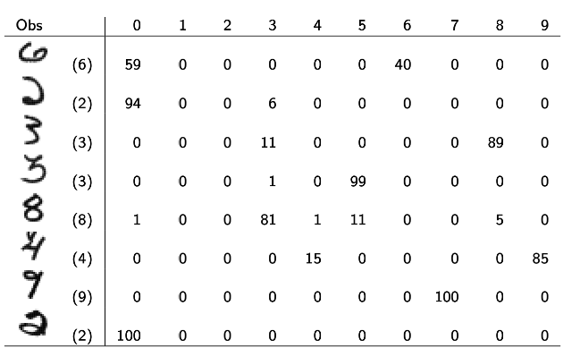

## Digit classification with regularisation

We can now refine our previous results on digit classification (see @fig-ML6-digit-class). When estimating the multinomial logistic regression, we introduce two regularisation terms in the likelihood: a \emph{ridge penalty} and a \emph{lasso penalty}. These control model complexity by shrinking or selecting coefficients, helping to prevent overfitting.

The optimal tuning parameters $\hat{\lambda}$ for both penalties are determined by 5-fold cross-validation, balancing the trade-off between training accuracy and test performance.

\begin{minipage}{0.55\textwidth}
\textbf{Models compared:}  
\begin{itemize}
\tightlist
\item \textbf{linreg:} direct linear regression.  
\item \textbf{LDA1:} Linear Discriminant Analysis (LDA) based on the values $x_i$.  
\item \textbf{LDA2:} LDA based on $x_i$ and $x_i^2$.  
\item \textbf{QDA:} Quadratic Discriminant Analysis with a distinct covariance matrix for each class.  
\item \textbf{log:} logistic regression (multinomial).  
\item \textbf{log-ridge:} logistic regression (multinomial) with ridge penalty.  
\item \textbf{log-lasso:} logistic regression (multinomial) with lasso penalty.
\end{itemize}
\end{minipage}
\hfill
\begin{minipage}{0.4\textwidth}
\begin{center}
\textbf{Training and test errors (\%)}  
\begin{tabular}{lcc}
\hline
Method & Training & Test \\
\hline
linreg & 7.6 & 13.1 \\
LDA1 & 6.2 & 11.5 \\
LDA2 & 3.9 & 10.2 \\
QDA & 1.8 & 13.5 \\
log & 0.01 & 11.1 \\
log-ridge & 4.1 & 9.0 \\
log-lasso & 2.7 & 8.8 \\
\hline
\end{tabular}
\end{center}
\end{minipage}

Regularisation improves generalisation by penalising overly complex models. Both ridge and lasso versions outperform unpenalised logistic regression, reducing the test error to below 9%. The lasso penalty performs slightly better, as it enforces sparsity by effectively selecting the most informative pixel predictors.

# Decision trees: regression

## Tree-based methods

Tree-based methods stratify or segment the feature space recursively into simple regions, denoted $R_1, \ldots, R_J$. They can be applied to both classification and regression tasks.\
For a given observation, the prediction corresponds to either:

\- the \emph{mean} of the training responses in the region (for regression), or\
- the \emph{most common class} of the training observations in the region (for classification).

The method divides the input space into rectangles that are successively refined, producing a piecewise-constant model with clear interpretability.

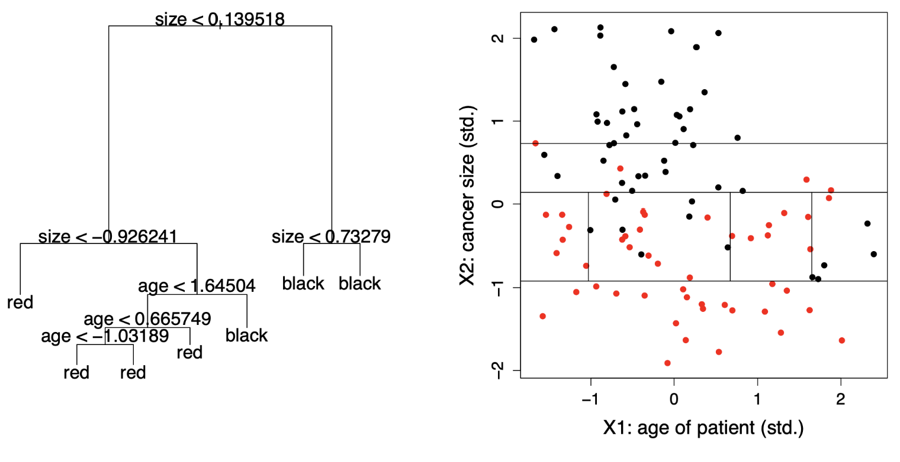{#fig-tbm}

Tree-based approaches can be grouped as follows:

1\. **Decision trees:** Single trees offering clear interpretability and simple decision rules.\
2. **Bagging / Boosting:** Methods combining multiple trees to improve prediction accuracy by reducing variance or bias.\
3. **Random forests:** Ensembles that decorrelate bagged trees, increasing stability and robustness.

As illustrated in Figure @fig-tbm, the **left panel** displays a small regression tree built using the predictors *age* ($X_1$) and *cancer size* ($X_2$). Each internal node represents a decision rule that splits the data based on a threshold value (e.g. *size \< 0.14*), dividing observations into smaller, more homogeneous groups. The **terminal nodes** (leaves) indicate the predicted response for each region. In this example, coloured as *red* and *black* to distinguish lower and higher predicted values.

The **right panel** shows how these splits translate into a partitioning of the two-dimensional predictor space. Each rectangular region corresponds to one terminal node from the tree, defining an area where all observations receive the same fitted value. The vertical and horizontal lines represent the thresholds used in the tree’s internal splits. Collectively, these partitions form a **piecewise-constant regression surface**, demonstrating how decision trees approximate complex, nonlinear relationships through a sequence of simple, interpretable divisions.

## Example: Hitters data set

As introduced in Figure \ref{fig-hitters}, the \textbf{Hitters} data set from the \emph{ISLR} package contains the annual \textbf{Salary} of 263 baseball players and $p = 19$ predictors such as the number of \textbf{Years} played in the major leagues and the number of \textbf{Hits} during the previous season.

In what follows, we focus only on the variables \emph{Years} and \emph{Hits} to illustrate how a \textbf{regression tree} predicts the (log) salary of a player. This simplified example allows us to visualise how the tree partitions the feature space and introduces the main terminology of tree models.

## Regression trees: terminology

\begin{minipage}{0.55\textwidth}
We fit a regression tree to predict the log \textbf{Salary} of a baseball player using only \textbf{Years} and \textbf{Hits} as predictors from the \textbf{Hitters} data set.\par
Each split in the tree is called a \textbf{node}, and a terminal node is referred to as a \textbf{leaf}. The interior nodes connect to further branches, forming a hierarchical structure of decision rules.\par
The label $(X_j < t)$ indicates the \emph{left-hand branch} from a split, while $(X_j \ge t)$ corresponds to the \emph{right-hand branch}. Each leaf contains the mean predicted value for all observations that fall into that region.\par
An important advantage of trees is their strong \textbf{interpretability}: the step-by-step structure mirrors how humans make sequential decisions, making them highly intuitive in applied prediction problems.
\end{minipage}\hfill
\begin{minipage}{0.4\textwidth}
\begin{figure}[H]
\centering
\includegraphics[width=\linewidth]{Images_qmd_ML/ML6_regtree_terms.png}
\caption{Regression tree predicting log Salary using Years and Hits}
\label{fig-ML6-regtree-terms}
\end{figure}
\end{minipage}

## Regression trees: segmentation of feature space

The regression tree partitions the feature space into three regions, each corresponding to one of the terminal nodes (leaves). Each region $R_j$ contains the observations that satisfy the set of split conditions leading to that node.

-   $R_1 = \{\mathbf{X} \mid \text{Years} < 4.5\}$,
-   $R_2 = \{\mathbf{X} \mid \text{Years} \ge 4.5,\, \text{Hits} < 117.5\}$,
-   $R_3 = \{\mathbf{X} \mid \text{Years} \ge 4.5,\, \text{Hits} \ge 117.5\}$.

\begin{minipage}{0.55\textwidth}
\textbf{Interpretation:}
\begin{itemize}
\tightlist
\item \emph{Years} is the most influential variable in determining \textbf{Salary}: players with fewer than 4.5 years of experience tend to earn less.  
\item Among more experienced players, \emph{Hits} becomes relevant, i.e., those with more than 117.5 hits typically have higher salaries.  
\item This simple tree structure highlights how regression trees create interpretable, piecewise-constant models of salary prediction.
\end{itemize}
\end{minipage}
\hfill
\begin{minipage}{0.4\textwidth}
\begin{figure}[H]
\centering
\includegraphics[width=\linewidth]{Images_qmd_ML/ML6_regtree_seg.png}
\caption{Segmentation of feature space by the regression tree}
\label{fig-ML6-regtree-seg}
\end{figure}
\end{minipage}

## How to grow a regression tree?

Given a training data set $(\mathbf{x}_1, y_1), \ldots, (\mathbf{x}_n, y_n)$ with $\mathbf{x}_i \in \mathbb{R}^p$ and $y_i \in \mathbb{R}$, we seek to construct a regression tree that divides the predictor space into $J$ non-overlapping regions $R_1, \ldots, R_J$.

-   The goal is to partition the predictor space $(X_1, \ldots, X_p)$ into distinct regions that are as homogeneous as possible with respect to the response $y_i$.

-   Although the regions could take any shape, regression trees restrict them to high-dimensional **rectangles (boxes)** for interpretability.

-   For each observation falling into region $R_j$, we predict a constant value: $$ \hat{y}_{R_j} = \frac{1}{n_j} \sum_{i : \mathbf{x}_i \in R_j} y_i $$\
    where $n_j$ is the number of training observations in region $R_j$.

-   The prediction in each region is thus the **mean** of the training responses for that region

-   The optimal partitioning aims to find the regions $R_1, \ldots, R_J$ that minimise the residual sum of squares (RSS): $$ \sum_{j=1}^{J} \sum_{i : \mathbf{x}_i \in R_j} (y_i - \hat{y}_{R_j})^2$$ This recursive partitioning procedure builds the tree by successively splitting the predictor space to reduce the RSS at each step, producing a hierarchy of simple, interpretable decision rules.

## Tree growing: greedy algorithm

It is computationally infeasible to test all possible ways of dividing the feature space into $J$ regions. Instead, regression trees are built using a **top-down, greedy algorithm**, also known as **recursive binary splitting**.

-   It is *top-down* because it starts at the root (the full training set) and **recursively splits** the predictor space into smaller regions.
-   It is *greedy* because each split is chosen to produce the best immediate improvement in fit, without considering future splits.
-   At each step, the algorithm searches over all predictors and all possible split points to find the combination $(j, t)$ that minimises the Residual Sum of Squares (RSS).
-   The process continues until a **stopping criterion** is reached. For example, when no region contains more than a minimum number of observations.

Formally, for each predictor $X_j$ and potential cutpoint $t$, we define the half-planes:

$$R_1(j, t) = \{ \mathbf{X} \mid X_j < t \}, \quad R_2(j, t) = \{ \mathbf{X} \mid X_j \ge t \}.$$

The algorithm finds the values $(j^*, t^*)$ that minimise the sum of squared residuals:

$$\sum_{i : \mathbf{x}_i \in R_1(j, t)} (y_i - \hat{y}_{R_1(j, t)})^2 + \sum_{i : \mathbf{x}_i \in R_2(j, t)} (y_i - \hat{y}_{R_2(j, t)})^2.$$

The splitting process is then repeated **recursively** on the resulting regions, producing a hierarchical partitioning of the predictor space.

Once the regions $R_1, \ldots, R_J$ are formed, predictions for a new observation $\mathbf{x}$ are made by assigning it to the appropriate region $R_j$ and using the average response within that region:

$$\hat{f}(\mathbf{x}) = \sum_{j=1}^{J} \hat{y}_{R_j} \mathbf{1}\{ \mathbf{x} \in R_j \}.$$

## Regression tree: two-dimensional feature space

A regression tree partitions the predictor space into a series of non-overlapping rectangular regions. In a two-dimensional example with predictors $X_1$ and $X_2$, the recursive binary splits successively divide the plane into subregions $\{R_1, R_2, \ldots, R_5\}$.

Each split corresponds to a threshold (cutpoint) on one of the variables, forming a hierarchical structure as shown below. The final model can be visualised both as a **tree diagram** and as a **piecewise-constant surface**, where each flat region represents the predicted response $\hat{y}_{R_j}$ for all observations in $R_j$.

\begin{figure}[H]
\centering
\includegraphics[width=0.85\linewidth]{Images_qmd_ML/ML6_2D_tree.png}
\caption{Two-dimensional feature space partition and corresponding regression tree}
\label{fig-ML6-2D-tree}
\end{figure}

## Cost-complexity pruning

When a tree is fully grown, it may overfit the training data. To improve generalisation, we prune it to a smaller subtree that balances fit and simplicity. This is achieved through **cost-complexity pruning** (or *weakest-link pruning*).

We consider a sequence of trees indexed by a tuning parameter $\alpha \ge 0$. For each $\alpha$, the corresponding subtree $T_\alpha \subset T_0$ minimises:

$$ \sum_{j=1}^{|T_\alpha|} \sum_{i : \mathbf{x}_i \in R_j} (y_i - \hat{y}_{R_j})^2 + \alpha |T_\alpha|. $$

-   The first term measures the **fit** of the tree (training error).
-   The second term $\alpha |T_\alpha|$ penalises **model complexity**, where $|T_\alpha|$ is the number of terminal nodes.
-   The tuning parameter $\alpha$ controls the degree of pruning:
    -   Large $\alpha$ → stronger penalty → simpler tree.
    -   Small $\alpha$ → weaker penalty → larger tree.
-   $\alpha$ plays a similar role to $\lambda$ in ridge or lasso regression.
-   The optimal $\alpha$ is typically selected by **cross-validation**.

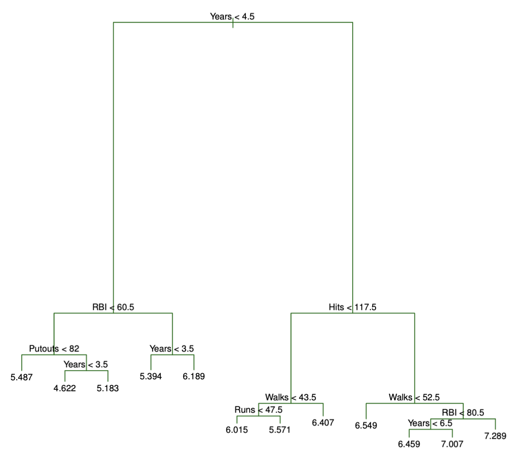{#fig-pruned-tree width="70%" fig-align="center"}

As we can see in Figure @fig-pruned-tree, the **pruned tree** is a simplified version of the original full tree grown on the *Hitters* dataset.\
Each internal node splits the data based on one predictor (e.g. `Years`, `Hits`, or `Walks`), while each **leaf** represents the **average log-salary** for players falling into that region.

-   Players with **few years in the league** and **low hits** are predicted to have **lower salaries**.
-   More experienced players with **higher hits** or **walks** tend to have **higher predicted salaries**.
-   By pruning, redundant splits are removed, retaining only those that meaningfully reduce the prediction error.

The pruned tree thus strikes a **bias–variance balance**: it is simpler (less variance) but still captures the main salary patterns (low bias), leading to better test performance.

## Regression example: Hitters data set

To evaluate the effect of pruning, the **Hitters** data set is split into 132 training observations and 131 test observations.\
A large regression tree is first grown on the training data and then **pruned** by varying the penalty parameter $\alpha$ to obtain subtrees with different numbers of terminal nodes.

**Six-fold cross-validation** is performed on the 132 training observations to estimate the mean squared error (MSE) for each subtree.\
The final test error is computed on the 131 test observations, which are **not used** for model fitting or selection.

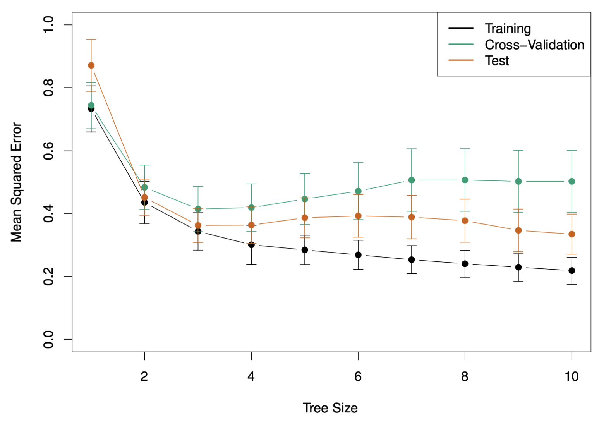{#fig-prune-cv-plot width="70%" fig-align="center"}

As we see in @fig-prune-cv-plot, **training error** (black) continues to decrease as the tree grows, while **cross-validation** (green) and **test** (orange) errors reach a minimum and then rise again, a clear sign of **overfitting** beyond the optimal tree size.

-   Small trees underfit the data, yielding high bias and poor predictive accuracy.
-   Large trees overfit, capturing noise and yielding high variance.
-   The **optimal subtree** is chosen where the **cross-validation error is minimal**, achieving the best balance between bias and variance.

In the *Hitters* example, this corresponds to a **moderately sized tree** that retains the main predictors (Years, Hits, Walks) while discarding redundant splits, leading to improved generalisation performance.

# Decision trees: classification

## Classification trees

**Classification trees** are conceptually similar to regression trees, except that they predict a **qualitative** rather than a **quantitative** response. The response variable takes values in a finite set $\mathcal{G} = \{1, \ldots, q\}$, representing different classes.

For each region $R_j$, the prediction is a constant $\hat{y}_{R_j}$ corresponding to the **most frequently occurring class** among the training observations that fall into that region. Formally, for class $g = 1, \ldots, q$: $$\hat{p}_{jg} = \frac{1}{n_j} \sum_{i : \mathbf{x}_i \in R_j} \mathbf{1}\{y_i = g\}.$$

Hence, the classifier assigns each new observation to the region $R_j$ that maximises $\hat{p}_{jg}$, producing the final prediction function: $$\hat{G}(\mathbf{x}) = \sum_{j=1}^{J} \hat{y}_{R_j} \mathbf{1}\{\mathbf{x} \in R_j\}.$$

The construction principles — such as **tree growth**, **pruning**, and **subtree selection** — are the same as in regression trees. However, the **residual sum of squares (RSS)** cannot be used as a loss function for qualitative outcomes. Instead, classification trees rely on **measures of node impurity**, which quantify the heterogeneity of classes within a region.

Common impurity measures for a terminal node $R_j$ include:

1.  **Misclassification error:** $$M = \frac{1}{n_j} \sum_{i : \mathbf{x}_i \in R_j} \mathbf{1}\{y_i \ne \hat{y}_{R_j}\}.$$

2.  **Gini index:** $$G = \sum_{g=1}^{q} \hat{p}_{jg} (1 - \hat{p}_{jg}).$$

3.  **Cross-entropy (or deviance):** $$D = - \sum_{g=1}^{q} \hat{p}_{jg} \log \hat{p}_{jg}.$$

These impurity measures are minimised when the node is “pure”, meaning that nearly all observations within it belong to the same class.

## Node impurity measures

-   In the case of two classes (see Figure @fig-node-imp below), the **misclassification error** is $1 - \max(p, 1 - p)$ (black), the **Gini index** is $2p(1 - p)$ (blue), and the **cross-entropy** is $-p \log p - (1 - p) \log(1 - p)$ (red).

-   The misclassification impurity is non-differentiable and thus unsuitable for optimisation.

-   The Gini index and the cross-entropy both **favour pure nodes**, where $p_{jg} \approx 0$ or $p_{jg} \approx 1$; they are numerically very similar.

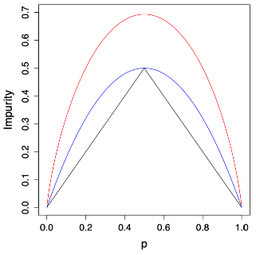{#fig-node-imp width="60%" fig-align="center"}

-   As we see above in Figure @fig-node-imp, both the Gini and cross-entropy curves decrease smoothly toward zero as the node becomes purer.

-   The cross-entropy (red) penalises uncertainty more strongly around $p = 0.5$, offering steeper gradients that make it more sensitive than the Gini index (blue).

-   The misclassification error (black), by contrast, changes abruptly and lacks the smoothness required for effective optimisation.

## Example: heart disease

The **heart** data set from the *ISLR* package records whether or not a patient has a heart disease (AHD), i.e. $G \in \{\text{Yes}, \text{No}\}$, for 303 patients who presented with chest pain. There are 13 predictors (e.g. *sex*, *age*, *chol*, …). A subset of the data is shown below:

| **AHD** | **Age** | **Sex** | **ChestPain** | **RestBP** | **Chol** | **Fbs** | **RestECG** | **MaxHR** |
|:------:|:------:|:------:|:------:|:------:|:------:|:------:|:------:|:------:|
| No | 63 | 1 | typical | 145 | 233 | 1 | 2 | 150 |
| Yes | 67 | 1 | asymptomatic | 160 | 286 | 0 | 2 | 108 |
| Yes | 67 | 1 | asymptomatic | 120 | 229 | 0 | 2 | 129 |

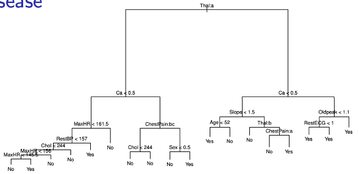{#fig-heart-tree width="80%" fig-align="center"}

A **classification tree** is fitted to predict the presence of heart disease (Yes/No). The tree uses variables such as *Thal*, *Ca*, *ChestPain*, and *MaxHR* to partition patients into subgroups with different risk levels.

In @fig-heart-tree we can see the **unpruned tree**, which is relatively complex and may overfit the training data.

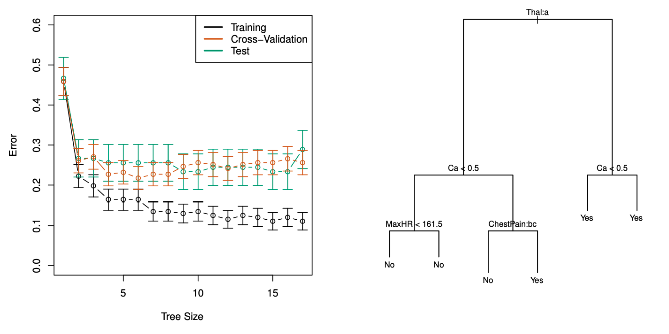{#fig-heart-pruned width="80%" fig-align="center"}

In Figure @fig-heart-pruned, the **bottom-left panel** shows the training, cross-validation, and test errors for trees of increasing size. The **bottom-right panel** shows the **pruned tree** corresponding to the optimal level of complexity, selected by cross-validation. Pruning simplifies the model, improving interpretability while maintaining nearly the same predictive accuracy.

In this tree, several predictors are qualitative, for example, *Thal* and *ChestPain*. The algorithm evaluates all possible binary partitions of their categories. For instance, the split *ChestPain:bc* divides the data into two groups, one with “typical” or “asymptomatic” pain and another with “nonanginal” or “nontypical” patterns.

Some splits lead to terminal nodes with the same predicted value, increasing **node purity**, i.e. greater certainty in classification. Decision trees can also handle missing predictor values directly, maintaining robustness during prediction.

## usTree growing in Python

The following tree, shown in @fig-tree-py, was generated using the *Heart* dataset in Python with `DecisionTreeClassifier` from *scikit-learn*. It predicts whether a patient has heart disease (`Yes`/`No`) based on three main predictors: **Thal**, **Ca**, and **Age**.

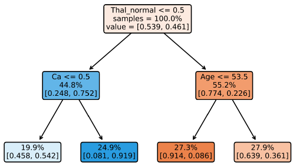{#fig-tree-py width="70%" fig-align="center"}

The algorithm splits the data recursively to minimise node impurity, measured by the *Gini index*. Each node in the tree contains the following information:

-   **Splitting rule** (e.g. `Thal_normal <= 0.5`): the condition dividing the observations into left and right child nodes.
-   **Samples**: percentage of training instances reaching that node.
-   **Value**: class proportions for `No` (first element) and `Yes` (second element).
-   **Colour intensity**: indicates the dominant class, with blue for `No disease` and orange for `Heart disease`.
-   The **root node** splits first on `Thal_normal <= 0.5`, distinguishing patients based on the *Thal* test results, i.e., the most informative feature.
-   For patients with `Thal_normal > 0.5`, the next split occurs on `Age <= 53.5`, separating younger and older individuals.
-   For those with `Thal_normal <= 0.5`, the split is on `Ca <= 0.5`, reflecting calcium levels in major vessels as a key determinant.

The **leaf nodes** display the predicted class probabilities. For example:

-   The leftmost leaf shows patients with *abnormal Thal* and *low calcium* having a **54% chance of not having heart disease**.
-   The rightmost leaf shows older patients with *normal Thal* having a **64% chance of heart disease**.

This visualisation illustrates how a decision tree partitions the predictor space into regions of high class homogeneity. In other words, it forms a simple yet interpretable classification model.

## Cost-complexity pruning in Python

The **cross-validation (CV) error plot**, shown in Figure @fig-cv-error, illustrates how the model’s performance changes as the pruning parameter $\alpha$ increases.

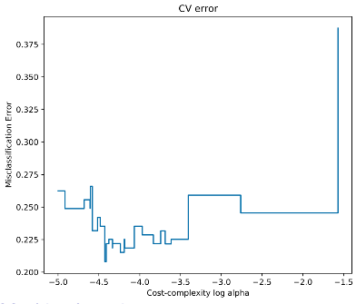{#fig-cv-error fig-align="center" width="60%"}

As $\alpha$ grows, the penalty for tree complexity becomes stronger, leading to **simpler trees** with fewer splits. Initially, this reduces **overfitting**, and the CV error decreases. However, beyond an optimal point, excessive pruning causes **underfitting**, and the CV error rises again.

The **minimum of the CV error curve** corresponds to the value of $\alpha$ that achieves the best trade-off between bias and variance — that is, the subtree with the lowest expected prediction error on unseen data.

## Trees versus linear classifiers

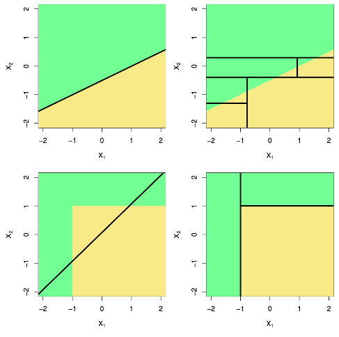{#fig-trees-vs-linear fig-align="center" width="65%"}

The plots in @fig-trees-vs-linear compare **decision trees** and **linear classifiers** in two-dimensional feature spaces.

-   The **top-left** panel shows a linear classifier that separates the feature space using a single straight decision boundary.
-   The **top-right** panel illustrates how a decision tree can approximate that same boundary by performing multiple **axis-aligned splits**, resulting in a stepwise partition of the space.
-   The **bottom-left** panel shows a situation where the relationship between predictors is non-linear; here, trees can flexibly adapt their partitions to capture local structure that linear models would miss.
-   The **bottom-right** panel demonstrates how trees create **rectangular regions** that align with the axes, providing a highly interpretable model at the cost of some boundary smoothness.

Overall, decision trees can approximate complex decision boundaries, while linear models are constrained to global linear relationships.

## Pros and cons of trees

**Pros**

-   Trees are very **easy to explain** and interpret, even more so than linear regression.
-   They **mirror human decision-making**, following a sequential and intuitive structure.
-   Results can be visualised **graphically**, making them accessible to non-experts.
-   Can naturally handle **qualitative predictors** without requiring dummy variables.

**Cons**

-   Single trees generally have **poor predictive performance** compared to ensemble methods.
-   They are **highly sensitive** to small changes in the data, which can lead to very different tree structures.

Although individual trees are often unstable and limited in accuracy, **combining many trees** (through methods such as **bagging**, **random forests**, or **boosting**) leads to more powerful and reliable predictive models.

# Bagging

# 
