# Bagging

## Bagging: main idea

-   **Bootstrap aggregation**, or **bagging**, is a general-purpose procedure for reducing the variance of a statistical learning method. It reduces variability by training multiple models on different bootstrap samples and averaging their predictions. Since each model sees a slightly different subset of the data, their individual errors tend to cancel out when aggregated, leading to a smoother and more stable estimator.
-   Given a set of $B$ independent observations $z_1, \dots, z_B$ each with variance $\sigma^2$, the variance of the mean $$\bar{z} = \frac{1}{B} \sum_{i=1}^{B} z_i $$ is $\sigma^2 / B$.
-   We can therefore reduce the variance by averaging a set of predictions. However, this is not practical because we usually do not have access to multiple training sets.
-   Instead, we use the bootstrap by taking repeated samples from the training data $$ Z = \{ (x_i, y_i),\, i = 1, \dots, n \}.$$

Bagging works by creating multiple bootstrap samples from the original dataset, training a separate model on each, and averaging their predictions. This aggregation stabilises the model by lowering variance without significantly increasing bias.

## The bootstrap

-   Let $B$ be the number of desired bootstrap datasets $Z^{*1}, \dots, Z^{*B}$.
-   For $b = 1, \dots, B$:
    -   Sample $n$ observations from $Z$ **with replacement**.
    -   This is the $b$th bootstrap dataset, denoted $Z^{*b}$.
-   Each bootstrap dataset contains on average 63.2% of the original samples.

\begin{minipage}{0.55\textwidth}
The bootstrap procedure generates multiple resampled datasets by drawing with replacement from the original data. Each sample replicates the variability inherent in the population, allowing us to estimate model variance or prediction stability without requiring new data. This approach underlies bagging and several ensemble methods.
\end{minipage}
\hfill
\begin{minipage}{0.4\textwidth}
\begin{figure}[H]
\centering
\includegraphics[width=\linewidth]{Images_qmd_ML/ML7_boot.png}
\caption{Bootstrap sampling}
\label{fig-bootstrap}
\end{figure}
\end{minipage}

## Bagging

-   Let $Z^{*1}, \dots, Z^{*B}$ be $B$ bootstrap datasets from the training data. For all $b = 1, \dots, B$, we can fit our predictive regression model $\hat{f}^{*b}$ on the $b$th bootstrap dataset $Z^{*b}$.
-   We then average all the predictions to obtain a single bagged model $$\hat{f}_{\text{bag}}(x) = \frac{1}{B} \sum_{b=1}^{B} \hat{f}^{*b}(x) $$ which is called **bagging**. In other words, we take all the $B$ predictions made by the $B$ models trained on different bootstrap samples. Then average those predictions to get a final one ($\hat{f}_{\text{bag}}(x)$).
-   If the individual models $\hat{f}^{*b}$ have low bias but high variance, the combined estimator $\hat{f}_{\text{bag}}$ retains a similar bias but exhibits lower variance.
-   In practice, we use a value of $B$ sufficiently large for the error to stabilise. Typically, a value between 100 and 1000 is sufficient.

Bagging therefore reduces variance through model aggregation while preserving the bias of the underlying learners, resulting in more stable and robust predictions.

## Out-of-bag error estimate

-   There is a straightforward way to estimate the test error of a bagged model, called the **out-of-bag (OOB) error estimate**.
-   The key idea of bagging is that the model is repeatedly fitted to bootstrap subsets of the data, which contain on average about two-thirds of the observations (≈ 63%).
-   The remaining one-third (≈ 37%) of the observations not used to fit a given bagged model are referred to as the **out-of-bag observations**.
-   We can predict the response for the $i$th observation using all models $\hat{f}^{*b}$ with $b \in I_{x_i} = \{ b = 1, \dots, B : (x_i, y_i) \notin Z^{*b} \}$, i.e. the models for which the observation was OOB. This yields around $B/3$ predictions for the $i$th observation, which we average: $$ \text{Err}_{\hat{f}_{\text{bag}}}(x_i) = \frac{1}{|I_{x_i}|} \sum_{b \in I_{x_i}} (y_i - \hat{f}^{*b}(x_i))^2.$$ In other words, this is *the mean of the squared prediction errors made by all the models* $b$ in $I_{x_i}$ (the models for which $x_i$ was OOB).
-   The average over all $n$ observations gives the overall OOB error estimate: $$ \text{Err}_{\hat{f}_{\text{bag}}} = \frac{1}{n} \sum_{i=1}^{n} \text{Err}_{\hat{f}_{\text{bag}}}(x_i). $$ *On average, how well does the bagged model generalise to unseen data?*
-   For large $B$, this estimator can be shown to be equivalent to the Leave-One-Out Cross-Validation (LOOCV) estimator, but in bagging, it comes for free.

The OOB error provides an internal validation mechanism without requiring an explicit test set, making it especially efficient for ensemble methods such as Random Forests.

## Bagging for trees

-   Classification and regression trees are perfectly suited for bagging, since their poor predictive accuracy comes from their high variance.
-   For a regression problem, [^1] for all $B$ bootstrap training sets we grow a large tree **without pruning** to obtain a high-variance predictive model. We then average all these (possibly overfitted) trees to obtain a bagged model with reduced variance.
-   This has shown to give impressive improvements in prediction accuracy, though at the cost of interpretability.
-   Importantly, $B$ is not a classical tuning parameter, since a large $B$ will not overfit the data; the error will simply stabilise.
-   For classification, we fit $B$ classification trees $\hat{G}^{*b}$ and then choose the predicted class by majority vote, that is $$ \hat{G}_{\text{bag}}(x) = \arg\max_{g=1,\dots,q} \frac{1}{B} \sum_{b=1}^{B} {1}\{ g = \hat{G}^{*b}(x) \}$$
    -   $\hat{G}_{\text{bag}}(x)$: the **final bagged classifier**, i.e. the class label the **ensemble of trees** assigns to $x$ after combining all their votes.
    -   $\arg\max_{g=1,\dots,q}$: we look across all possible classes and choose the one with the **largest average vote** from the trees.
    -   $\frac{1}{B}$: we compute the **fraction of trees** that predict each class $g$.
    -   $\hat{G}^{*b}(x)$: the **prediction of the** $b$th tree for observation $x$.
    -   ${1}\{ g = \hat{G}^{*b}(x) \}$: for a given class $g$, this equals 1 if the $b$th tree predicts class $g$, and 0 otherwise. The sum $\sum_{b=1}^{B} {1}\{ g = \hat{G}^{*b}(x) \}$ therefore counts how many trees voted for $g$.
-   Bagging is therefore especially effective for high-variance, low-bias models such as decision trees, as averaging across bootstrap replicates substantially reduces their prediction variance.

[^1]: In this context, a regression problem refers to a supervised learning task where the target variable $y$ is continuous. In contrast, a classification problem deals with categorical outputs.

## Example: bagging and variance reduction

To illustrate the effect of bagging, we return to the **heart disease** dataset, where decision trees are used to predict whether a patient has heart disease. As seen earlier, a single unpruned tree has high variance: small changes in the data can lead to very different tree structures.

Bagging mitigates this instability by repeatedly resampling the training data and averaging the resulting models.

{#fig-bootstrapped-trees width="90%" fig-align="center"}

In @fig-bootstrapped-trees, three trees are trained on different bootstrap samples drawn **with replacement** from the same dataset. Each tree follows a different structure and makes slightly different predictions, showing the variability of high-variance learners such as decision trees.

By averaging the predictions from all these trees, bagging produces a single, more stable model with reduced variance. The gain from aggregation is evident in the out-of-bag (OOB) error plot below.

{#fig-heart-bag width="60%" fig-align="center"}

In @fig-heart-bag, the **OOB error rate** decreases rapidly as the number of trees increases, then stabilises once variance reduction saturates. This shows how bagging improves generalisation performance by averaging across many slightly different models rather than relying on a single, unstable one.

# Random forest

## Variance reduction and correlation

-   Recall that given a set of $B$ **independent** observations $z_1, \dots, z_B$, each with variance $\sigma^2$, the variance of their mean is $$ \bar{z} = \frac{1}{B} \sum_{i=1}^{B} z_i$$ and the variance of $\bar{z}$ is $\sigma^2 / B$.
-   This result holds only if the $z_i$ are independent. If they are **correlated**, the variance reduction achieved by averaging becomes much smaller.
-   In bagging, each model is trained on a bootstrap sample of the data. These samples overlap substantially, so the fitted trees are often **correlated**. As a result, the averaging in bagging does not reduce variance as effectively as it would if the models were completely independent.
-   To understand this, consider $z_i \sim \mathcal{N}(0,1)$ and three levels of correlation between them:
    1.  **Independence:** $\text{cor}(z_i, z_j) = 0$ for all $i, j$.
    2.  **Weak dependence:** $\text{cor}(z_i, z_{i+1}) = 0.3$.
    3.  **Strong dependence:** $\text{cor}(z_i, z_{i+1}) = 0.8$.

{#fig-var-red-corr}

As seen in @fig-var-red-corr, correlation among observations (or models) greatly affects how quickly variance decreases when averaging.

The **left plot** shows the sample average as the number of samples $B$ increases. When the observations are independent (black line), the average quickly stabilises near zero. With weak (green) or strong (red) dependence, convergence is much slower and the variability remains higher.

The **right plot** shows the distribution of the sample mean when $B = 500$. Independence (black) yields a narrow distribution with small variance; as correlation increases, the distribution widens, meaning the average fluctuates more.

This demonstrates that averaging only reduces variance effectively when the individual models or samples are **uncorrelated**. If the models are correlated (because they rely on similar features or data points) the benefit of averaging diminishes.

In the next section, we see how random forests address this limitation by introducing randomness in feature selection (by randomly choosing subsets of predictors at each split) which reduces correlation between trees and improves variance reduction beyond bagging.

```{r}
#TODO add this foot ntoe_ the specific mechanism in random forests where, at each split of a tree, the algorithm randomly selects a subset of predictors (features) from the total available ones, instead of considering all features.
```

## Bagging: correlated trees

-   In bagging, each tree is trained on a bootstrap dataset that is drawn **with replacement** from the original training data. Because these bootstrap samples overlap substantially, the trees share **many common observations**.
-   The decision tree algorithm is **greedy**: it chooses at each split the variable that gives the largest reduction in impurity. Since the datasets are very similar, the trees tend to select the **same predictors for their early splits**.

```{r}
#TODO include this as a footnote: Impurity quantifies how mixed the node is. The decision tree algorithm greedily picks the split that most reduces impurity — that is, makes the resulting groups more homogeneous.
# In classification, impurity is measured using the Gini index or entropy, while in regression it’s measured using variance (RSS).
```

-   As a result, the trees end up looking very similar and their predictions $\hat{f}^{*b}(x_0)$ for a new input $x_0$ are **highly correlated** for all $b = 1, \dots, B$. In other words, for all $b = 1, \dots, B$” means that this correlation property applies across all the trees in the bagged ensemble, each $\hat{f}^{*b}(x_0)$ tends to give a similar prediction for the same input $x_0$.

As seen in @fig-bootstrapped-trees, the three trees trained on different bootstrap samples from the same dataset share much of their structure.\
They all split early on similar variables (Thal, Ca, Oldpeak), showing that even after resampling, the bagged trees remain strongly correlated.This shows how, despite resampling, the bagged trees remain **strongly correlated** because they repeatedly rely on the same dominant predictors for their early decisions.

Such correlation limits the benefit of averaging in bagging: even though we combine many trees, if they make **similar errors**, the ensemble’s variance does not decrease as much as expected.\
This motivates the next step, i.e., **random forests**, which introduce randomness in feature selection at each split to decorrelate the trees and achieve greater variance reduction.

```{r}
#TODO but if we add randomness to then reduce the variance, isnt it a bit working twice?
```

## Random forest: main idea

-   **Random forests** extend the concept of bagging. The key idea is to **decorrelate** the trees by introducing randomness during the growing process.
-   In bagging, trees are highly correlated because they often use the same strong predictors for their first splits. Random forests reduce this correlation by **randomly selecting a subset of predictors** at each split.
-   This randomisation prevents all trees from relying on the same dominant variables, leading to a more diverse ensemble and stronger variance reduction.

### Random forest algorithm

1.  **Bootstrap the data** $B$ times, obtaining $B$ bootstrap samples $Z^{*1}, \dots, Z^{*B}$.
2.  **Grow a tree** on each bootstrap sample. At each node, randomly select $m$ predictors out of $p$, and choose the best split among those $m$.
3.  **Grow the trees fully**, without pruning (as in bagging).
4.  **Aggregate predictions**:
    -   For **regression**, average the predictions from the $B$ trees.
    -   For **classification**, use the **majority vote** among the $B$ trees.

### Intuition and choice of $m$

As seen in @fig-trees, selecting only a random subset of variables at each split prevents trees from becoming too similar.\
Even though all trees are trained on overlapping bootstrap samples, their different variable choices make them less correlated, which in turn improves variance reduction and generalisation performance.

Typical values for $m$:

-   For **classification**, $m \approx \sqrt{p}$.
-   For **regression**, $m \approx p / 3$.

This rule of thumb works well in practice because it balances diversity and predictive strength: small $m$ increases randomness (reducing correlation), while large $m$ allows trees to use stronger predictors (reducing bias).

{#fig-trees width="90%" fig-align="center"}

## Heart data: bagging and random forest in Python

{#fig-heart-oob width="50%" fig-align="center"}

As shown in @fig-heart-oob, the **out-of-bag (OOB) error rate** decreases rapidly as the number of trees increases for both methods. The experiment is based on the *Heart Disease* dataset, where the goal is to predict whether a patient has heart disease (AHD = Yes/No) using medical predictors such as age, cholesterol, and maximum heart rate. The code trains two ensemble models:

-   A **bagging classifier**, where each tree is built from a bootstrap sample of the training data.
-   A **random forest classifier**, which extends bagging by randomly selecting a subset of predictors at each split (`max_features="sqrt"`).

Each model is trained incrementally (`warm_start=True`) from 3 to 600 trees, and the **OOB score** (an internal cross-validation estimate) is tracked at every step.\
The **random forest** (orange line) achieves a lower OOB error than bagging (blue line) because random feature selection reduces tree correlation, leading to lower variance and improved generalisation.\
This improvement arises because random feature selection decorrelates the trees, reducing the ensemble’s overall variance.

\begin{minipage}{0.55\textwidth}
\textbf{Example:} Comparison of classification performance using confusion matrices.  
The figure on the right compares how bagging and random forest predict heart disease:

- The \textbf{top confusion matrix} corresponds to \textbf{bagging}. It correctly classifies 80\% of patients without heart disease and 77\% of those with it.


- The \textbf{bottom confusion matrix} corresponds to the \textbf{random forest}, which slightly improves accuracy to 83\% and 78\% respectively.

These results confirm that random forests enhance predictive power by combining decorrelated trees, producing more stable and generalisable predictions than simple bagging.
\end{minipage}
\hfill
\begin{minipage}{0.4\textwidth}
\begin{figure}[H]
\centering
\includegraphics[width=\linewidth]{Images_qmd_ML/ML7_heart_2.png}
\caption{Confusion matrices for bagging (top) and random forest (bottom).}
\label{fig-heart-cm}
\end{figure}
\end{minipage}

## Variable importance

-   Bagging and random forests have **high predictive power**, but the resulting ensemble of trees is difficult to interpret visually.
-   To recover interpretability, we define an **overall measure of variable importance** that quantifies how much each predictor contributes to model performance.
-   For **regression**, we record the total reduction in **Residual Sum of Squares (RSS)** due to splits involving a predictor $X_j$.
-   For **classification**, we record the total decrease in **Gini index** or **deviance** associated with each predictor.
-   Another way to assess importance is by **randomly permuting** a given predictor among the **out-of-bag (OOB) observations** and measuring how much the model’s prediction error increases. A strong increase indicates that the variable was important for accurate predictions.

{#fig-var-imp width="55%" fig-align="center"}

As seen in @fig-var-imp, the variables *Thal* (thalassemia type) and *Ca* (number of major vessels) are the most influential predictors of heart disease, followed by *ChestPain* and *Oldpeak*. Features such as *Fbs* (fasting blood sugar) or *RestECG* contribute comparatively little to the model’s performance.\
This ranking provides a powerful interpretative tool to understand which features drive the predictive accuracy of the random forest, even though the individual trees themselves are no longer easily interpretable.

## Random forests and nearest-neighbours

Random forests can be understood as an **adaptive weighted nearest-neighbours method**, where “closeness” is defined by how often two observations fall into the same leaf nodes across trees.

-   Recall that trees in a random forest are **fully grown and unpruned**. Each terminal node (leaf) represents a small region of the feature space containing similar training observations.

-   For a new input $x_0$, each tree in the forest assigns $x_0$ to one of these regions, and the predicted response $y_0$ is the average of the $y_i$ values within that leaf.

-   Thus, for each tree, the prediction for $x_0$ is associated with one or more “neighbouring” training observations $x_i$, analogous to **nearest-neighbour methods** — except that here, *proximity is defined by the structure of the tree*, not by Euclidean distance.

-   Each observation $x_i$ contributes to the final prediction with a weight $w_i$ proportional to how often it appears in the same terminal node as $x_0$ across the ensemble. Formally, the random forest prediction is $$ \hat{y}_0 = \sum_{i=1}^{n} w_i y_i, \quad \text{where } w_i \ge 0 $$

    and $w_i$ represents the **fraction of trees** where $x_i$ and $x_0$ fall into the same leaf.

Hence, random forests can be viewed as a **smoothing method** that adapts locally to the data.\
Unlike standard $k$-NN, the notion of “neighbourhood” is **data-driven and complex**, determined by the hierarchical partitioning of the feature space in multiple random trees.

## Pros and cons of random forests

Random forests extend bagging by introducing randomness in feature selection, resulting in strong predictive models that generalise well to unseen data.\
They are highly practical because they combine **robustness**, **accuracy**, and **low tuning requirements**, making them one of the most reliable ensemble methods in practice.

**Pros:**

-   **Excellent predictive performance:** combining many uncorrelated trees drastically reduces variance and improves accuracy on both regression and classification tasks.
-   **Minimal tuning required:** only a few parameters (e.g., number of trees $B$, number of features $m$ per split) need to be set, and performance is typically stable across a wide range of values.
-   **Built-in validation:** the **out-of-bag (OOB) error estimate** provides an internal measure of test error, eliminating the need for cross-validation.
-   **Variable importance:** random forests naturally provide a measure of which predictors contribute most to the model’s performance, aiding interpretability at the feature level.
-   **Ease of implementation:** readily available in standard libraries such as *scikit-learn* and *R’s randomForest*, and relatively fast to train even with large datasets.

**Cons:**

-   **Loss of interpretability:** by averaging hundreds of trees, the model becomes a “black box.”\
    Although we can rank variable importance, we lose the intuitive visualisation and explanation that a single decision tree offers.\
    This makes random forests less suitable for contexts where transparency and explainability are essential, such as legal or medical decision-making.

## Digit classification with random forest

As seen in @fig-digit-class, the **digit classification** task involves recognising handwritten digits (0–9) based on pixel intensity values.\
Each model is trained on the same dataset and evaluated on its ability to correctly classify unseen digits.

{#fig-digit-class width="70%" fig-align="center"}

\begin{minipage}{0.55\textwidth}
\textbf{Models compared:}  
\begin{itemize}
\tightlist
\item \textbf{linreg:} direct linear regression.  
\item \textbf{LDA1:} Linear Discriminant Analysis (LDA) based on the values $x_i$.  
\item \textbf{LDA2:} LDA based on $x_i$ and $x_i^2$.  
\item \textbf{QDA:} Quadratic Discriminant Analysis with a distinct covariance matrix for each class.  
\item \textbf{log:} logistic regression (multinomial).  
\item \textbf{log-ridge:} logistic regression with ridge penalty.  
\item \textbf{log-lasso:} logistic regression with lasso penalty.  
\item \textbf{RF:} random forest.
\end{itemize}
\end{minipage}
\hfill
\begin{minipage}{0.4\textwidth}
\begin{center}
\textbf{Training and test errors (\%)}  
\begin{tabular}{lcc}
\hline
Method & Training & Test \\
\hline
linreg & 7.6 & 13.1 \\
LDA1 & 6.2 & 11.5 \\
LDA2 & 3.9 & 10.2 \\
QDA & 1.8 & 13.5 \\
log & 0.01 & 11.1 \\
log-ridge & 4.1 & 9.0 \\
log-lasso & 2.7 & 8.8 \\
RF & 0.0 & 5.9 \\
\hline
\end{tabular}
\end{center}
\end{minipage}

The results show that **random forests** achieve the lowest **test error (5.9%)**, outperforming all other methods.\
This strong generalisation comes from combining many decision trees trained on bootstrapped samples with random subsets of features. thereby creating a model structure that captures **non-linear dependencies** and **complex feature interactions** across the pixel space.

This strong generalisation arises from combining many decision trees trained on bootstrapped samples with random feature subsets, creating a structure that captures **non-linear dependencies** and **complex feature interactions** across the pixel space.

Regularised logistic models (ridge and lasso) also perform well, as they prevent overfitting by penalising large coefficients.\
However, random forests remain the most powerful approach here, thanks to their ability to model intricate decision boundaries while maintaining robustness through averaging and decorrelation.

## Digit classification: variable importance

As shown in @fig-digit-imp, random forests allow us to interpret complex models by computing a measure of **variable importance**, in this case, identifying which **pixels** contribute most to distinguishing each handwritten digit.

{#fig-digit-imp width="75%" fig-align="center"}

Each heatmap corresponds to one digit (0–9), where the **dark regions** highlight the pixels most influential in the model’s decisions.\
For example, the central pixels are highly important for distinguishing **0** and **8**, whereas the **vertical strokes** dominate the importance maps for **1**.\
These visual patterns align with how humans recognise digits, showing that the model learns to focus on the structural areas that define each number.

This technique provides a useful diagnostic tool:

-   It helps confirm that the random forest has learned meaningful visual features rather than random noise.
-   It also offers limited interpretability despite the ensemble’s overall “black-box” nature, giving insights into what drives the model’s predictions.

Thus, pixel-level variable importance visualisation bridges the gap between **performance** and **explainability**, showing how random forests internally differentiate complex visual classes.

# Boosting

## Boosting for trees

Boosting builds upon the idea of bagging but reverses its focus. In **bagging**, we use many **unbiased**, high-variance models (deep trees) and reduce their variance through averaging. Each tree is grown independently on a bootstrap sample[^2] of the data, and their predictions are averaged to form a stable, low-variance model.

[^2]: A bootstrap sample is a dataset obtained by **sampling with replacement** from the original training data. Each decision tree in bagging is trained on a different bootstrap sample, which introduces randomness: although all trees see roughly the same number of observations, they each **contain different subsets and repetitions** of the data. This variability makes the trees slightly different from one another, allowing their predictions to be **averaged** to reduce variance in the final ensemble. Averaging smooths out these fluctuations, it reduces variance, but does not change the underlying model’s bias (each tree is still an unbiased estimator, just noisy).

**Boosting**, in contrast, aims to reduce the **bias** of the model. Instead of combining many deep, independent trees, it combines many **weak**, biased learners (typically shallow trees) that individually have low variance. These trees are not grown independently but **sequentially**: each new tree focuses on the parts of the data that the previous ones predicted poorly.

In other words:

-   Bagging: reduces **variance** by averaging large, independent trees.

-   Boosting: reduces **bias** by adding small trees that correct previous errors.

-   Each tree in boosting learns from the **residuals** of the preceding model, gradually improving performance.

-   This sequential correction makes boosting a form of *iterative learning*, where each step targets what remains unexplained.

## Boosting algorithm for regression trees

The boosting algorithm formalises this process for regression trees. It builds the model step by step, with each new tree improving upon the errors of the last. Before starting, we fix three tuning parameters:

-   **Number of repetitions** $B \in \mathbb{N}$: the number of trees (iterations).
-   **Number of splits** $d \in \mathbb{N}$: the depth of each tree, controlling its complexity.
-   **Shrinkage parameter** $\lambda \in (0,1)$: a learning rate that controls how strongly each tree contributes to the model. $\lambda = 1$ no shrinkage; fast learning but high risk of overfitting. With $\lambda$ too close to 0, learning becomes very slow, as each tree makes only a tiny adjustment.

Given a training set $(x_i, y_i)$, $i = 1, \ldots, n$, the algorithm proceeds as follows:

1.  **Initialisation**: start with a null model and set the initial residuals to the observed outcomes: $$\hat{f}(x) = 0, \quad r_i = y_i. $$ This means the model initially predicts zero for all observations. So the residuals are numerically equal to the observed responses $y_i$, because the model hasn’t learned anything yet. That’s why the first residuals are sometimes described as the original response values or the real observations.

2.  **Iterative fitting** For $b = 1, \ldots, B$:

    -   Fit a regression tree $\hat{f}^b$ with $d$ splits to the data $(x_i, r_i)$. Each tree now tries to explain the residuals: the part of $y_i$ that remains unexplained by the model so far.
    -   Update the model by adding a *shrunken* version of this tree: $$ \hat{f}(x) \leftarrow \hat{f}(x) + \lambda \hat{f}^b(x). $$ The shrinkage factor $\lambda$ prevents overfitting by slowing down the learning process.
    -   Update the residuals to reflect the remaining error after adding the new tree: $$ r_i \leftarrow r_i - \lambda \hat{f}^b(x_i). $$ Residuals that remain large indicate regions where the model still performs poorly, guiding the next tree to focus on those points.

3.  **Final model** After $B$ iterations, the boosted model is the sum of all the shrunken trees: $$ \hat{f}(x) = \sum_{b=1}^{B} \lambda \hat{f}^b(x). $$ This model captures complex patterns by successively correcting its own mistakes — an effect that makes boosting powerful, yet prone to overfitting if $B$ is too large.

In summary, boosting performs **slow learning** through small, sequential updates. While each tree alone is a poor predictor, together they form a strong model that reduces bias and achieves high accuracy when the tuning parameters are chosen carefully.

## Tuning and learning rate in boosting

Boosting can be understood as a form of **slow learning**, since it builds the model step by step using many small trees that gradually improve $\hat{f}$ in regions where it performs poorly. Each tree makes only a small correction to the current model, focusing on residuals that remain large. Over successive iterations, these corrections accumulate into a powerful ensemble.

The **shrinkage parameter** $\lambda$ further slows this process, controlling how much each new tree contributes. A smaller $\lambda$ makes learning more gradual, allowing the algorithm to fit a wider variety of tree shapes to the residuals and avoid overfitting. This mechanism ensures that improvement happens progressively and in diverse parts of the predictor space.

Boosting has three key **tuning parameters**:

-   **(a) Number of trees** $B$: determines how many iterations the algorithm performs.\
    Unlike bagging and random forests, boosting can overfit if $B$ becomes too large, although this typically happens slowly. The optimal $B$ is chosen via cross-validation to stop learning before overfitting begins.

-   **(b) Shrinkage parameter** $\lambda$: typically a small positive number (e.g. 0.01 or 0.001).\
    It controls the *learning rate* of the algorithm. Smaller values imply slower learning but often lead to better generalisation, requiring more trees for good performance.

-   **(c) Number of splits** $d$: controls the complexity of each individual tree.\
    When $d = 1$, each tree is a **stump**, i.e. a single split. Such simple trees usually work surprisingly well because boosting reduces bias sequentially, making deep trees unnecessary.

Boosting can also be applied to **classification** problems, although the algorithm’s formulation is slightly more complex than for regression.

## Hitters data: boosting

To illustrate the behaviour of boosting, consider its application to the **Hitters** dataset, where the goal is to predict baseball players’ salaries. The plots below show the **test error** as a function of the number of boosting iterations $B$ for different values of the shrinkage parameter $\lambda$ and tree depth $d$.

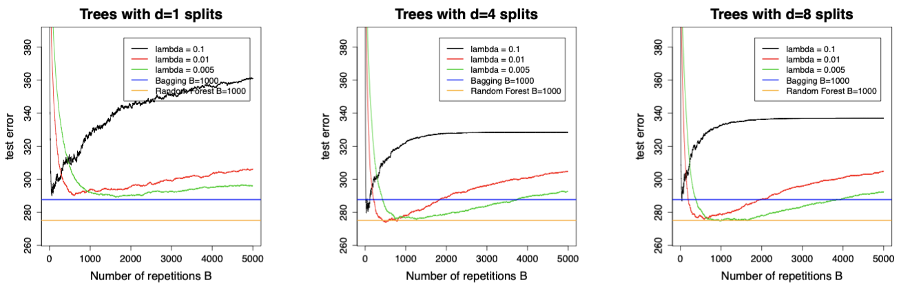{#fig-boosting-hitters width="110%"}

When $\lambda = 0.1$, the model learns very quickly, and the test error drops sharply but also rises again soon, which is a sign of **overfitting**. A small $\lambda$ (e.g. 0.01 or 0.005) slows learning, resulting in a more gradual decrease of the test error that remains low over a broader range of $B$. This makes model selection via cross-validation more stable.

With **stumps** ($d=1$), the model initially underfits, but increasing the depth to $d=4$ allows it to reach lower test errors comparable to those of bagging and random forests. Further increasing $d$ (e.g. to $8$) offers little benefit and can even worsen performance, as overfitting begins earlier.

In practice, a **small learning rate** (around 0.01) and **moderately shallow trees** (e.g. $d=4$) tend to yield the best trade-off between bias reduction and generalisation. Boosting thus provides a flexible yet controlled way to improve predictive performance through slow, sequential learning.

# Support Vector Machines: Maximal Margin Classifier

**Support Vector Machines (SVM)** represent a geometric approach to classification. Unlike LDA or logistic regression, which model statistical relationships between $Y$ and $X$, SVMs make **no distributional assumptions**. They aim instead to find a **decision boundary** (a hyperplane) that separates classes in the feature space.

A **hyperplane** in $\mathbb{R}^p$ is defined as the set of all $x$ satisfying the linear equation $$ \beta_0 + \beta_1 x_1 + \cdots + \beta_p x_p = 0. $$

This boundary divides the predictor space into two half-spaces. For any observation $z$, the function $z = \beta_0 + \beta_1 z_1 + \cdots + \beta_p z_p$ indicates its position relative to the hyperplane: points with $f({z}) > 0$ belong to one class, and those with $f({z}) < 0$ to the other. Points exactly on the hyperplane satisfy $f({z}) = 0$.

The vector $\boldsymbol{\beta} = (\beta_1, \ldots, \beta_p)$ is called the **normal vector** because it is orthogonal to the hyperplane. Its direction determines the orientation of the separating boundary, and its length is usually normalised to one to ensure a unique parametrisation. The intercept $\beta_0$ shifts the hyperplane along the direction of $\boldsymbol{\beta}$ without changing its orientation.

To build intuition:

-   Points with $|f({z})|$ large are far from the boundary.
-   Points with $f({z}) \approx 0$ lie close to it and are more uncertain.
-   Thus, the magnitude $|f({z})|$ can be interpreted as the **distance** from ${z}$ to the hyperplane.

Now consider a binary classification problem with classes labelled $y_i \in \{-1, +1\}$.\
A hyperplane **separates** the training data if it assigns positive values of $f(x_i)$ to all observations with $y_i = +1$ and negative values to all with $y_i = -1$. Formally, $$ y_i (\beta_0 + {\beta}^\top {x}_i) > 0, \quad \text{for all } i = 1, \ldots, n. $$\
If such a hyperplane exists, there are infinitely many possible ones, each perfectly separating the two classes but differing in position.

The **Maximal Margin Classifier (MMC)** resolves this ambiguity by choosing the separating hyperplane that **maximises** the **margin**, defined as the smallest distance between the hyperplane and any training observation. Denoting this distance by $M$, the optimisation problem is: $$ \max_{\beta_0, \boldsymbol{\beta}, M} \; M \quad \text{s.t.} \quad \|\boldsymbol{\beta}\| = 1, \; y_i (\beta_0 + {\beta}^\top {x}_i) \geq M \ \text{for all } i. $$ This ensures all observations lie at least $M$ units away from the separating boundary, yielding the widest possible margin.

The observations that lie exactly at this minimal distance, i.e., those that satisfy $y_i (\beta_0 + \boldsymbol{\beta}^\top {x}_i) = M$, called the **support vectors**. They define the position of the maximal margin hyperplane. Small changes to these points can shift the boundary, whereas non-support points have no effect.

Although conceptually elegant, the MMC has two key **limitations**:

1.  It is **unstable**, as it depends heavily on the few support vectors near the boundary.
2.  It only works when the classes are **linearly separable**. In most real-world data, perfect separation is impossible, motivating more flexible extensions such as the **Support Vector Classifier**, which allows for a *soft* margin.

SVMs therefore build upon this geometric idea, gradually introducing relaxation and nonlinearity to handle more complex data structures while maintaining the same underlying optimisation principle.

## Hyperplanes: construction

A **hyperplane** in $\mathbb{R}^p$ is defined by the equation $$ \beta_0 + \beta_1 x_1 + \cdots + \beta_p x_p = 0. $$ This represents a $(p-1)$-dimensional flat surface that divides the feature space into two half-spaces.

The vector $\boldsymbol{\beta} = (\beta_1, \ldots, \beta_p)$ is called the **normal vector**, as it is **orthogonal** to the hyperplane. Its direction indicates the orientation of the separating boundary, while the intercept $\beta_0$ determines its distance from the origin.

To ensure a unique parametrisation, we usually normalise the normal vector so that $\|\boldsymbol{\beta}\| = 1$. Without this constraint, scaling both $\beta_0$ and $\boldsymbol{\beta}$ by the same constant would produce the same hyperplane but different parameter values.

For any point ${z} \in {R}^p$, the signed distance from the hyperplane is given by $|\beta_0 + \beta_1 z_1 + \cdots + \beta_p z_p|$.\
- If this value is **positive**, ${z}$ lies on one side of the hyperplane.\
- If it is **negative**, ${z}$ lies on the opposite side.\
- If it equals **zero**, ${z}$ lies exactly on the hyperplane.

As shown in @fig-hyperplane, the $\textcolor{blue}{\textbf{blue line}}$ represents the hyperplane in $\mathbb{R}^2$, while the $\textcolor{red}{\textbf{red arrow}}$ depicts the normal vector that is orthogonal to it. The absolute value of the linear function corresponds to the **distance** between each point and the hyperplane, capturing how far an observation lies from the separating boundary.

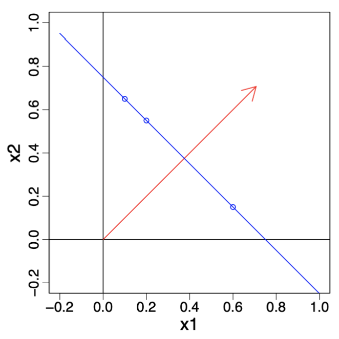{#fig-hyperplane width="40%"}

## Separating hyperplanes

We now focus on the simplest SVM setting: two classes, denoted by $\mathcal{G} = \{-1, +1\}$.\
Given training data $(x_1, y_1), \ldots, (x_n, y_n)$ with $y_i \in \{-1, +1\}$, we say that a **hyperplane is separating** if it correctly classifies all observations according to $$\beta_0 + \beta_1 x_{i1} + \cdots + \beta_p x_{ip} > 0 \ \text{if } y_i = +1, \quad
\beta_0 + \beta_1 x_{i1} + \cdots + \beta_p x_{ip} < 0 \ \text{if } y_i = -1.$$

These two inequalities can be written more compactly as $$ y_i (\beta_0 + \boldsymbol{\beta}^\top {x}_i) > 0, \quad i = 1, \ldots, n. $$

This expression captures both cases simultaneously: if $y_i = +1$, the term remains positive, while if $y_i = -1$, it reverses sign to ensure that the point lies on the opposite side of the hyperplane.

A separating hyperplane therefore divides the feature space so that all points of one class lie on one side and all points of the other class lie on the opposite side. When such a hyperplane exists, there are **infinitely many** possible separating boundaries, each producing zero training error but potentially different generalisation properties.

As illustrated in @fig-separating, several hyperplanes can perfectly separate the same data. The plot on the left shows multiple valid separating lines, all achieving perfect classification, while the right panel depicts one such decision boundary dividing the feature space into two regions corresponding to the two classes.

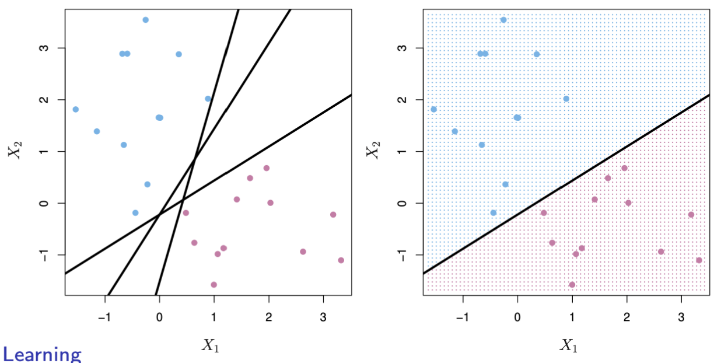{#fig-separating width="90%"}

## Maximal Margin Classifier

When a separating hyperplane exists, it defines a **natural classifier** for new data points. The function $f(x_0)$ tells us on which side of the hyperplane a point $x_0$ lies: if it is positive, we assign the class $+1$, and if negative, the class $-1$. The **magnitude** of this value indicates how far the point lies from the boundary.

The **margin** represents the smallest distance between the training data and the separating hyperplane. The **Maximal Margin Classifier (MMC)** selects the hyperplane that maximises this margin, thereby creating the **widest possible gap** between the two classes. A wider margin leads to a more robust classifier, as small changes in the data are less likely to alter the decision boundary.

\begin{minipage}{0.55\textwidth}
Only the observations lying exactly on the margin determine the boundary. These are known as \textbf{support vectors} because they “hold” the hyperplane in place. If one of them moves, the hyperplane shifts as well. Points further from the margin have no influence on its position.

The MMC is obtained by solving a convex quadratic optimisation problem that efficiently identifies the separating hyperplane with the largest margin.
\end{minipage}
\hfill
\begin{minipage}{0.4\textwidth}
\begin{figure}[H]
\centering
\includegraphics[width=\linewidth]{Images_qmd_ML/ML8_max_margin.png}
\captionsetup{margin=1pt}
\caption{MMC: the optimal hyperplane (solid line) maximises the distance to the nearest training points of either class, defining the margin (dashed lines).}
\label{fig-max-margin}
\end{figure}
\end{minipage}

## Comments and limitations

The optimisation problem behind the **maximal margin classifier** is a **convex quadratic programme**, which guarantees that the global optimum can be found efficiently.

However, as seen in Figure \ref{fig-max-margin}, only a few observations (the **support vectors**) determine the position of the separating hyperplane. Slightly moving one of these support vectors alters the optimal boundary, while moving other observations has no effect at all. This dependence on just a few critical points makes the classifier **sensitive** and potentially **unstable**.

In practice, this instability is compounded by another limitation: **most datasets are not perfectly linearly separable**. As illustrated in Figure \ref{fig-max-margin}, the maximal margin classifier only works when a hyperplane can fully separate the classes. When such perfect separation is impossible, the optimisation problem has no feasible solution.

These challenges motivate the next step, i.e., the **Support Vector Classifier**, which introduces a *soft margin* allowing for some classification errors while maintaining the geometric intuition of maximising the margin.

# Support Vector Machines: Support Vector Classifier

## Support Vector Classifier

The maximal margin classifier seeks a separating hyperplane that classifies the training data perfectly, which is often too rigid in the presence of noise or mislabelled observations. The support vector classifier is a *soft margin* method that permits controlled violations of the margin to improve robustness and generalisation.

We introduce slack variables $\xi_i \ge 0$ for training observations $(x_i, y_i)$ with $y_i \in \{-1, +1\}$ and solve the optimisation problem: $$ \min_{\beta_0, \boldsymbol{\beta}, \boldsymbol{\xi}} \left( \frac{1}{2}\lVert \boldsymbol{\beta} \rVert^2 + C \sum_{i=1}^n \xi_i \right) \quad \text{s.t.} \quad y_i(\beta_0 + \boldsymbol{\beta}^{\top}x_i) \ge 1 - \xi_i, \ \xi_i \ge 0. $$

Here, the parameter $C > 0$ controls the trade-off between a wide margin (small $\lVert \boldsymbol{\beta} \rVert$) and tolerance for violations (large $\xi_i$). In other words, the parameter $C$ determines how strongly the model penalises violations of the margin (i.e., large $\xi_i$ values). The variables $\xi_i$ do not set the margin; instead, they measure how much each observation violates the margin constraint.\
$C$ controls *tolerance*, $\xi_i$ measures *actual violations*, and $\boldsymbol{\beta}$ determines the *margin width*.

The positions of points are as follows:

-   **Points with** $\xi_i = 0$: on or outside the margin.
-   **Points with** $0 < \xi_i \le 1$: inside the margin but correctly classified.
-   **Points with** $\xi_i > 1$: misclassified.

As $C \to \infty$, we recover a hard margin (when separable). A smaller $C$ widens the margin and typically yields a smoother, more stable decision rule focused on the most informative points — the *support vectors*.

Algorithmically:

1.  Choose $C$ (for instance, via cross-validation).
2.  Solve the convex quadratic programme above.
3.  Form the decision function $\hat{f}(x) = \mathrm{sign}(\beta_0 + \boldsymbol{\beta}^{\top}x)$, supported by training points with non-zero Lagrange multipliers (the support vectors).

Interpretation: the classifier allocates a *budget* of margin violations to gain robustness to outliers, achieve better average classification, and admit solutions when the classes are not perfectly separable.

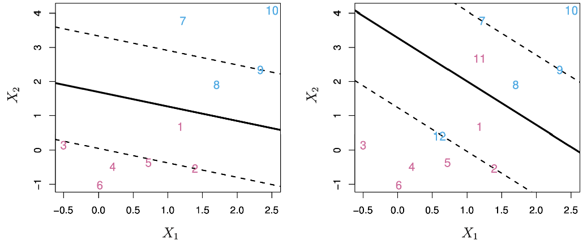{#fig-ML9_SVC width="80%"}

As seen in @fig-ML9_SVC, the **left-hand plot** shows the *maximal margin classifier*, which fits the training data perfectly but results in a narrow margin that is highly sensitive to outliers. Even one mislabelled point could completely change the orientation of the separating hyperplane.

The **right-hand plot** depicts the *support vector classifier*, where some points are allowed to lie inside or even beyond the margin (those with $\xi_i > 0$). This flexibility leads to a wider margin and a more stable decision boundary.\
The support vectors (the points closest to or inside the margin) determine this boundary, while all other points play no direct role in its position.

## Mathematical formulation of the support vector classifier

The soft-margin formulation can also be expressed as a maximisation problem. We aim to find the largest possible margin $M$ while allowing controlled violations through slack variables $\xi_i \ge 0$.

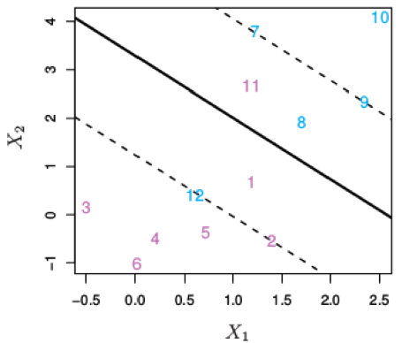{#fig-ML9_SVC_s2 width="25%" fig-align="center"}

The optimisation problem is: $$\max_{\beta_0,\ldots,\beta_p,\ \xi_1,\ldots,\xi_n} \ M$$ subject to $$\sum_{j=1}^{p} \beta_j^2 = 1, \quad 
y_i(\beta_0 + \beta_1 x_{i1} + \cdots + \beta_p x_{ip}) \ge M(1 - \xi_i),$$ $$\xi_i \ge 0, \quad 
\sum_{i=1}^{n} \xi_i \le b.$$

As illustrated in @fig-ML9_SVC_s2, the soft-margin classifier allows some points to fall inside or even beyond the margin, depending on their corresponding $\xi_i$ values.\
Each $\xi_i$ quantifies how much observation $i$ violates the margin constraint:

-   $\xi_i = 0$: the observation lies on or outside the margin (correctly classified).
-   $0 < \xi_i \le 1$: the observation lies inside the margin but is still correctly classified.
-   $\xi_i > 1$: the observation is misclassified, on the wrong side of the separating hyperplane.

In @fig-ML9_SVC_s2, the points exactly on the margin correspond to $\xi_i = 0$, while those inside the shaded margin regions have $0 < \xi_i \le 1$.\
Points that cross the decision boundary entirely (on the wrong side) represent $\xi_i > 1$ and contribute most to the violation term in the optimisation.

The constant $b > 0$ acts as a *tuning* or *regularisation* parameter that sets the total “budget” of margin violations across all $n$ observations. A larger $b$ allows more flexibility, useful for noisy or non-separable data, while a smaller $b$ enforces stricter separation with fewer violations.

Here, the *support vectors* are the observations that either lie exactly on the margin or violate it (i.e. those for which $\xi_i > 0$). Only these points determine the position and orientation of the separating hyperplane ; all other observations, being further from the decision boundary, have no influence on the classifier.

Consequently, the regularisation parameter $b$ indirectly controls the number of support vectors and hence the complexity of the model. A smaller $b$ (stricter margin) limits violations, reducing the number of support vectors and yielding a simpler, higher-bias but lower-variance model. Conversely, a larger $b$ allows more margin violations, increasing the number of support vectors and producing a more flexible, lower-bias but higher-variance classifier.

## Tuning parameter $b$

The regularisation constant $b$ plays a central role in controlling the flexibility of the support vector classifier. It sets the total “budget” of margin violations permitted across all training observations, and therefore determines the number of support vectors used to define the decision boundary.

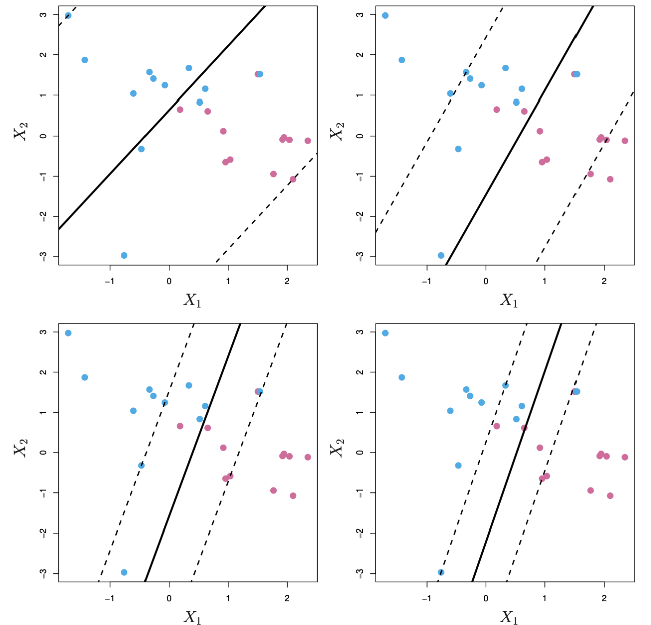{#fig-ML9_tunning_p_b fig-align="center" width="50%"}

As illustrated in Figure @fig-ML9_tunning_p_b, increasing or decreasing $b$ directly influences the width of the margin and the bias–variance characteristics of the model:

-   **Large** $b$ allows more violations, leading to **wider margins** and a **higher-bias, lower-variance** classifier. The decision boundary becomes smoother and less sensitive to individual observations.
-   **Small** $b$ enforces fewer violations, producing **tighter margins** and a **lower-bias, higher-variance** classifier. The boundary fits the training data more closely but risks overfitting.

The optimal value of $b$ is typically chosen through **cross-validation**, balancing the trade-off between margin width and classification accuracy on unseen data.

## Limitations of the support vector classifier

Although the support vector classifier is a powerful method for constructing linear decision boundaries, it has an important limitation: it can only produce *linear* separation in the feature space.

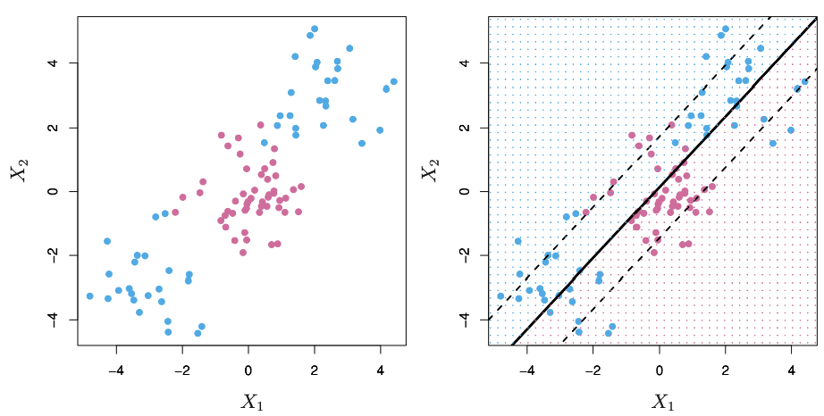{#fig-ML9_limitations width="85%" fig-align="center"}

As shown in @fig-ML9_limitations, when the true decision boundary is non-linear, a linear classifier (such as the support vector classifier) fails to capture the complex shape that separates the two classes. In such cases:

-   A **linear decision boundary** performs poorly if the data are not linearly separable in the feature space $(X_1, \ldots, X_p)$.
-   One might try to **enlarge the feature space**, for example by adding polynomial terms such as $X_1^2, X_2^2, \ldots$, and then apply a linear classifier in this higher-dimensional space.
-   However, enlarging the feature space dramatically increases dimensionality, and the resulting **computational cost** can become infeasible for large datasets.

This limitation motivates the next step: introducing **non-linear decision boundaries** through the use of kernels, which implicitly map the data into a higher-dimensional space without the need to compute the expanded features explicitly.

# Support Vector Machines

## Support Vector Machines

Support Vector Machines (SVMs) generalise the support vector classifier to allow **non-linear decision boundaries**. They achieve this by enlarging the feature space — but in an *automatic* way, without explicitly constructing new variables as in manual feature engineering.

In the support vector classifier, we used the decision function $$f(x) = \beta_0 + \beta_1 x_1 + \cdots + \beta_p x_p, $$ which defines a **linear hyperplane** in the feature space. Once the optimal parameters are found, this function is used to classify new observations: $$ \hat{G}(x) =\begin{cases} +1 & \text{if } f(x) > 0, \\ -1 & \text{if } f(x) < 0. \end{cases} $$

A deep mathematical result shows that the optimal separating function can be rewritten as $$ f({x}) = \beta_0 + \sum_{i=1}^n \alpha_i y_i \langle {x}, {x}_i \rangle, $$ where each $\alpha_i$ is a parameter associated with training observation $i$, and $\langle {x}, {z} \rangle = \sum_{j=1}^p x_j z_j$ denotes the **inner product** between two feature vectors.

Only a small subset of training points have $\alpha_i \ne 0$; these correspond to the **support vectors** that determine the decision boundary. All other points do not influence the classifier.

The inner product $\langle {x}, {z} \rangle$ can be interpreted as a **similarity measure**: it is large when two vectors point in similar directions (highly correlated) and small when they are nearly orthogonal. This observation motivates the idea of **replacing** the inner product with a more general similarity function $K({x}, {z})$, called a **kernel**.

By doing so, the Support Vector Machine retains the same structure as the support vector classifier but gains the ability to create **non-linear decision boundaries** in the original predictor space.

## The Kernel Trick

Support Vector Machines classify observations using a function that is, in general, *non-linear* in the original feature space: $$ f({x}) = \beta_0 + \sum_{i=1}^{n} \alpha_i y_i K({x}, {x}_i), $$ where $K({x}, {z})$ is a *(positive definite)* **kernel function** measuring the similarity between two feature vectors ${x}, {z} \in \mathbb{R}^p$.

By replacing the inner product $\langle {x}, {z} \rangle$ with a kernel $K({x}, {z})$, the SVM effectively **enlarges the feature space implicitly**, without ever computing the higher-dimensional representation explicitly.\
This elegant idea is known as the **kernel trick**.

-   With the **linear kernel**, $K({x}, {z}) = \langle {x}, {z} \rangle$, we recover the standard support vector classifier.
-   With **non-linear kernels**, the classifier defines curved and flexible decision boundaries in the original predictor space while remaining linear in the (implicit) high-dimensional feature space.

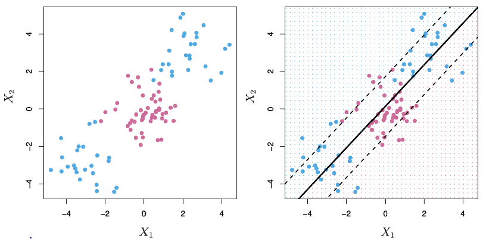{#fig-ML9_kernel_trick fig-align="center" width="70%"}

As seen in @fig-ML9_kernel_trick, mapping the data into a higher-dimensional space allows a simple linear boundary in that space to correspond to a **non-linear boundary** in the original feature space, i.e., the essence of the kernel trick.

## The Kernel Trick: Examples

Support Vector Machines can use different kernels to implicitly map the data into higher (even infinite) dimensional spaces, enabling highly flexible decision boundaries.

### The Polynomial Kernel

The **polynomial kernel** is defined as $$K({x}, {z}) = \left( 1 + \gamma \sum_{j=1}^{p} x_j z_j \right)^d, $$ where $\gamma$ is a scaling parameter and $d$ is the degree of the polynomial.

This kernel corresponds to fitting a **support vector classifier in a higher-dimensional space** that includes all polynomial terms up to degree $d$.\
In the code, this is specified as `svm = SVC(kernel='poly', degree=d, gamma=gamma)`.\
The parameter $\gamma$ controls the **scale** of the transformation and hence the flexibility of the decision boundary.

-   Larger $\gamma$ and higher $d$ produce more flexible, curved boundaries that adapt to complex patterns.
-   Smaller $\gamma$ or lower $d$ result in smoother, more regular decision surfaces.

### The Radial (Gaussian) Kernel

The **radial basis function (RBF)** or **Gaussian kernel** is defined as $$ K({x}, {z}) = \exp \left( -\gamma \sum_{j=1}^{p} (x_j - z_j)^2 \right), $$ where $\gamma > 0$ determines how quickly similarity decays with distance.

This kernel corresponds to fitting a **support vector classifier in an infinite-dimensional feature space**, since the associated basis functions are infinitely many.\
In the code, it is specified with `kernel='rbf'` inside `svm = SVC(kernel='rbf', gamma=gamma)`, allowing $\gamma$ to control how local or global the decision surface becomes.

-   Large values of $\gamma$ make the kernel highly localised: only nearby observations influence the classification, producing **flexible, non-linear** decision boundaries.
-   Small values of $\gamma$ yield smoother, more global fits, where distant points still contribute, resulting in **wider margins** and more stable boundaries.

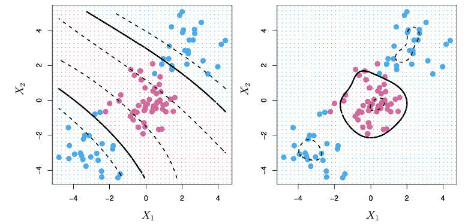{#fig-ML9_k_t_examples width="90%" fig-align="center"}

As seen in @fig-ML9_k_t_examples, the **left-hand plot** based on the polynomial kernel captures some curvature but remains relatively smooth, while the **right-hand plot**, using the radial kernel, displays a highly adaptive boundary that separates non-linear patterns effectively. This demonstrates how the choice of kernel and the tuning of $\gamma$ determine the **locality** and **flexibility** of the Support Vector Machine.

## Comments on Support Vector Machines

Support Vector Machines (SVMs) are a **powerful and flexible tool** for classification, capable of learning both linear and non-linear decision boundaries through the use of kernels.

Although the underlying mathematics are complex, the **kernel trick** allows us to apply SVMs without needing to explicitly compute the high-dimensional feature mappings. In practice, fitting an SVM simply requires computing the pairwise similarities $$ K({x}_i, {x}_j) $$ for all distinct pairs of training observations $(i, j)$.

A wide variety of kernels have been developed, but even the **standard choices**, such as the linear, polynomial, and radial basis (Gaussian) kernels, typically perform very well across a broad range of applications.

For **multi-class problems**, SVMs can be extended using:

\- **One-versus-one classification**, where a separate classifier is trained for each pair of classes; or\
- **One-versus-all classification**, where each classifier distinguishes one class from all the others.

For further discussion and examples, see Chapter 9 of *An Introduction to Statistical Learning (ISL)*.

## Support Vector Machines in Python

The following Python example fits Support Vector Machines on the *Iris* dataset using an **RBF (radial basis function) kernel**. Only the first two features (“sepal length” and “sepal width”) are used so that the resulting decision boundaries can be visualised in two dimensions.

The code iterates over three values of the tuning parameter $\gamma$ ( 0.1, 1, and 20) each time fitting an SVM model and plotting its resulting decision boundary.

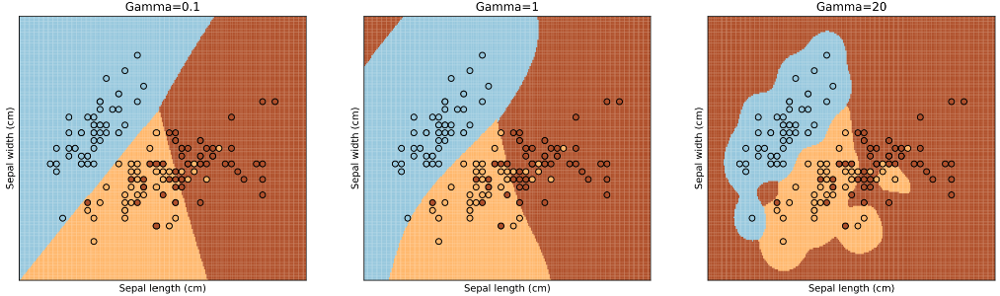{#fig-ML9_SVM_py_1 width="90%" fig-align="center"}

In the code, the line `svm = SVC(C=1, kernel='rbf', gamma=gamma)` creates an SVM classifier with the specified $\gamma$, and the subsequent loop visualises the corresponding decision boundaries.

Each subplot in @fig-ML9_SVM_py_1 illustrates how $\gamma$ controls the **locality** and **flexibility** of the model:

-   In the **left-hand plot** ($\gamma = 0.1$), the kernel is *broad and global*: similarities decay slowly, so many training points influence each decision. The resulting boundary is smooth and less adaptive, i.e., a **high-bias, low-variance** model.
-   In the **middle plot** ($\gamma = 1$), the decision surface adapts more closely to the data while preserving a reasonable margin. This corresponds to a **balanced bias–variance trade-off**.
-   In the **right-hand plot** ($\gamma = 20$), the kernel is *highly localised*: only nearby points affect predictions. The decision boundary becomes extremely wiggly, indicating **low bias but high variance** and the risk of overfitting.

This example highlights the **bias–variance trade-off** governed by $\gamma$: smaller values yield smoother, more generalisable boundaries, whereas larger values produce complex, locally adaptive ones.

### Effect of the Cost Parameter

In the next example, the SVM is again fitted on the *Iris* dataset using the **radial basis function (RBF) kernel**, this time fixing $\gamma = 20$ and varying the **cost parameter** $C$ (the inverse of the margin budget).

The parameter $C$ determines how strongly misclassifications are penalised during training:

-   **Small** $C$ allows more margin violations (a *larger budget*) leading to a smoother, more regularised decision boundary.
-   **Large** $C$ penalises violations heavily (a *smaller budget*) yielding a tighter boundary that fits the training data more closely.

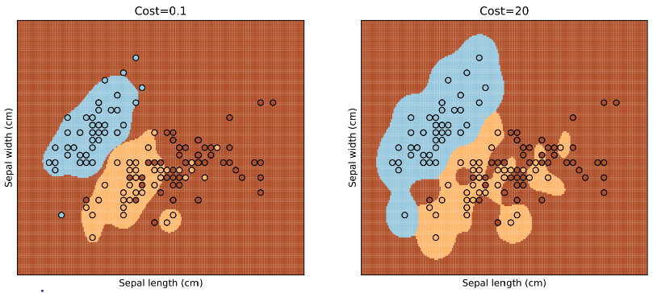{#fig-ML9_SVM_py_2 fig-align="center" width="75%"}

As seen in @fig-ML9_SVM_py_2, the **left-hand plot** with $C = 0.1$ results in a wider margin that tolerates a few misclassified points but generalises better. In contrast, the **right-hand plot** with $C = 20$ shows a much tighter boundary that fits almost all training data points correctly but risks overfitting.

This again illustrates the **bias–variance trade-off**: smaller $C$ increases bias but reduces variance, while larger $C$ decreases bias at the expense of higher variance.

### Model Selection by Cross-validation

In this final example, an SVM with a **radial basis function (RBF) kernel** is tuned automatically using **cross-validation**.\
Instead of choosing the parameters $\gamma$ and $C$ manually, a grid search is performed over a predefined range of values, and the model is evaluated with $k$-fold cross-validation to identify the best-performing combination.

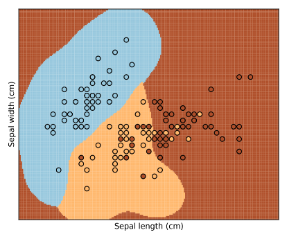{#fig-ML9_SVM_py_3 fig-align="center" width="40%"}

As illustrated in @fig-ML9_SVM_py_3, the selected parameters ($C = 1.2$, $\gamma = 5$ in this case) yield a decision boundary that balances **flexibility** and **smoothness**. Compared with the earlier examples:

-   The boundary is less rigid than with a small $\gamma$ or small $C$, avoiding underfitting.
-   It is also less wiggly than with excessively large values, preventing overfitting.

This process demonstrates the value of **cross-validation** for model selection: it systematically explores combinations of hyperparameters to achieve the best trade-off between bias and variance, ensuring robust generalisation on unseen data.

## Digit Classification with SVMs

We now return to the **digit classification** problem introduced earlier (see Figure @fig-ML6-digit-class).\
Support Vector Machines are applied here to classify handwritten digits using a **One-Versus-One** scheme, where one binary classifier is trained for each pair of digits.\
We compare SVMs using **linear**, **polynomial**, and **radial (Gaussian)** kernels. The tuning parameter $C$ was selected by **10-fold cross-validation** to optimise test accuracy.

\begin{minipage}{0.55\textwidth}
\textbf{Training and test data:}  
\begin{itemize}
\tightlist
\item Training data $({x}_1, y_1), \ldots, ({x}_n, y_n)$, $n = 7290$, are used for model fitting and parameter tuning.  
  \begin{itemize}
  \tightlist
  \item Predictors ${x}_i$ are greyscale pixel intensities of each image $\in \mathbb{R}^p$.  
  \item Outcomes $y_i$ correspond to the true digit labels $\in \{0, 1, \ldots, 9\}$.
  \end{itemize}
\item Test data $(\hat{{x}}_1, \hat{y}_1), \ldots, (\hat{{x}}_m, \hat{y}_m)$, $m = 2006$, are used only for evaluating predictive performance.
\end{itemize}

\smallskip
\textbf{Models compared:}  
\begin{itemize}
\tightlist
\item \textbf{linreg:} direct linear regression.  
\item \textbf{LDA1:} LDA based on the raw pixel values $x_i$.  
\item \textbf{LDA2:} LDA based on $x_i$ and their squares $x_i^2$.  
\item \textbf{QDA:} Quadratic Discriminant Analysis with a separate covariance matrix per class.  
\item \textbf{log:} multinomial logistic regression.  
\item \textbf{log-ridge:} logistic regression with ridge penalty.  
\item \textbf{log-lasso:} logistic regression with lasso penalty.  
\item \textbf{RF:} random forest.  
\item \textbf{linear SVM:} support vector classifier with a linear kernel.  
\item \textbf{radial SVM:} support vector machine with an RBF kernel.
\end{itemize}
\end{minipage}
\hfill
\begin{minipage}{0.4\textwidth}
\begin{center}
\textbf{Training and test errors (\%)}  
\begin{tabular}{lcc}
\hline
Method & Training & Test \\
\hline
linreg & 7.6 & 13.1 \\
LDA1 & 6.2 & 11.5 \\
LDA2 & 3.9 & 10.2 \\
QDA & 1.8 & 13.5 \\
log & 0.01 & 11.1 \\
log-ridge & 4.1 & 9.0 \\
log-lasso & 2.7 & 8.8 \\
RF & 0.0 & 5.9 \\
linear SVM & 1.5 & 6.5 \\
radial SVM & 0.6 & 5.4 \\
\hline
\end{tabular}
\end{center}
\end{minipage}

\smallskip

The results show that both **linear** and **radial** SVMs perform extremely well, with the **radial kernel** achieving the lowest test error (5.4%).\
This demonstrates the flexibility of kernel-based SVMs in modelling complex, non-linear decision boundaries, even in high-dimensional spaces like image pixels.

As seen throughout this lecture, the **kernel trick** allows SVMs to implicitly map data into richer feature spaces without explicitly constructing new variables, resulting in powerful and computationally efficient classifiers.

# Deep learning: Single hidden layer neural networks

## Neural networks

In this part of the course we turn to **deep learning** and, in particular, to neural networks. We start from the most basic architecture, the **single hidden layer neural network**, and then move on to deeper models.

Neural networks have attracted a lot of attention in recent years and are often presented as almost magical tools that can solve any prediction problem. Our goal here is to **demystify** them and treat a (deep) neural network for what it is: a **highly flexible, non-linear prediction method**, comparable to methods you already know, such as random forests or support vector machines.

In our view, neural networks are simply mathematical models that are very good at prediction. They can be used for **regression**, when $Y$ is quantitative, and for **classification**, when $Y$ takes a finite number of classes. We will use the single hidden layer neural network as the basic building block to understand how these models are constructed and why they work well.

## Single hidden layer neural network for regression

We now introduce the simplest neural network architecture for a quantitative response $Y$. As in previous regression methods, we start from $p$ original predictors $X = (X_1,\dots,X_p)^\top$ and would like to build a flexible model for $Y$. The key idea of a single hidden layer neural network is to construct $m$ new intermediate variables, called hidden units or hidden neurons $Z_j$, which play the role of automatically engineered features. Think of each hidden unit $Z_j$ as a little calculator that does two operations in a row:

1.  It computes a weighted sum of the inputs (plus a constant).
2.  It squashes that number through a non-linear function.

Each hidden unit $Z_j$ is obtained in two clear steps:

1.  **Linear combination of the inputs.** We first compute a linear predictor $$ Z_j^{\text{lin}} = b_j^{(1)} + w_j^{(1)\top} X, \quad j = 1,\dots,m, $$ which is a compact way of writing $$ Z_j^{\text{lin}} = b_j^{(1)} + w_{j1}^{(1)} X_1 + w_{j2}^{(1)} X_2 + \cdots + w_{jp}^{(1)} X_p. $$ where

    -   $w_j^{(1)} = (w_{j1}^{(1)},\dots,w_{jp}^{(1)})^\top \in \mathbb{R}^p$ is the weight vector of the $j$-th hidden unit. in other words. In other words, $w_{j1}^{(1)},\dots,w_{jp}^{(1)}$ are **weights** saying how important each feature is for this particular hidden unit and correspond to the arrows from the input nodes to a given hidden node in the network diagram.
    -   $b_j^{(1)} \in \mathbb{R}$ is its **bias** (an intercept term inside this inner linear model; it is unrelated to the “bias” from the bias–variance trade-off),
    -   $Z_j^{\text{lin}}$ is therefore a standard linear combination of the original predictors.

    Intuitively, this is like a grade computed as $\text{grade} = 5 + 0.5 \times \text{exam} + 0.3 \times \text{project} + 0.2 \times \text{homework}$: multiply each input by a weight, add them up, add a constant. That is exactly what $Z_j^{\text{lin}}$ does.

    Geometrically, the equation $w_j^{(1)\top} X + b_j^{(1)} = 0$ defines a hyperplane (a line in 2D, a plane in 3D, etc.). The sign and size of $Z_j^{\text{lin}}$ tell you on which side of that hyperplane you are and how far you are from it.

2.  **Non-linear activation.** $Z_j = g(\cdot)$

    We then apply a non-linear activation function $g:\mathbb{R}\to\mathbb{R}$ (function that takes real numbers as input and produces real numbers as output) to this linear predictor, $$ Z_j = g\big(b_j^{(1)} + w_j^{(1)\top} X\big), \quad j = 1,\dots,m. $$ This function $g$ is exactly where the non-linearity of the model is introduced: if $g$ were the identity, the hidden units would just be linear functions of $X$ and the overall model would remain linear. By choosing a non-linear $g$ (such as a sigmoid or ReLU, discussed later), we obtain transformed features $Z_1,\dots,Z_m$ that can capture complex relationships in the data. Importantly, the number $m$ of hidden units does not need to equal $p$; it is a modelling choice that controls how rich this intermediate representation is.

    The final value $Z_j$ is therefore a **non-linear feature** of the original inputs $X$. The network learns all the weights and biases so that these non-linear features become useful for predicting $Y$.

Intuitively:

-   Step 1 (linear) measures **how strongly the pattern** the neuron is looking for is present in the inputs.

-   Step 2 (activation) decides **how much the neuron fires** in response to that pattern.

    -   With ReLU: if the linear combination is negative, the neuron stays silent ($0$); if it is positive, it passes the value on.

    -   With sigmoid: the neuron responds smoothly between 0 and 1.

\begin{minipage}{0.55\textwidth}
In summary, the first step of a single hidden layer neural network for regression takes the original predictors in the input layer and maps them to $m$ hidden units via linear combinations plus a non-linear activation. Each hidden neuron collects signals from all input variables, weighs them according to its own weight vector, adds a bias, and then fires through $g$. These hidden units form a new set of features that will then be combined in a second step to model the response $Y$, as we will see next. The overall structure is sketched in Figure \ref{fig-single-hlnn}.
\end{minipage}
\hfill
\begin{minipage}{0.4\textwidth}
\begin{figure}[H]
\centering
\includegraphics[width=\linewidth]{Images_qmd_ML/ML10_single_HLNN.png}
\caption{Single hidden layer neural network: inputs $X_1,\dots,X_p$ are linearly combined and passed through an activation function to form hidden units $Z_1,\dots,Z_m$.}
\label{fig-single-hlnn}
\end{figure}
\end{minipage}

## Single hidden layer neural network for regression (output layer)

Once we have constructed the hidden units, we collect them in the vector $Z = (Z_1,\dots,Z_m)^\top$. In the regression setting we have a single quantitative output $Y$, so we now need to combine these $m$ hidden neurons into a model for $Y$. We do this in exactly the same spirit as before: we take a linear combination of the hidden units and add an intercept, and optionally apply a further function $h$ to this result, writing $$ \hat{f}(X) = h\big( b^{(2)} + w^{(2)\top} Z \big), $$ where $w^{(2)} = (w^{(2)}_1,\dots,w^{(2)}_m)^\top \in \mathbb{R}^m$ are the second-layer weights and $b^{(2)} \in \mathbb{R}$ is the second-layer bias.

In regression we typically choose $h$ to be the identity function, so the final model is simply a linear regression on the hidden units, $$ \hat{f}(X) = b^{(2)} + w^{(2)\top} Z. $$ Intuitively, each hidden neuron $Z_j$ has already applied a non-linear transformation to the original inputs through the activation function $g$. The output neuron now just mixes these transformed features linearly. Because there is only one output neuron in regression, there is only one weight vector $w^{(2)}$ and one bias $b^{(2)}$, in contrast to the many weight vectors and biases in the hidden layer. The full network for regression can therefore be seen as two stacked linear models separated by the non-linear activation function $g$: first from $X$ to $Z$, then from $Z$ to $Y$.

@fig-single-hlnn-2 visualises this whole process: the green nodes on the left represent the original predictors $X_1,\dots,X_p$ (input layer), the blue nodes in the middle are the hidden units $Z_1,\dots,Z_m$, and the red node on the right is the output $Y$. The arrows correspond to the weights in the two layers: first-layer weights from $X$ to $Z$, and second-layer weights from $Z$ to $Y$. Reading the diagram from left to right therefore mirrors exactly the two-step computation of the model $\hat{f}(X)$.

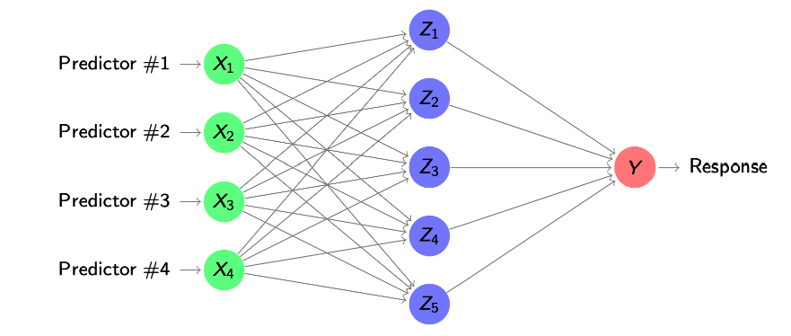{#fig-single-hlnn-2}

## Biological motivation and notation

Artificial neural networks are loosely inspired by how neurons in the brain work, but only at a very high level. A biological neuron receives signals through its dendrites, combines them in the cell body, and, if the overall activation is large enough, sends an output impulse along its axon, as shown on the left of @fig-bio-motivation.

The artificial neuron on the right of @fig-bio-motivation mirrors this structure in mathematical form. The inputs $x_1, x_2,\dots$ correspond to incoming signals, each weighted by a connection strength $w_i$ and summed together with a bias $b$. This sum is passed through an activation function $f(\cdot)$, which determines the output “firing” of the neuron. This loose analogy explains the biological terminology (neurons, activation, firing) used for what are, in the end, purely mathematical models.

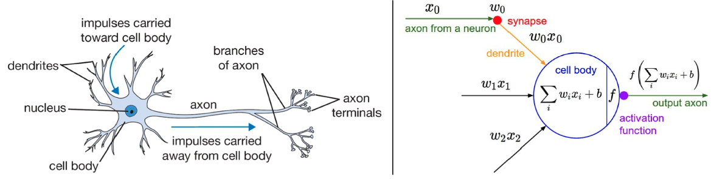{#fig-bio-motivation}

## Activation functions in the hidden layer

In matrix notation we can collect the $m$ hidden units into the vector $$ Z = g\big(b^{(1)} + W^{(1)} X\big) \in \mathbb{R}^m, $$ where $W^{(1)} \in \mathbb{R}^{m \times p}$ contains the weights of the connections from the $p$ inputs to the $m$ hidden units, $b^{(1)} \in \mathbb{R}^m$ is the vector of biases, and $g$ is applied componentwise to this vector.

The choice of activation function $g$ is crucial. A traditional choice is the **sigmoid function** $$ \sigma(x) = \exp(x)/(1 + \exp(x)), $$ which smoothly squashes any real input to a value between 0 and 1, as shown in the left panel of @fig-activation-plot. In modern neural networks, the default is usually the **rectified linear unit (ReLU)**, $$ \text{ReLU}(x) = \max\{0,x\}, $$ displayed in the right panel of @fig-activation-plot. ReLU leaves positive inputs unchanged and sets negative inputs to zero, which leads to simpler gradients and often faster, more stable training in deep networks.

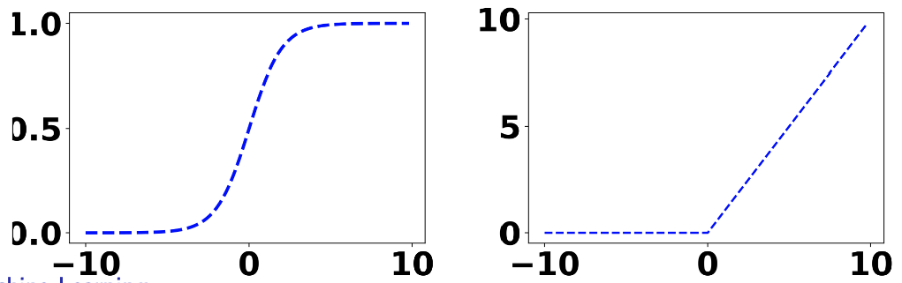{#fig-activation-plot width=70%}

## Single hidden layer neural network for regression

In regression, the output layer function $h$ is typically just the identity $h(z) = z$, so the network prediction is a linear combination of the hidden units, $$ \hat{f}(X) = b^{(2)} + w^{(2)\top} Z. $$

If we now use ReLU in the hidden layer, the hidden vector is $$ Z = \max\{0,\, b^{(1)} + W^{(1)} X\}, $$ where the max is applied componentwise. Plugging this expression for $Z$ into the output layer gives a compact formula for the whole single hidden layer neural network, $$ \hat{f}(X) = b^{(2)} + w^{(2)\top} \max\{0,\, b^{(1)} + W^{(1)} X\}. $$

The diagram in @fig-single-hlnn-2 summarises this computation visually: the inputs $X_1,\dots,X_p$ are first transformed by the ReLU hidden layer into $Z_1,\dots,Z_m$, and these hidden activations are then combined linearly in the single output neuron to produce the prediction for $Y$.

## Single hidden layer neural network for classification

If the output is qualitative with $q$ classes $Y \in \mathcal{G} = \{1,\dots,q\}$, we want the network to produce $q$ class probabilities, one for each class. This is achieved by using $q$ output neurons, each representing the probability of a particular class.

The hidden layer is unchanged and is still given in matrix form by $$ Z = g\big(b^{(1)} + W^{(1)} X\big), $$ where $Z \in \mathbb{R}^m$ is the vector of hidden activations. In the output layer we now use a weight matrix $W^{(2)} \in \mathbb{R}^{q \times m}$ and a bias vector $b^{(2)} \in \mathbb{R}^q$. For each class $i = 1,\dots,q$, the network first computes a score
$$ s_i(X) = b^{(2)}_i + w^{(2)\top}_i Z, $$
where $w^{(2)}_i$ is the $i$-th row of $W^{(2)}$.

To turn these scores into probabilities we choose the output functions $h_i$ to be the **softmax** components. Given $q$ input scores $x_1,\dots,x_q$, the $i$-th softmax component is $$ h_i(x_1,\dots,x_q) = \text{softmax}(x_1,\dots,x_q)_i = \frac{\exp(x_i)}{\sum_{j=1}^q \exp(x_j)}, \quad i = 1,\dots,q. $$

This is exactly the same softmax function used in multinomial logistic regression. With ReLU in the hidden layer and softmax in the output layer, the single hidden layer neural network directly models the posterior probabilities
$$ \hat{f}_i(X) = \Pr(Y = i \mid X) = \text{softmax}\!\big(b^{(2)} + W^{(2)} \max\{0,\, b^{(1)} + W^{(1)} X\}\big)_i, \quad i = 1,\dots,q. $$

For a new input $x_0 \in \mathbb{R}^p$ we then apply the Bayes classifier by predicting the class with the largest estimated probability,
$$ \hat{G}(x_0) = \hat{y}_0 = \arg\max_{i=1,\dots,q} \hat{f}_i(x_0). $$

The architecture in @fig-class-hlnn visualises this: the green nodes represent the original predictors, the blue nodes are the shared hidden layer $Z_1,\dots,Z_m$, and the red output nodes $Y_1,\dots,Y_q$ compute the $q$ class probabilities by applying softmax to different linear combinations of the same hidden activations.

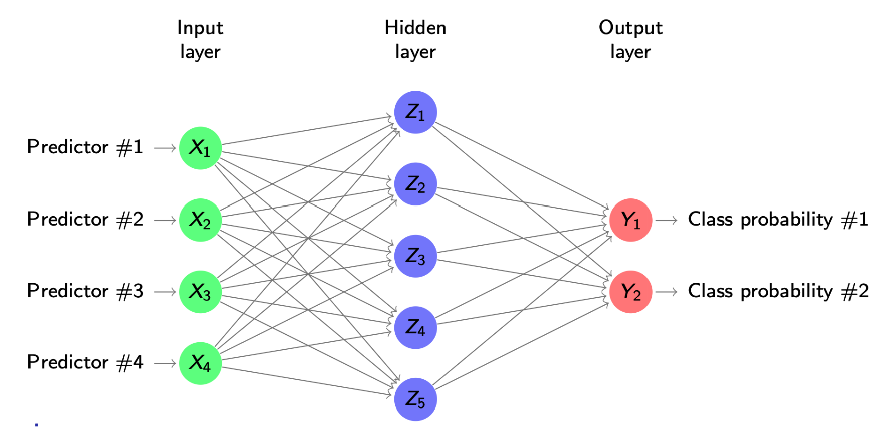{#fig-class-hlnn}

# Deep Learning: Deep Neural Networks

## Deep neural networks

A deep neural network is a neural network with **multiple hidden layers** between the input and the output layer. Instead of transforming the inputs $X$ into a single hidden layer and then directly into the output, we now pass the information through a sequence of hidden layers, each building on the previous one.

Formally, we denote by $Z^{(1)},\dots,Z^{(M)}$ the hidden layers, where $M$ is the number of hidden layers. The first hidden layer is constructed as $$ Z^{(1)} = g_1\big(b^{(1)} + W^{(1)} X\big), $$ where $W^{(1)}$ and $b^{(1)}$ are the weights and biases from the input to the first hidden layer, and $g_1$ is an activation function such as ReLU. Each subsequent hidden layer takes the previous hidden layer as input, $$ Z^{(2)} = g_2\big(b^{(2)} + W^{(2)} Z^{(1)}\big),\dots,\; Z^{(M)} = g_M\big(b^{(M)} + W^{(M)} Z^{(M-1)}\big). $$

From the last hidden layer we still need to produce the outputs. For $q$ outputs (for example $q$ classes in classification), we use $$ \hat{f}_i(X) = h_i\big(b^{(M+1)} + W^{(M+1)} Z^{(M)}\big), \quad i = 1,\dots,q, $$ where $W^{(M+1)}$ and $b^{(M+1)}$ are the weights and biases from the last hidden layer to the output layer, and $h_i$ is the output function (identity for regression, softmax components for classification).

The network in @fig-dnn-arch visualises this construction: the green nodes are the input predictors, the blue nodes are the successive hidden layers $Z^{(1)},Z^{(2)},Z^{(3)}$, and the red output nodes $Y_1,Y_2$ are obtained by applying a final linear transformation and output functions to the last hidden layer.

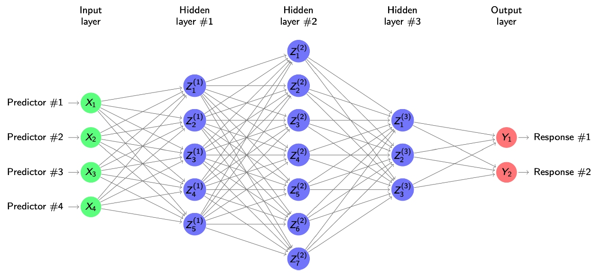{#fig-dnn-arch}

## The architecture of deep neural networks

The **depth** of a neural network is the total number of layers, counting both hidden layers and the output layer (and sometimes also the input layer, depending on convention). For each layer, the **width** is the number of neurons in that layer. Together, depth and width largely determine the **architecture** of a deep neural network.

In practice there can be additional architectural choices, such as restricting which neurons are connected, or forcing some weights to be shared across different parts of the network (as in convolutional neural networks). A good architecture is usually found by combining prior experience with systematic comparison via cross-validation: we try several candidate depths and widths and keep the one that generalises best to new data.

The network shown in @fig-dnn-arch is an example of such an architecture: it has one input layer, three hidden layers of different widths, and an output layer with two neurons, each representing one response.

## Comments on deep neural networks

In deep neural networks the default choice for all activation functions is usually the ReLU, $$ g_j(x) = \max\{0,x\},\ j = 1,\dots,M, $$ because it is simple, cheap to evaluate, and works well in practice for many hidden layers.

For regression problems we typically have a single output ($q = 1$) and use the identity in the output layer, $$ h(z) = z, $$ so the network returns a real-valued prediction. For classification, the output functions $h_i$ are the softmax components, which turn the final layer scores into class probabilities.

The hidden layers act as **feature extractors**: each layer transforms the representation from the previous one, gradually extracting higher-level patterns in the data. The first hidden layer, which is directly connected to the inputs, is particularly important for interpretation and visualisation of what features the network is learning.

Deep networks are **highly flexible**: with enough neurons they can approximate any continuous function on $\mathbb{R}^p$ to arbitrary accuracy (under mild assumptions). However, this flexibility comes at a cost. They contain **many parameters**, so fitting them is computationally expensive and there is a serious risk of overfitting. In practice, choosing and training a good architecture relies on experience plus careful use of validation and regularisation.

## A simple example: digit classification

To see what these architectures look like in practice, consider a small digits data set where each image is represented by $p = 256$ grey-scale pixels. Each digit like those in @fig-ML6-digit-class is flattened into a vector $X \in \mathbb{R}^{256}$ that we feed into a deep neural network.

We take a **fully connected** network with $M = 3$ hidden layers, each containing 256 neurons, and an output layer with 10 neurons (one for each digit 0–9). The structure is shown in @fig-ML10-digit-class: every neuron in one layer is connected to every neuron in the next one, so the information from each pixel can, in principle, influence every hidden unit and every output.

Even this “simple” architecture already has a large number of parameters. Each hidden layer has $(256 + 1) \times 256 = 257 \times 256$ weights and biases, and the output layer has $(256 + 1) \times 10 = 2570$ parameters. Altogether this is roughly $$ 3 \times 257 \times 256 + 257 \times 10 \approx 200\,000 $$ parameters to estimate. This example illustrates both the expressive power of deep networks and why training them is computationally demanding and prone to overfitting if not properly regularised.

{#fig-ML6-digit-class}

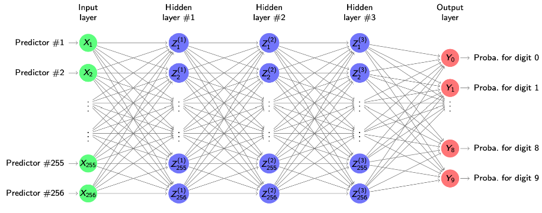{#fig-ML10-digit-class}

# Deep learning: Fitting neural networks and back-propagation

## Loss functions for neural networks

Neural networks are non-linear parametric prediction models. All weights and biases that transform one layer into the next can be collected into a single long parameter vector $\theta$, even if this vector has thousands or hundreds of thousands of entries. For a fixed $\theta$ the network defines a predictive function, which we denote by $f$. In regression we usually write $f(x)$ and keep in mind that it depends on $\theta$, while in classification with $q$ terminal neurons the network outputs $q$ functions $f_1(x),\dots,f_q(x)$, one for each class probability.

Given training data $(x_1,y_1),\dots,(x_n,y_n)$, we define a loss function $J(\theta)$ that measures how well the network predicts the responses on the whole training set. This $J(\theta)$ is our objective function: if we change $\theta$, the neural network changes, the predictions $f(x_i)$ change, and therefore the value of $J(\theta)$ changes.

For regression, where the $y_i$ are quantitative, we use the usual squared-error loss and define the residual sum of squares $$J(\theta)=\sum_{i=1}^n\big(y_i-f(x_i)\big)^2.$$ This is just the squared error iterated over all training samples, comparing each true response to the prediction from the neural network.

For classification with $q$ classes, $y_i\in\{1,\dots,q\}$, we use the cross-entropy (deviance) loss known from multinomial logistic regression, $$J(\theta)=-\sum_{i=1}^n\sum_{j=1}^q I\{y_i=j\}\log f_j(x_i).$$ Here $I\{y_i=j\}$ is the indicator of the true class. For each observation this loss takes the log-probability that the network assigns to the true class and sums it over all training samples. Minimising $J(\theta)$ in this case is equivalent to maximum likelihood estimation of a classifier with class probabilities given by the neural network.

## Fitting of neural networks

Fitting a neural network means choosing the parameter vector $\theta$ (all weights and biases stacked into one long vector) so that the loss $J(\theta)$ is small on the training data. As the lecturer stresses, this is really an art and an active research topic in its own right. The loss $J(\theta)$ is a highly non-linear, non-convex function of very many parameters, so there is no closed-form solution: we cannot simply write down the optimal $\theta$ as we did for linear regression.

You should picture $J(\theta)$ as a complicated surface over a huge parameter space. In low dimension we might draw a bumpy landscape with many valleys and ridges; in reality the neural network lives in a very high-dimensional version of this picture. Because we have so many parameters, the true global (or even very deep local) minimum of $J(\theta)$ would typically correspond to overfitting the training data: the network can adapt too closely to idiosyncrasies and noise. In practice we are not trying to find that global minimum. Instead, we will later control overfitting with tools such as regularisation and early stopping and be satisfied with parameter values that give a good fit without memorising the data.

For now, the question is how we can improve an initial model using gradient descent. We start from some arbitrary initial parameter vector $\theta^{(0)}$ and move step by step down the loss surface.

**Gradient descent for neural networks**

1. Start with an arbitrary initial value $\theta^{(0)}$.
2. For iterations $i=1,2,\dots$:
   1. Compute the gradient (derivative) of the loss at the current parameters,
      $$\nabla_\theta J(\theta^{(i-1)})=\left.\frac{\partial J(\theta)}{\partial \theta}\right|_{\theta=\theta^{(i-1)}}.$$
   2. Update the parameters with learning rate $\alpha>0$,
      $$\theta^{(i)}=\theta^{(i-1)}-\alpha\nabla_\theta J(\theta^{(i-1)}).$$
3. Stop when a suitable stopping criterion is satisfied (for example, after a fixed number of iterations or when the loss stops improving).

Intuitively, each step looks at the current model, asks in which direction in parameter space $J(\theta)$ decreases fastest, and moves a small distance in that direction. The lecturer emphasises that this algorithm itself is standard; what is specific to neural networks is how we obtain the gradient efficiently for such a complex model. Thus, all we really need in order to fit a neural network by gradient descent are the gradients $\nabla_\theta J(\theta)$, which will be provided by the backpropagation algorithm.

## Computing the gradient: back-propagation

In the sequel we focus on **regression**; the classification case is entirely analogous but uses the cross-entropy loss instead of the squared error. For regression with squared loss, the gradient of the total loss at some parameter vector $\theta$ can be written as a sum over the training samples,
$$\nabla_\theta J(\theta)=\sum_{i=1}^n \nabla_\theta\big(f_\theta(x_i)-y_i\big)^2.$$
This expression says that the overall direction in which we should move $\theta$ is obtained by adding up the contributions of each individual training example.

Because the gradient is a sum, we can look at a **single** training pair $(x,y)$ and study its loss contribution
$$L(\theta)=\big(f_\theta(x)-y\big)^2.$$
If we understand how to differentiate this one-sample loss with respect to all parameters, then the full gradient is just the sum of these single-sample gradients. This is exactly the viewpoint that underlies back-propagation and, later, stochastic and mini-batch gradient descent.

Back-propagation is simply a way of computing $\nabla_\theta L(\theta)$ efficiently by exploiting the **chain rule** of calculus. The neural network takes $x$, pushes it through a sequence of linear transformations and non-linear activations, and finally produces the prediction $f_\theta(x)$. This whole computation is a long composition of simple functions. The chain rule tells us how the derivative of such a composition factors into the product of simpler derivatives.

Recall the chain rule for two functions $f$ and $g$. If we define $h(x)=f(g(x))$, then $$\left.\frac{\partial h(x)}{\partial x}\right|_{x=x_0}
=\left.\frac{\partial f(z)}{\partial z}\right|_{z=g(x_0)}
\cdot
\left.\frac{\partial g(x)}{\partial x}\right|_{x=x_0}.$$
In short-hand notation, if we set $z=g(x)$, this becomes $$\frac{\partial h}{\partial x}=\frac{\partial h}{\partial z}\cdot\frac{\partial z}{\partial x}.$$

The key idea for back-propagation is to apply this rule repeatedly along the layers of the network, but **from the output back to the input**. We first differentiate the loss with respect to the final output $f_\theta(x)$, then propagate this derivative backwards through the last layer, then through the previous layer, and so on, each time multiplying by the relevant local derivative. In this way we reuse intermediate quantities and avoid recomputing the same derivatives many times. This is what makes back-propagation an efficient method for obtaining the gradients needed in gradient descent for neural networks.

## Back-propagation: the forward pass

To compute the gradient for a given parameter vector $\theta$ it is convenient to look at one training pair $(x,y)$ at a time. We fix a single input vector $x=(x_1,\dots,x_p)$ and its target $y$, together with the current weights and biases collected in $\theta$. For this fixed $\theta$ we first run a **forward pass** through the network in order to know the activation value of every hidden neuron and the final prediction.

Starting from the input layer, the activations of the hidden units are computed exactly as in the definition of the network. For a single hidden layer with activation function $g$ this means  
$$z=g\big(b^{(1)}+W^{(1)}x\big),$$
where $W^{(1)}$ and $b^{(1)}$ are the weights and biases of the first layer and $z$ collects the hidden activations. The output neuron then combines these hidden activations linearly to form the prediction
$$\hat{y}=f_\theta(x)=b^{(2)}+w^{(2)\top}z.$$

Conceptually, the forward pass in @fig-backprop-forward takes the fixed input $x$ (green nodes on the left), pushes it through the hidden layer (blue nodes $z_1,z_2$), and produces the output $\hat{y}$ (red node). We then compare $\hat{y}$ with the true target $y$ (green node on the right) and evaluate the loss
$$L(\theta)=(\hat{y}-y)^2.$$
In deeper networks the same idea applies: we repeatedly apply “linear transformation + non-linearity” from layer to layer until we reach the output. All these intermediate quantities (the activations in each layer and the prediction) will then be reused in the backward pass to compute the gradients efficiently via the chain rule.

**Summary of the forward pass for one sample $(x,y)$ (as in @fig-backprop-forward):**

- Fix the input vector $x=(x_1,\dots,x_p)$, the target $y$ and the current parameters $\theta$.
- Compute the hidden activations by propagating $x$ through the first layer: $z=g\big(b^{(1)}+W^{(1)}x\big)$.
- Compute the network prediction at the output layer: $\hat{y}=b^{(2)}+w^{(2)\top}z$.
- Evaluate the loss contribution of this sample: $L(\theta)=(\hat{y}-y)^2$.

These forward computations provide all the activations that back-propagation will differentiate with respect to the parameters in the backward pass.

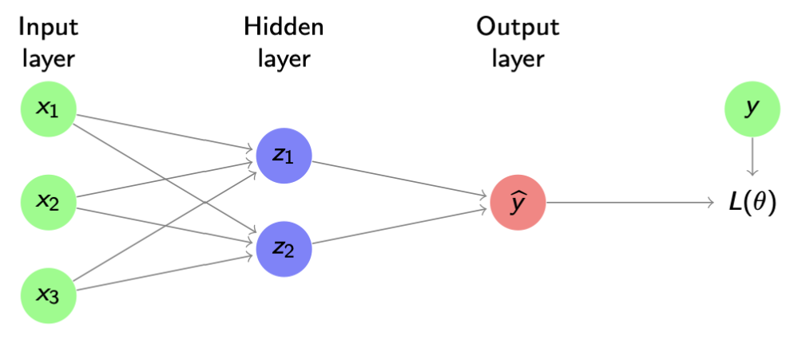{#fig-backprop-forward width="70%" fig-align="center"}

## Back-propagation

From the forward pass we know that, for a single hidden layer,
$$z=g\big(b^{(1)}+W^{(1)}x\big),\qquad \hat{y}=f_\theta(x)=b^{(2)}+w^{(2)\top}z,\qquad L(\theta)=(\hat{y}-y)^2.$$
Here $z$ contains the hidden activations, $\hat{y}$ is the prediction for the fixed input $x$, and $L(\theta)$ is the squared-error loss for this one training pair, exactly as in @fig-backprop-forward.

To obtain the **gradient**, we differentiate $L(\theta)$ with respect to **all parameters** in the network, starting from the output layer and moving backwards.

### Output-layer weights

Suppose the output-layer weight vector is $w^{(2)}=(w^{(2)}_1,w^{(2)}_2)$ as in @fig-backprop-forward. We first look at $\partial L/\partial w^{(2)}_1$, i.e. how much the loss changes if we slightly change the connection from hidden unit $z_1$ to the output.

Back-propagation applies the **chain rule**:
$$\frac{\partial L}{\partial w^{(2)}_1}
=\frac{\partial L}{\partial \hat{y}}\cdot\frac{\partial \hat{y}}{\partial w^{(2)}_1}.$$
For the squared loss $L(\theta)=(\hat{y}-y)^2$ we have
$$\frac{\partial L}{\partial\hat{y}}=2(\hat{y}-y),$$
which is just (twice) the prediction error. Since the output is linear in the hidden activations,
$$\hat{y}=b^{(2)}+w^{(2)\top}z=b^{(2)}+w^{(2)}_1z_1+w^{(2)}_2z_2,$$
we obtain
$$\frac{\partial\hat{y}}{\partial w^{(2)}_1}=z_1.$$
Putting these pieces together gives
$$\frac{\partial L}{\partial w^{(2)}_1}=2(\hat{y}-y)\,z_1.$$
By the same argument,
$$\frac{\partial L}{\partial w^{(2)}_2}=2(\hat{y}-y)\,z_2,$$
and in general
$$\frac{\partial L}{\partial w^{(2)}_i}=2(\hat{y}-y)\,z_i.$$

Thus each gradient component at the output layer is the product of an **error term** $(\hat{y}-y)$ at the red node and the corresponding **hidden activation** $z_i$ at the blue node in @fig-backprop-forward.

### First-layer weights

We now move one step further back and compute derivatives with respect to the **first-layer weights**. Focus first on a single weight $w^{(1)}_{11}$, which connects input $x_1$ to hidden unit $z_1$ in @fig-backprop-forward. Along this path the loss depends on $w^{(1)}_{11}$ via
$$w^{(1)}_{11}\;\longrightarrow\;z_1\;\longrightarrow\;\hat{y}\;\longrightarrow\;L,$$
so the chain rule gives
$$\frac{\partial L}{\partial w^{(1)}_{11}}
=\frac{\partial L}{\partial \hat{y}}\cdot\frac{\partial \hat{y}}{\partial z_1}\cdot\frac{\partial z_1}{\partial w^{(1)}_{11}}.$$

We already know $\partial L/\partial\hat{y}=2(\hat{y}-y)$. The second factor is the sensitivity of the output to the hidden unit:
$$\frac{\partial \hat{y}}{\partial z_1}=w^{(2)}_1,$$
because $\hat{y}=b^{(2)}+w^{(2)}_1z_1+w^{(2)}_2z_2$. For the third factor we use the definition of the hidden activation,
$$z_1=g\big(b^{(1)}_1+w^{(1)\top}_1 x\big),$$
where $w^{(1)}_1$ is the row of $W^{(1)}$ corresponding to hidden unit $z_1$. Differentiating with respect to $w^{(1)}_{11}$ yields
$$\frac{\partial z_1}{\partial w^{(1)}_{11}}
=g'\big(b^{(1)}_1+w^{(1)\top}_1 x\big)\,x_1.$$

Combining the three factors we obtain the explicit formula from the slide:
$$\frac{\partial L}{\partial w^{(1)}_{11}}
=2(\hat{y}-y)\cdot w^{(2)}_1\cdot g'\big(b^{(1)}_1+w^{(1)\top}_1 x\big)\,x_1.$$

Exactly the same logic applies to any first-layer weight $w^{(1)}_{ij}$, which connects input $x_j$ to hidden unit $z_i$. Along the path
$$w^{(1)}_{ij}\;\longrightarrow\;z_i\;\longrightarrow\;\hat{y}\;\longrightarrow\;L$$
we obtain
$$\frac{\partial L}{\partial w^{(1)}_{ij}}
=\frac{\partial L}{\partial \hat{y}}\cdot\frac{\partial \hat{y}}{\partial z_i}\cdot\frac{\partial z_i}{\partial w^{(1)}_{ij}}
=2(\hat{y}-y)\cdot w^{(2)}_i\cdot g'\big(b^{(1)}_i+w^{(1)\top}_i x\big)\,x_j.$$

This formula shows the typical **back-propagation structure** for a hidden-layer weight:

- an error term $2(\hat{y}-y)$ coming from the output layer,
- multiplied by the weight $w^{(2)}_i$ that connects hidden unit $z_i$ to the output,
- multiplied by the derivative of the activation $g'$ evaluated at the hidden pre-activation $b^{(1)}_i+w^{(1)\top}_i x$,
- multiplied by the input $x_j$ to that hidden unit.

In words, the error at the output node is propagated backwards through the network, scaled at each step by the relevant weights and activation derivatives. This is precisely why the algorithm is called **back-propagation** and why it efficiently provides gradients for all parameters using only local computations along the graph in @fig-backprop-forward.

### Error terms and compact notation

The formulas we obtained for the weight derivatives can be written more compactly by introducing **error terms** (often called *deltas*).

For the output-layer weights we had
$$\frac{\partial L}{\partial w^{(2)}_i}=2(\hat{y}-y)\,z_i.$$
We now define a single scalar
$$\delta^{(2)}=2(\hat{y}-y),$$
which is the error at the output neuron for the current parameters $\theta$. Then
$$\frac{\partial L}{\partial w^{(2)}_i}=\delta^{(2)}z_i.$$

For the first-layer weights we found
$$\frac{\partial L}{\partial w^{(1)}_{ij}}
=2(\hat{y}-y)\cdot w^{(2)}_i\cdot g'\big(b^{(1)}_i+w^{(1)\top}_i x\big)\,x_j.$$
We now define, for each hidden unit $i$,
$$\delta^{(1)}_i
=2(\hat{y}-y)\cdot w^{(2)}_i\cdot g'\big(b^{(1)}_i+w^{(1)\top}_i x\big),$$
so that
$$\frac{\partial L}{\partial w^{(1)}_{ij}}=\delta^{(1)}_i x_j.$$

The quantities $\delta^{(2)}$ and $\delta^{(1)}_i$ are the **errors** associated with the output neuron and the $i$-th hidden neuron, respectively. They satisfy the simple relationship
$$\delta^{(1)}_i=\delta^{(2)}\cdot w^{(2)}_i\cdot g'\big(b^{(1)}_i+w^{(1)\top}_i x\big),$$
which is exactly the expression on the slide: the error at a hidden node is the error at the next layer, multiplied by the connecting weight and by the derivative of the activation at that node.

For the ReLU activation $g(x)=\max\{0,x\}$ we have
$$g'(x)=\mathbf{1}\{x>0\},$$
so the hidden error $\delta^{(1)}_i$ is either zero (if the neuron is inactive) or proportional to $\delta^{(2)}w^{(2)}_i$ (if the neuron is active).

### Two-pass back-propagation algorithm

With this delta notation, back-propagation is implemented as a **two-pass algorithm**:

1. **Forward pass.**  
   Compute all hidden activations $z_i$ and the prediction $\hat{y}$ for the current $\theta$, then evaluate the loss $L(\theta)=(\hat{y}-y)^2$.

2. **Backward pass.**  
   - Compute the output error $\delta^{(2)}=2(\hat{y}-y)$.  
   - Use the recursion  
     $$\delta^{(1)}_i=\delta^{(2)}\cdot w^{(2)}_i\cdot g'\big(b^{(1)}_i+w^{(1)\top}_i x\big)$$  
     to obtain the hidden errors $\delta^{(1)}_i$.  
   - Finally compute the gradients
     $$\frac{\partial L}{\partial w^{(2)}_i}=\delta^{(2)}z_i,\qquad
       \frac{\partial L}{\partial w^{(1)}_{ij}}=\delta^{(1)}_i x_j.$$

The equations for the derivatives with respect to the biases are analogous: each bias gradient is just the corresponding delta (for the neuron it belongs to). In deeper networks, the same pattern repeats layer by layer: errors are first computed at the output, then **back-propagated** through the network using formulas of the form above, and the gradients with respect to all weights and biases follow from these deltas.

## Advantages of back-propagation

The delta notation extends directly from a single hidden layer to **deep networks** with many hidden layers. In a network with hidden layers $Z^{(1)},\dots,Z^{(M)}$ and output $\hat{y}$, we have an error vector $\delta^{(m)}$ at each hidden layer $m=1,\dots,M$ and an output error $\delta^{(M+1)}$ at the last layer. Back-propagation computes these errors starting from the output and then propagating them backwards through the layers, exactly as we did for the single hidden layer.

As illustrated in @fig-backprop-advantages, each blue hidden layer has its own error vector $\delta^{(m)}$. The recursion has always the same structure: the error at layer $m$ is obtained from the error at layer $m+1$ by multiplying with the corresponding weight matrix and the derivative of the activation function at that layer. Once all $\delta^{(m)}$ have been computed, the gradients with respect to all weights and biases follow from simple local formulas such as
$$\frac{\partial L}{\partial w^{(m)}_{ij}}=\delta^{(m)}_i a^{(m-1)}_j,$$
where $a^{(m-1)}_j$ is the activation coming into layer $m$ (for $m=1$ this is just the input $x_j$).

Back-propagation has several important advantages:

- It is **very efficient**: the same forward activations and backward error terms $\delta^{(m)}$ are reused many times when computing the gradients, so the cost of obtaining all partial derivatives is only a small constant factor larger than a single forward pass.
- Only **local derivatives** are needed at each node: we never differentiate the full composition explicitly, but only the activation function at that node and the local linear transformation. This locality makes the algorithm easy to implement for a wide range of architectures.
- The computations at different neurons and different training examples are **embarrassingly parallel**, so back-propagation can be implemented very efficiently on GPUs and other parallel hardware.

In summary, back-propagation scales well to deep neural networks precisely because it organises gradient computation into local, reusable pieces: forward activations $a^{(m)}$ and backward errors $\delta^{(m)}$ that flow through the layered structure in @fig-backprop-advantages.

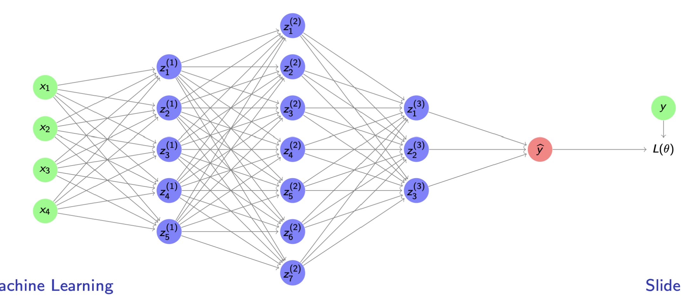{#fig-backprop-advantages width="80%" fig-align="center"}


## Batch optimisation

Recall from the gradient descent section that the loss for regression is
$$J(\theta)=\sum_{i=1}^n\big(y_i-\hat f_\theta(x_i)\big)^2,$$
so its gradient is the sum of the per-sample gradients
$$\nabla_\theta J(\theta)=\sum_{i=1}^n\nabla_\theta\big(y_i-\hat f_\theta(x_i)\big)^2.$$
Back-propagation gives us exactly these single-sample gradients: for each training pair $(x_i,y_i)$ we can run a forward pass, compute the loss, and then a backward pass to obtain $\nabla_\theta\big(y_i-\hat f_\theta(x_i)\big)^2$.

To improve the error function $J(\theta)$ we now have two options; the first one is **batch optimisation** (the classical setting in the script):

- For each update step we use the **whole training set** $(x_1,y_1),\dots,(x_n,y_n)$.
- We compute all per-sample gradients via back-propagation and sum them to obtain the exact gradient $\nabla_\theta J(\theta)$ as in the formula above.
- We then take a gradient descent step
  $$\theta\leftarrow\theta-\alpha\,\nabla_\theta J(\theta),$$
  where $\alpha>0$ is the learning rate.

This procedure is simply **standard gradient descent** applied to neural networks: every step moves the parameters in the direction of the *true* gradient based on all observations. The advantage is that each update uses the most accurate possible information about how $J(\theta)$ changes. The drawback, emphasised in the video, is computational: when $n$ is large, each step requires running back-propagation over the full dataset, which can be very slow. This motivates mini-batch and stochastic variants discussed on the following slides.

## Stochastic gradient descent

For regression the loss is $$J(\theta)=\sum_{i=1}^n\big(y_i-\hat f_\theta(x_i)\big)^2,$$
so the exact gradient needed for gradient descent is $$\nabla_\theta J(\theta)=\sum_{i=1}^n\nabla_\theta\big(y_i-\hat f_\theta(x_i)\big)^2.$$
In batch optimisation we use **all** $n$ training samples to compute this gradient before each update. As highlighted in the script, when $n$ is very large (millions or billions of examples), a single full gradient step already becomes prohibitively slow.

To make learning feasible we approximate this gradient using much smaller **mini-batches**.

### Mini-batch optimisation and stochastic gradient descent

* Randomly shuffle the training data and split it into $\frac{n}{m}$ **mini-batches** of size $m$, where $m\ll n$ (typically from $1$ to a few hundred).
* In each step, stochastic gradient descent picks one mini-batch
  ${(x^{(1)},y^{(1)}),\dots,(x^{(m)},y^{(m)})}$
  and uses only these $m$ examples to approximate the full gradient: $$\nabla_\theta J(\theta)\approx\sum_{i=1}^m\nabla_\theta\big(y^{(i)}-\hat f_\theta(x^{(i)})\big)^2.$$
* We then update the parameters using this **stochastic** gradient: $$\theta\leftarrow\theta-\alpha\sum_{i=1}^m\nabla_\theta\big(y^{(i)}-\hat f_\theta(x^{(i)})\big)^2.$$

Each mini-batch therefore gives a **noisy estimate** of the true gradient. A single step is not optimal, but it is very fast to compute, and by taking many such steps we still move, on average, in a good descent direction.

### Intuition and comparison with batch optimisation

* Mini-batch optimisation takes **many small, cheap steps** that are only approximately optimal but can be computed very quickly.
* Batch optimisation takes **few very accurate steps**, but each requires a pass over all $n$ samples and is therefore much slower and often infeasible for large datasets.
* In modern applications, many training samples are **similar or redundant** (for example, similar images). Using a mini-batch discards little information while dramatically reducing computation.
* A **training epoch** is one full sweep over the training set: each observation has appeared in at least one mini-batch update. In practice we run several epochs, letting these noisy updates gradually decrease $J(\theta)$ as the parameters $\theta$ are refined.

