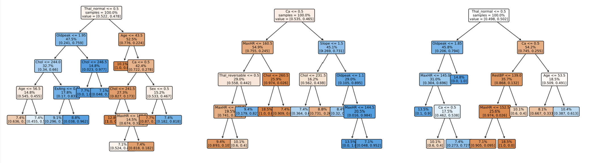
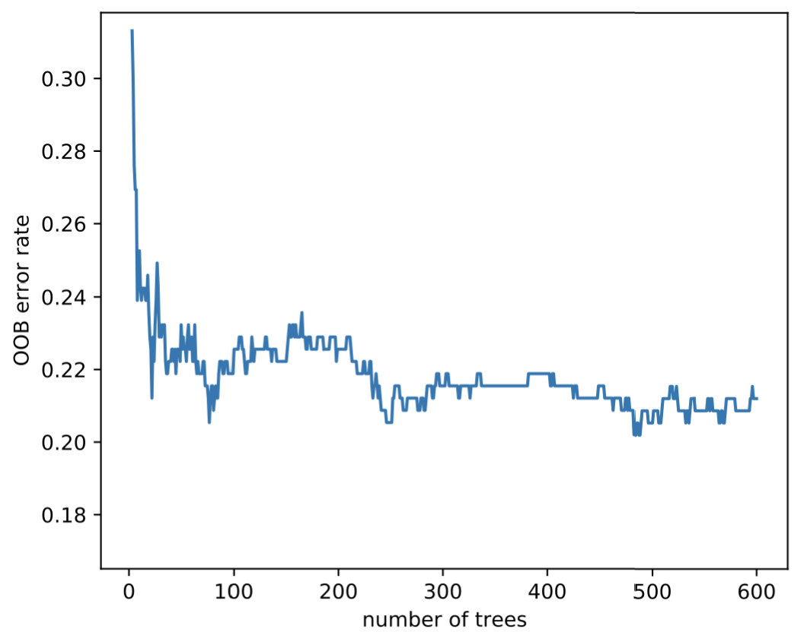
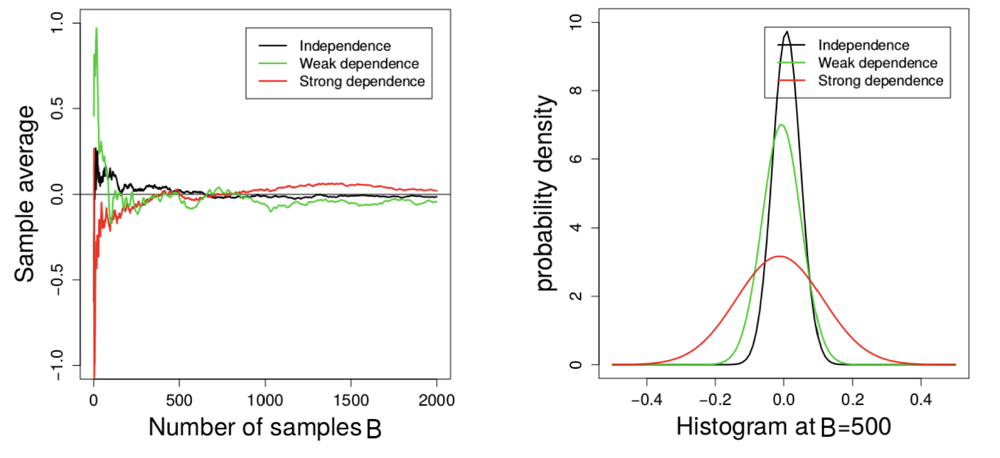
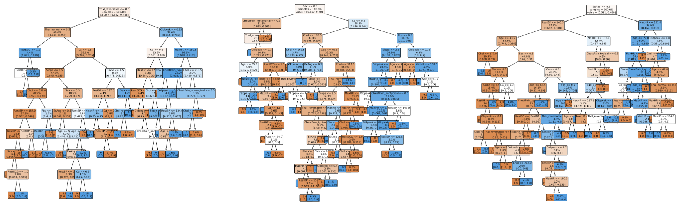
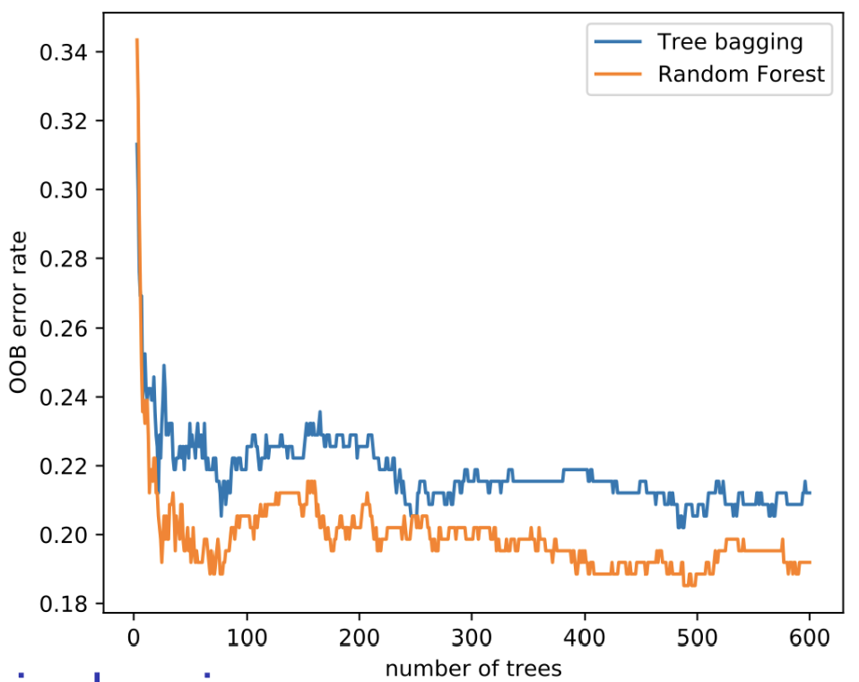
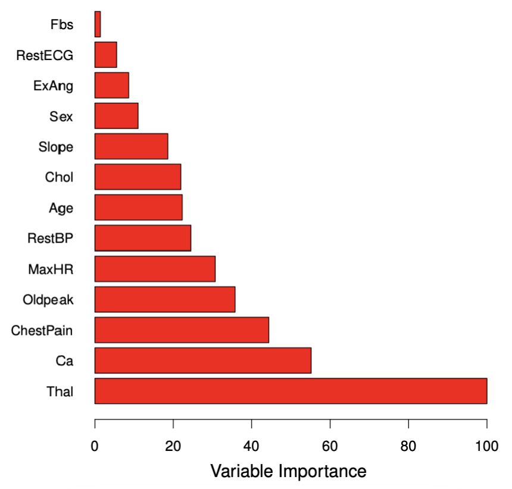
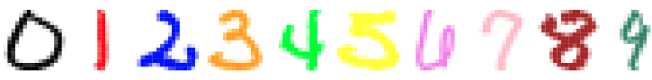
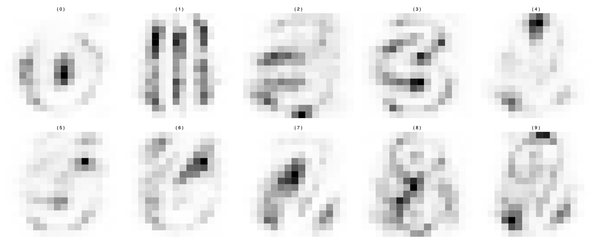

# Bagging

## Bagging: main idea

-   **Bootstrap aggregation**, or **bagging**, is a general-purpose procedure for reducing the variance of a statistical learning method. It reduces variability by training multiple models on different bootstrap samples and averaging their predictions. Since each model sees a slightly different subset of the data, their individual errors tend to cancel out when aggregated, leading to a smoother and more stable estimator.
-   Given a set of $B$ independent observations $z_1, \dots, z_B$ each with variance $\sigma^2$, the variance of the mean $$\bar{z} = \frac{1}{B} \sum_{i=1}^{B} z_i $$ is $\sigma^2 / B$.
-   We can therefore reduce the variance by averaging a set of predictions. However, this is not practical because we usually do not have access to multiple training sets.
-   Instead, we use the bootstrap by taking repeated samples from the training data $$ Z = \{ (x_i, y_i),\, i = 1, \dots, n \}.$$

Bagging works by creating multiple bootstrap samples from the original dataset, training a separate model on each, and averaging their predictions. This aggregation stabilises the model by lowering variance without significantly increasing bias.

## The bootstrap

-   Let $B$ be the number of desired bootstrap datasets $Z^{*1}, \dots, Z^{*B}$.
-   For $b = 1, \dots, B$:
    -   Sample $n$ observations from $Z$ **with replacement**.
    -   This is the $b$th bootstrap dataset, denoted $Z^{*b}$.
-   Each bootstrap dataset contains on average 63.2% of the original samples.

\begin{minipage}{0.55\textwidth}
The bootstrap procedure generates multiple resampled datasets by drawing with replacement from the original data. Each sample replicates the variability inherent in the population, allowing us to estimate model variance or prediction stability without requiring new data. This approach underlies bagging and several ensemble methods.
\end{minipage}
\hfill
\begin{minipage}{0.4\textwidth}
\begin{figure}[H]
\centering
\includegraphics[width=\linewidth]{Images_qmd_ML/ML7_boot.png}
\caption{Bootstrap sampling}
\label{fig-bootstrap}
\end{figure}
\end{minipage}

## Bagging

-   Let $Z^{*1}, \dots, Z^{*B}$ be $B$ bootstrap datasets from the training data. For all $b = 1, \dots, B$, we can fit our predictive regression model $\hat{f}^{*b}$ on the $b$th bootstrap dataset $Z^{*b}$.
-   We then average all the predictions to obtain a single bagged model $$\hat{f}_{\text{bag}}(x) = \frac{1}{B} \sum_{b=1}^{B} \hat{f}^{*b}(x) $$ which is called **bagging**. In other words, we take all the $B$ predictions made by the $B$ models trained on different bootstrap samples. Then average those predictions to get a final one ($\hat{f}_{\text{bag}}(x)$).
-   If the individual models $\hat{f}^{*b}$ have low bias but high variance, the combined estimator $\hat{f}_{\text{bag}}$ retains a similar bias but exhibits lower variance.
-   In practice, we use a value of $B$ sufficiently large for the error to stabilise. Typically, a value between 100 and 1000 is sufficient.

Bagging therefore reduces variance through model aggregation while preserving the bias of the underlying learners, resulting in more stable and robust predictions.

## Out-of-bag error estimate

-   There is a straightforward way to estimate the test error of a bagged model, called the **out-of-bag (OOB) error estimate**.
-   The key idea of bagging is that the model is repeatedly fitted to bootstrap subsets of the data, which contain on average about two-thirds of the observations (≈ 63%).
-   The remaining one-third (≈ 37%) of the observations not used to fit a given bagged model are referred to as the **out-of-bag observations**.
-   We can predict the response for the $i$th observation using all models $\hat{f}^{*b}$ with $b \in I_{x_i} = \{ b = 1, \dots, B : (x_i, y_i) \notin Z^{*b} \}$, i.e. the models for which the observation was OOB. This yields around $B/3$ predictions for the $i$th observation, which we average: $$ \text{Err}_{\hat{f}_{\text{bag}}}(x_i) = \frac{1}{|I_{x_i}|} \sum_{b \in I_{x_i}} (y_i - \hat{f}^{*b}(x_i))^2.$$ In other words, this is *the mean of the squared prediction errors made by all the models* $b$ in $I_{x_i}$ (the models for which $x_i$ was OOB).
-   The average over all $n$ observations gives the overall OOB error estimate: $$ \text{Err}_{\hat{f}_{\text{bag}}} = \frac{1}{n} \sum_{i=1}^{n} \text{Err}_{\hat{f}_{\text{bag}}}(x_i). $$ *On average, how well does the bagged model generalise to unseen data?*
-   For large $B$, this estimator can be shown to be equivalent to the Leave-One-Out Cross-Validation (LOOCV) estimator — but in bagging, it comes for free.

The OOB error provides an internal validation mechanism without requiring an explicit test set, making it especially efficient for ensemble methods such as Random Forests.

## Bagging for trees

-   Classification and regression trees are perfectly suited for bagging, since their poor predictive accuracy comes from their high variance.
-   For a regression problem, [^1] for all $B$ bootstrap training sets we grow a large tree **without pruning** to obtain a high-variance predictive model. We then average all these (possibly overfitted) trees to obtain a bagged model with reduced variance.
-   This has shown to give impressive improvements in prediction accuracy, though at the cost of interpretability.
-   Importantly, $B$ is not a classical tuning parameter, since a large $B$ will not overfit the data; the error will simply stabilise.
-   For classification, we fit $B$ classification trees $\hat{G}^{*b}$ and then choose the predicted class by majority vote, that is $$ \hat{G}_{\text{bag}}(x) = \arg\max_{g=1,\dots,q} \frac{1}{B} \sum_{b=1}^{B} \mathbf{1}\{ g = \hat{G}^{*b}(x) \} $$
    -   $\hat{G}_{\text{bag}}(x)$: the **final bagged classifier**, i.e. the class label the **ensemble of trees** assigns to $x$ after combining all their votes.
    -   $\arg\max_{g=1,\dots,q}$: we look across all possible classes and choose the one with the **largest average vote** from the trees.
    -   $\frac{1}{B}$: we compute the **fraction of trees** that predict each class $g$.
    -   $\hat{G}^{*b}(x)$: the **prediction of the** $b$th tree for observation $x$.
    -   $\mathbf{1}\{ g = \hat{G}^{*b}(x) \}$: for a given class $g$, this equals 1 if the $b$th tree predicts class $g$, and 0 otherwise. The sum $\sum_{b=1}^{B} \mathbf{1}\{ g = \hat{G}^{*b}(x) \}$ therefore counts how many trees voted for $g$.
-   Bagging is therefore especially effective for high-variance, low-bias models such as decision trees, as averaging across bootstrap replicates substantially reduces their prediction variance.

[^1]: In this context, a regression problem refers to a supervised learning task where the target variable $y$ is continuous. In contrast, a classification problem deals with categorical outputs.

## Example: bagging and variance reduction

To illustrate the effect of bagging, we return to the **heart disease** dataset, where decision trees are used to predict whether a patient has heart disease. As seen earlier, a single unpruned tree has high variance: small changes in the data can lead to very different tree structures.

Bagging mitigates this instability by repeatedly resampling the training data and averaging the resulting models.

{#fig-bootstrapped-trees width="90%" fig-align="center"}

In @fig-bootstrapped-trees, three trees are trained on different bootstrap samples drawn **with replacement** from the same dataset. Each tree follows a different structure and makes slightly different predictions, showing the variability of high-variance learners such as decision trees.

By averaging the predictions from all these trees, bagging produces a single, more stable model with reduced variance. The gain from aggregation is evident in the out-of-bag (OOB) error plot below.

{#fig-heart-bag width="60%" fig-align="center"}

In @fig-heart-bag, the **OOB error rate** decreases rapidly as the number of trees increases, then stabilises once variance reduction saturates. This shows how bagging improves generalisation performance by averaging across many slightly different models rather than relying on a single, unstable one.

# Random forest

## Variance reduction and correlation

-   Recall that given a set of $B$ **independent** observations $z_1, \dots, z_B$, each with variance $\sigma^2$, the variance of their mean is $$ \bar{z} = \frac{1}{B} \sum_{i=1}^{B} z_i$$ and the variance of $\bar{z}$ is $\sigma^2 / B$.
-   This result holds only if the $z_i$ are independent. If they are **correlated**, the variance reduction achieved by averaging becomes much smaller.
-   In bagging, each model is trained on a bootstrap sample of the data. These samples overlap substantially, so the fitted trees are often **correlated**. As a result, the averaging in bagging does not reduce variance as effectively as it would if the models were completely independent.
-   To understand this, consider $z_i \sim \mathcal{N}(0,1)$ and three levels of correlation between them:
    1.  **Independence:** $\text{cor}(z_i, z_j) = 0$ for all $i, j$.
    2.  **Weak dependence:** $\text{cor}(z_i, z_{i+1}) = 0.3$.
    3.  **Strong dependence:** $\text{cor}(z_i, z_{i+1}) = 0.8$.

{#fig-var-red-corr}

As seen in @fig-var-red-corr, correlation among observations (or models) greatly affects how quickly variance decreases when averaging.

The **left plot** shows the sample average as the number of samples $B$ increases. When the observations are independent (black line), the average quickly stabilises near zero. With weak (green) or strong (red) dependence, convergence is much slower and the variability remains higher.

The **right plot** shows the distribution of the sample mean when $B = 500$. Independence (black) yields a narrow distribution with small variance; as correlation increases, the distribution widens, meaning the average fluctuates more.

This demonstrates that averaging only reduces variance effectively when the individual models or samples are **uncorrelated**. If the models are correlated (because they rely on similar features or data points) the benefit of averaging diminishes.

In the next section, we see how random forests address this limitation by introducing feature-level randomness, reducing correlation between trees and improving variance reduction beyond bagging.

## Bagging: correlated trees

-   In bagging, each tree is trained on a bootstrap dataset that is drawn **with replacement** from the original training data. Because these bootstrap samples overlap substantially, the trees share **many common observations**.
-   The decision tree algorithm is **greedy**: it chooses at each split the variable that gives the largest reduction in impurity. Since the datasets are very similar, the trees tend to select the **same predictors for their early splits**.
-   As a result, the trees end up looking very similar and their predictions $\hat{f}^{*b}(x_0)$ for a new input $x_0$ are **highly correlated** for all $b = 1, \dots, B$.

As seen in @fig-bootstrapped-trees, the three trees trained on different bootstrap samples from the same dataset share much of their structure.\
They all split early on similar variables (Thal, Ca, Oldpeak), showing that even after resampling, the bagged trees remain strongly correlated.This shows how, despite resampling, the bagged trees remain **strongly correlated** because they repeatedly rely on the same dominant predictors for their early decisions.

Such correlation limits the benefit of averaging in bagging: even though we combine many trees, if they make **similar errors**, the ensemble’s variance does not decrease as much as expected.\
This motivates the next step, i.e., **random forests**, which introduce randomness in feature selection at each split to decorrelate the trees and achieve greater variance reduction.

## Random forest: main idea

-   **Random forests** extend the concept of bagging. The key idea is to **decorrelate** the trees by introducing randomness during the growing process.
-   In bagging, trees are highly correlated because they often use the same strong predictors for their first splits. Random forests reduce this correlation by **randomly selecting a subset of predictors** at each split.
-   This randomisation prevents all trees from relying on the same dominant variables, leading to a more diverse ensemble and stronger variance reduction.

### Random forest algorithm

1.  **Bootstrap the data** $B$ times, obtaining $B$ bootstrap samples $Z^{*1}, \dots, Z^{*B}$.
2.  **Grow a tree** on each bootstrap sample. At each node, randomly select $m$ predictors out of $p$, and choose the best split among those $m$.
3.  **Grow the trees fully**, without pruning (as in bagging).
4.  **Aggregate predictions**:
    -   For **regression**, average the predictions from the $B$ trees.
    -   For **classification**, use the **majority vote** among the $B$ trees.

### Intuition and choice of $m$

As seen in @fig-trees, selecting only a random subset of variables at each split prevents trees from becoming too similar.\
Even though all trees are trained on overlapping bootstrap samples, their different variable choices make them less correlated, which in turn improves variance reduction and generalisation performance.

Typical values for $m$:

-   For **classification**, $m \approx \sqrt{p}$.
-   For **regression**, $m \approx p / 3$.

This rule of thumb works well in practice because it balances diversity and predictive strength: small $m$ increases randomness (reducing correlation), while large $m$ allows trees to use stronger predictors (reducing bias).

{#fig-trees width="90%" fig-align="center"}

## Heart data: bagging and random forest in Python

{#fig-heart-oob width="50%" fig-align="center"}

As shown in @fig-heart-oob, the **out-of-bag (OOB) error rate** decreases rapidly as the number of trees increases for both methods.\
The experiment is based on the *Heart Disease* dataset, where the goal is to predict whether a patient has heart disease (AHD = Yes/No) using medical predictors such as age, cholesterol, and maximum heart rate.\
The code trains two ensemble models:

-   A **bagging classifier**, where each tree is built from a bootstrap sample of the training data.
-   A **random forest classifier**, which extends bagging by randomly selecting a subset of predictors at each split (`max_features="sqrt"`).

Each model is trained incrementally (`warm_start=True`) from 3 to 600 trees, and the **OOB score** (an internal cross-validation estimate) is tracked at every step.\
The **random forest** (orange line)  achieves a lower OOB error than bagging (blue line) because random feature selection reduces tree correlation, leading to lower variance and improved generalisation.\
This improvement arises because random feature selection decorrelates the trees, reducing the ensemble’s overall variance.

\begin{minipage}{0.55\textwidth}
\textbf{Example:} Comparison of classification performance using confusion matrices.  
The figure on the right compares how bagging and random forest predict heart disease:

- The \textbf{top confusion matrix} corresponds to \textbf{bagging}. It correctly classifies 80% of patients without heart disease and 77% of those with it.

- The \textbf{bottom confusion matrix} corresponds to the \textbf{random forest}, which slightly improves accuracy to 83% and 78% respectively.

These results confirm that random forests enhance predictive power by combining decorrelated trees, producing more stable and generalisable predictions than simple bagging.
\end{minipage}
\hfill
\begin{minipage}{0.4\textwidth}
\begin{figure}[H]
\centering
\includegraphics[width=\linewidth]{Images_qmd_ML/ML7_heart_2.png}
\caption{Confusion matrices for bagging (top) and random forest (bottom).}
\label{fig-heart-cm}
\end{figure}
\end{minipage}

## Variable importance

-   Bagging and random forests have **high predictive power**, but the resulting ensemble of trees is difficult to interpret visually.
-   To recover interpretability, we define an **overall measure of variable importance** that quantifies how much each predictor contributes to model performance.
-   For **regression**, we record the total reduction in **Residual Sum of Squares (RSS)** due to splits involving a predictor $X_j$.
-   For **classification**, we record the total decrease in **Gini index** or **deviance** associated with each predictor.
-   Another way to assess importance is by **randomly permuting** a given predictor among the **out-of-bag (OOB) observations** and measuring how much the model’s prediction error increases. A strong increase indicates that the variable was important for accurate predictions.

{#fig-var-imp width="55%" fig-align="center"}

As seen in @fig-var-imp, the variables *Thal* (thalassemia type) and *Ca* (number of major vessels) are the most influential predictors of heart disease, followed by *ChestPain* and *Oldpeak*. Features such as *Fbs* (fasting blood sugar) or *RestECG* contribute comparatively little to the model’s performance.\
This ranking provides a powerful interpretative tool to understand which features drive the predictive accuracy of the random forest, even though the individual trees themselves are no longer easily interpretable.

## Random forests and nearest-neighbours

Random forests can be understood as an **adaptive weighted nearest-neighbours method**, where “closeness” is defined by how often two observations fall into the same leaf nodes across trees.

-   Recall that trees in a random forest are **fully grown and unpruned**. Each terminal node (leaf) represents a small region of the feature space containing similar training observations.

-   For a new input $x_0$, each tree in the forest assigns $x_0$ to one of these regions, and the predicted response $y_0$ is the average of the $y_i$ values within that leaf.

-   Thus, for each tree, the prediction for $x_0$ is associated with one or more “neighbouring” training observations $x_i$, analogous to **nearest-neighbour methods** — except that here, *proximity is defined by the structure of the tree*, not by Euclidean distance.

-   Each observation $x_i$ contributes to the final prediction with a weight $w_i$ proportional to how often it appears in the same terminal node as $x_0$ across the ensemble. Formally, the random forest prediction is

    $$ \hat{y}_0 = \sum_{i=1}^{n} w_i y_i, \quad \text{where } w_i \ge 0 $$

    and $w_i$ represents the **fraction of trees** where $x_i$ and $x_0$ fall into the same leaf.

Hence, random forests can be viewed as a **smoothing method** that adapts locally to the data.\
Unlike standard $k$-NN, the notion of “neighbourhood” is **data-driven and complex**, determined by the hierarchical partitioning of the feature space in multiple random trees.

## Pros and cons of random forests

Random forests extend bagging by introducing randomness in feature selection, resulting in strong predictive models that generalise well to unseen data.\
They are highly practical because they combine **robustness**, **accuracy**, and **low tuning requirements**, making them one of the most reliable ensemble methods in practice.

**Pros:**

-   **Excellent predictive performance:** combining many uncorrelated trees drastically reduces variance and improves accuracy on both regression and classification tasks.
-   **Minimal tuning required:** only a few parameters (e.g., number of trees $B$, number of features $m$ per split) need to be set, and performance is typically stable across a wide range of values.
-   **Built-in validation:** the **out-of-bag (OOB) error estimate** provides an internal measure of test error, eliminating the need for cross-validation.
-   **Variable importance:** random forests naturally provide a measure of which predictors contribute most to the model’s performance, aiding interpretability at the feature level.
-   **Ease of implementation:** readily available in standard libraries such as *scikit-learn* and *R’s randomForest*, and relatively fast to train even with large datasets.

**Cons:**

-   **Loss of interpretability:** by averaging hundreds of trees, the model becomes a “black box.”\
    Although we can rank variable importance, we lose the intuitive visualisation and explanation that a single decision tree offers.\
    This makes random forests less suitable for contexts where transparency and explainability are essential, such as legal or medical decision-making.

## Digit classification with random forest

As seen in @fig-digit-class, the **digit classification** task involves recognising handwritten digits (0–9) based on pixel intensity values.\
Each model is trained on the same dataset and evaluated on its ability to correctly classify unseen digits.

{#fig-digit-class width="70%" fig-align="center"}

\begin{minipage}{0.55\textwidth}
\textbf{Models compared:}  
\begin{itemize}
\tightlist
\item \textbf{linreg:} direct linear regression.  
\item \textbf{LDA1:} Linear Discriminant Analysis (LDA) based on the values $x_i$.  
\item \textbf{LDA2:} LDA based on $x_i$ and $x_i^2$.  
\item \textbf{QDA:} Quadratic Discriminant Analysis with a distinct covariance matrix for each class.  
\item \textbf{log:} logistic regression (multinomial).  
\item \textbf{log-ridge:} logistic regression with ridge penalty.  
\item \textbf{log-lasso:} logistic regression with lasso penalty.  
\item \textbf{RF:} random forest.
\end{itemize}
\end{minipage}
\hfill
\begin{minipage}{0.4\textwidth}
\begin{center}
\textbf{Training and test errors (\%)}  
\begin{tabular}{lcc}
\hline
Method & Training & Test \\
\hline
linreg & 7.6 & 13.1 \\
LDA1 & 6.2 & 11.5 \\
LDA2 & 3.9 & 10.2 \\
QDA & 1.8 & 13.5 \\
log & 0.01 & 11.1 \\
log-ridge & 4.1 & 9.0 \\
log-lasso & 2.7 & 8.8 \\
RF & 0.0 & 5.9 \\
\hline
\end{tabular}
\end{center}
\end{minipage}

The results show that **random forests** achieve the lowest **test error (5.9%)**, outperforming all other methods.\
This strong generalisation comes from combining many decision trees trained on bootstrapped samples with random subsets of features. thereby creating a model structure that captures **non-linear dependencies** and **complex feature interactions** across the pixel space.

This strong generalisation arises from combining many decision trees trained on bootstrapped samples with random feature subsets, creating a structure that captures **non-linear dependencies** and **complex feature interactions** across the pixel space.

Regularised logistic models (ridge and lasso) also perform well, as they prevent overfitting by penalising large coefficients.\
However, random forests remain the most powerful approach here, thanks to their ability to model intricate decision boundaries while maintaining robustness through averaging and decorrelation.

## Digit classification: variable importance

As shown in @fig-digit-imp, random forests allow us to interpret complex models by computing a measure of **variable importance**, in this case, identifying which **pixels** contribute most to distinguishing each handwritten digit.

{#fig-digit-imp width="75%" fig-align="center"}

Each heatmap corresponds to one digit (0–9), where the **dark regions** highlight the pixels most influential in the model’s decisions.\
For example, the central pixels are highly important for distinguishing **0** and **8**, whereas the **vertical strokes** dominate the importance maps for **1**.\
These visual patterns align with how humans recognise digits, showing that the model learns to focus on the structural areas that define each number.

This technique provides a useful diagnostic tool:

-   It helps confirm that the random forest has learned meaningful visual features rather than random noise.
-   It also offers limited interpretability despite the ensemble’s overall “black-box” nature, giving insights into what drives the model’s predictions.

Thus, pixel-level variable importance visualisation bridges the gap between **performance** and **explainability**, showing how random forests internally differentiate complex visual classes.